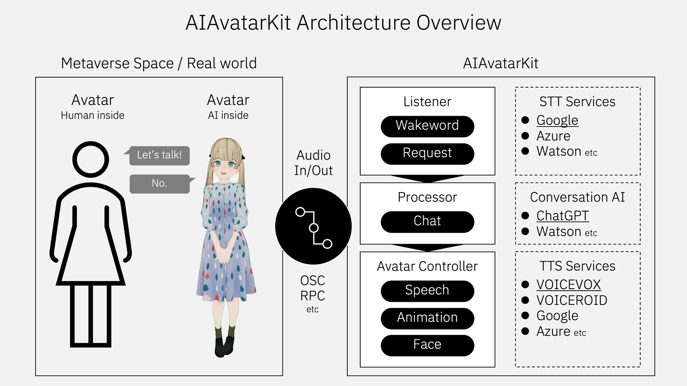
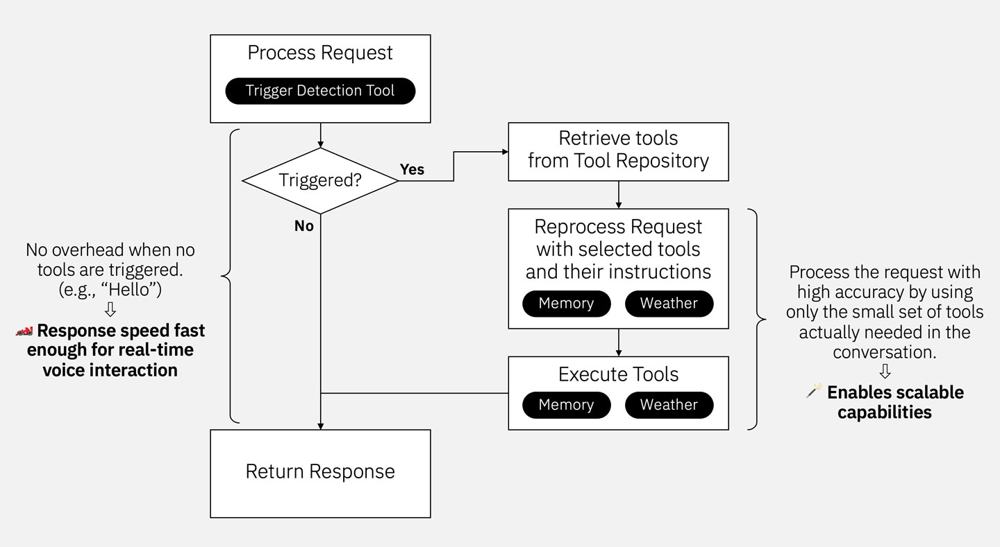

# AIAvatarKit

🥰 Building AI-based conversational avatars lightning fast ⚡️💬

 

## ✨ Features

- **🌏 Live anywhere**: AIAvatarKit is a general-purpose Speech-to-Speech framework with multimodal input/output support. It can serve as the backend for a wide range of conversational AI systems.
    - Metaverse Platforms: Compatible with VRChat, cluster, Vket Cloud, and other platforms
    - Standalone Apps: Enables ultra-low latency real-time interaction via WebSocket or HTTP (SSE), with a unified interface that abstracts differences between LLMs
    - Channels and Devices: Supports edge devices like Raspberry Pi and telephony services like Twilio
- **🧩 Modular architecture**: Components such as VAD, STT, LLM, and TTS are modular and easy to integrate via lightweight interfaces. Supported modules include:
    - VAD: Built-in standard VAD (silence-based end-of-turn detection), SileroVAD
    - STT: Google, Azure, OpenAI, AmiVoice
    - LLM: ChatGPT, Gemini, Claude, and any model supported by LiteLLM or Dify
    - TTS: VOICEVOX / AivisSpeech, OpenAI, SpeechGateway (including Style-Bert-VITS2 and NijiVoice)
- **⚡️ AI Agent native**: Designed to support agentic systems. In addition to standard tool calls, it offers Dynamic Tool Calls for extensibility and supports progress feedback for high-latency operations.


## 🍩 Requirements

- VOICEVOX API in your computer or network reachable machine (Text-to-Speech)
- API key for OpenAI API (ChatGPT and Speech-to-Text)
- Python 3.10 (Runtime)


## 🚀 Quick start

Install AIAvatarKit.

```sh
pip install aiavatar
```

**NOTE:** If the steps in technical blogs don’t work as expected, the blog may be based on a version prior to v0.6. Some features may be limited, but you can try downgrading with `pip install aiavatar==0.5.8` to match the environment described in the blog.


Make the script as `run.py`.

```python
import asyncio
from aiavatar import AIAvatar

aiavatar_app = AIAvatar(
    openai_api_key=OPENAI_API_KEY,
    debug=True
)
asyncio.run(aiavatar_app.start_listening())
```

Start AIAvatar. Also, don't forget to launch VOICEVOX beforehand.

```bash
$ python run.py
```

Conversation will start when you say the wake word "こんにちは" (or "Hello" when language is not `ja-JP`).

Feel free to enjoy the conversation afterwards!


## 🔄 Migration Guide: From v0.6.x to v0.7.0

In version **v0.7.0**, the internal Speech-to-Speech pipeline previously provided by the external `LiteSTS` library has been fully integrated into AIAvatarKit.

### What Changed?

- The functionality remains the same — **no API behavior changes**.
- However, **import paths have been updated**.

### 🔧 Required Changes

All imports from `litests` should now be updated to `aiavatar.sts`.

For example:

```python
# Before
from litests import STSRequest, STSResponse
from litests.llm.chatgpt import ChatGPTService

# After
from aiavatar.sts import STSRequest, STSResponse
from aiavatar.sts.llm.chatgpt import ChatGPTService
```

This change ensures compatibility with the new internal structure and removes the need for `LiteSTS` as a separate dependency.


## 🔖 Contents

- [🎓 Generative AI](#-generative-ai)
    - [ChatGPT](#chatgpt)
    - [Claude](#claude)
    - [Gemini](#gemini)
    - [Dify](#dify)
    - [OpenAI-compatible APIs](#openai-compatible-apis)
    - [Other LLMs](#other-llms)
- [🗣️ Voice](#️voice)
- [👂 Speech Listener](#-speech-listener)
    - [Preprocessing and Postprocessing](#preprocessing-and-postprocessing)
    - [Speaker Diarization](#speaker-diarization)
- [🎙️ Speech Detector](#%EF%B8%8F-speech-detector)
- [🥰 Face Expression](#-face-expression)
- [💃 Animation](#-animation)

- [🧩 API](#-api)
    - [💫 RESTful API (SSE)](#-restful-api-sse)
    - [🔵 Dify-compatible API](#-dify-compatible-api)
    - [🔌 WebSocket](#-websocket)

- [🦜 AI Agent](#-ai-agent)
    - [⚡️ Tool Call](#️-tool-call)
    - [⌛️ Tool Call with Streaming Progress](#%EF%B8%8F-tool-call-with-streaming-progress)
    - [🪄 Dynamic Tool Call](#-dynamic-tool-call)
    - [🔌 MCP](#-mcp)

- [🛡️ Guardrail](#%EF%B8%8F-guardrail)

- [🌎 Platform Guide](#-platform-guide)
    - [🐈 VRChat](#-vrchat)
    - [🍓 Raspberry Pi](#-raspberry-pi)

- [⚙️ Administration](#️-administration)
    - [🎛️ Configuration API](#️-configuration-api)
    - [🎮 Control API](#-control-api)
    - [🔐 Authorization](#-authorization)
    - [📈 Observability](#-observability)

- [🧪 Evaluation](#-evaluation)

- [🤿 Deep Dive](#-deep-dive)
    - [👀 Vision](#-vision)
    - [💾 Long-term Memory](#-long-term-memory)
    - [🐓 Wakeword](#-wakeword)
    - [📋 System Prompt Parameters](#-system-prompt-parameters)
    - [🧵 Request merging](#-request-merging)
    - [🧺 Shared Context](#-shared-context)
    - [🔈 Audio Device](#-audio-device)
    - [🎭 Custom Behavior](#-custom-behavior)
    - [🎚️ Noise Filter](#%EF%B8%8F-noise-filter)


## 🎓 Generative AI

You can set model and system prompt when instantiate `AIAvatar`.

```python
aiavatar_app = AIAvatar(
    openai_api_key="YOUR_OPENAI_API_KEY",
    openai_model="gpt-4o",
    system_prompt="You are my cat."
)
```

### ChatGPT

If you want to configure in detail, create instance of `ChatGPTService` with custom parameters and set it to `AIAvatar`.

```python
# Create ChatGPTService
from aiavatar.sts.llm.chatgpt import ChatGPTService
llm = ChatGPTService(
    openai_api_key=OPENAI_API_KEY,
    model="gpt-4o",
    temperature=0.0,
    system_prompt="You are my cat."
)

# Create AIAvatar with ChatGPTService
aiavatar_app = AIAvatar(
    llm=llm,
    openai_api_key=OPENAI_API_KEY   # API Key for STT
)
```

### Claude

Create instance of `ClaudeService` with custom parameters and set it to `AIAvatar`. The default model is `claude-sonnet-4-5`.

```python
# Create ClaudeService
from aiavatar.sts.llm.claude import ClaudeService
llm = ClaudeService(
    anthropic_api_key=ANTHROPIC_API_KEY,
    model="claude-sonnet-4-5",
    temperature=0.0,
    system_prompt="You are my cat."
)

# Create AIAvatar with ClaudeService
aiavatar_app = AIAvatar(
    llm=llm,
    openai_api_key=OPENAI_API_KEY   # API Key for STT
)
```

NOTE: We support Claude on Anthropic API, not Amazon Bedrock for now. Use LiteLLM or other API Proxies.


### Gemini

Create instance of `GeminiService` with custom parameters and set it to `AIAvatar`. The default model is `gemini-2.0-flash-exp`.

```python
# Create GeminiService
# pip install google-genai
from aiavatar.sts.llm.gemini import GeminiService
llm = GeminiService(
    gemini_api_key=GEMINI_API_KEY,
    model="gemini-2.0-pro-latest",
    temperature=0.0,
    system_prompt="You are my cat."
)

# Create AIAvatar with GeminiService
aiavatar_app = AIAvatar(
    llm=llm,
    openai_api_key=OPENAI_API_KEY   # API Key for STT
)
```

NOTE: We support Gemini on Google AI Studio, not Vertex AI for now. Use LiteLLM or other API Proxies.


### Dify

You can use the Dify API instead of a specific LLM's API. This eliminates the need to manage code for tools or RAG locally.

```python
# Create DifyService
from aiavatar.sts.llm.dify import DifyService
llm = DifyService(
    api_key=DIFY_API_KEY,
    base_url=DIFY_URL,
    user="aiavatarkit_user",
    is_agent_mode=True
)

# Create AIAvatar with DifyService
aiavatar_app = AIAvatar(
    llm=llm,
    openai_api_key=OPENAI_API_KEY   # API Key for STT
)
```


### OpenAI-compatible APIs

`ChatGPTService` supports OpenAI-compatible APIs, such as Grok, Gemini, and Claude.

By specifying the `model`, `openai_api_key`, and `base_url`, these models can now be used with a non-reasoning configuration out of the box.

```python
# Grok
MODEL = "grok-4-1-fast-non-reasoning"
OPENAI_API_KEY = "YOUR_XAI_API_KEY"
BASE_URL = "https://api.x.ai/v1"

# Gemini on Google AI Studio
MODEL = "gemini-2.5-flash"
OPENAI_API_KEY = "YOUR_GEMINI_API_KEY"
BASE_URL = "https://generativelanguage.googleapis.com/v1beta/openai/"

# Claude on Anthropic
LLM_MODEL = "claude-haiku-4-5"
OPENAI_API_KEY = "YOUR_ANTHROPIC_API_KEY"
BASE_URL = "https://api.anthropic.com/v1/"

# Configure ChatGPTService
from aiavatar.sts.llm.chatgpt import ChatGPTService
llm = ChatGPTService(
    openai_api_key=OPENAI_API_KEY,
    base_url=BASE_URL,
    model=MODEL,
    system_prompt=SYSTEM_PROMPT,
    # extra_body={"thinking": { "type": "disabled"}},   # Claude
)
```


### Other LLMs

You can use other LLMs by using `LiteLLMService` or implementing `LLMService` interface.

See the details of LiteLLM here: https://github.com/BerriAI/litellm


## 🗣️　Voice

You can set speaker id and the base url for VOICEVOX server when instantiate `AIAvatar`.

```python
aiavatar_app = AIAvatar(
    openai_api_key="YOUR_OPENAI_API_KEY",
    # 46 is Sayo. See http://127.0.0.1:50021/speakers to get all ids for characters
    voicevox_speaker=46
)
```

If you want to configure in detail, create instance of `VoicevoxSpeechSynthesizer` with custom parameters and set it to `AIAvatar`.
Here is the example for [AivisSpeech](https://aivis-project.com).

```python
# Create VoicevoxSpeechSynthesizer with AivisSpeech configurations
from aiavatar.sts.tts.voicevox import VoicevoxSpeechSynthesizer
tts = VoicevoxSpeechSynthesizer(
    base_url="http://127.0.0.1:10101",  # Your AivisSpeech API server
    speaker="888753761"   # Anneli
)

# Create AIAvatar with VoicevoxSpeechSynthesizer
aiavatar_app = AIAvatar(
    tts=tts,
    openai_api_key=OPENAI_API_KEY   # API Key for LLM and STT
)
```

You can also set speech controller that uses alternative Text-to-Speech services. We support Azure, Google, OpenAI and any other TTS services supported by [SpeechGateway](https://github.com/uezo/speech-gateway) such as Style-Bert-VITS2 and NijiVoice.

```python
from aiavatar.sts.tts.azure import AzureSpeechSynthesizer
from aiavatar.sts.tts.google import GoogleSpeechSynthesizer
from aiavatar.sts.tts.openai import OpenAISpeechSynthesizer
from aiavatar.sts.tts.speech_gateway import SpeechGatewaySpeechSynthesizer
```

### Instant TTS Synthesizer

For quick setup of custom TTS services with HTTP API endpoints, use `create_instant_synthesizer`. This allows you to create a TTS synthesizer with just HTTP request parameters.

```python
from aiavatar.sts.tts.base import create_instant_synthesizer

# Example: Style-Bert-VITS2 API
sbv2_tts = create_instant_synthesizer(
    method="POST",
    url="http://127.0.0.1:5000/voice",
    json={
        "model_id": "0",
        "speaker_id": "0",
        "text": "{text}"  # Placeholder for processed text
    }
)
```

The `{text}` and `{language}` placeholders in params, headers, and json will be automatically replaced with the processed text and language values during synthesis.


You can also make custom tts components by impelemting `SpeechSynthesizer` interface.

### Preprocessing

AIAvatarKit provides text preprocessing functionality that transforms text before Text-to-Speech processing. This enables improved speech quality and conversion of specific text patterns.

#### Alphabet to Katakana Conversion

Here's an example of a preprocessor that converts alphabet text to katakana:

```python
from aiavatar.sts.tts.preprocessor.alphabet2kana import AlphabetToKanaPreprocessor

# Create preprocessor
alphabet2kana_preproc = AlphabetToKanaPreprocessor(
    openai_api_key=OPENAI_API_KEY,
    model="gpt-4o-mini",                      # Model to use (default: gpt-4.1-mini)
    alphabet_length=3,                        # Minimum alphabet length to convert (default: 3)
    system_prompt="Convert foreign languages..." # Custom prompt (optional)
)

# Add to TTS
tts.preprocessors.append(alphabet2kana_preproc)
```

#### Pattern Match Conversion

You can also use regular expressions and string patterns for conversion:

```python
from aiavatar.sts.tts.preprocessor.patternmatch import PatternMatchPreprocessor

# Create pattern match preprocessor
pattern_preproc = PatternMatchPreprocessor(patterns=[
    ("API", "エーピーアイ"),               # Fixed string replacement
    ("URL", "ユーアールエル"),
    (r"\d+", lambda m: "number"),          # Regex replacement with function
])

# Add common patterns
pattern_preproc.add_number_dash_pattern()  # Number-dash patterns (e.g., 12-34 → イチニの サンヨン)
pattern_preproc.add_phonenumber_pattern()  # Phone number patterns

# Add to TTS
tts.preprocessors.append(pattern_preproc)
```

#### Creating Custom Preprocessors

You can create your own preprocessors by implementing the `TTSPreprocessor` interface:

```python
from aiavatar.sts.tts.preprocessor import TTSPreprocessor

class CustomPreprocessor(TTSPreprocessor):
    def __init__(self, custom_dict: dict = None):
        self.custom_dict = custom_dict or {}
    
    async def process(self, text: str, style_info: dict = None, language: str = None) -> str:
        # Custom conversion logic
        processed_text = text
        
        # Dictionary-based replacement
        for original, replacement in self.custom_dict.items():
            processed_text = processed_text.replace(original, replacement)
        
        # Language-specific conversions
        if language == "ja-JP":
            processed_text = processed_text.replace("OK", "オーケー")
        
        return processed_text

# Use custom preprocessor
custom_preproc = CustomPreprocessor(custom_dict={
    "GitHub": "ギットハブ",
    "Python": "パイソン",
    "Docker": "ドッカー"
})

tts.preprocessors.append(custom_preproc)
```

#### Combining Preprocessors

Multiple preprocessors can be used together. They are executed in the order they were registered:

```python
# Combine multiple preprocessors
tts.preprocessors.extend([
    pattern_preproc,        # 1. Pattern match conversion
    alphabet2kana_preproc,  # 2. Alphabet to katakana conversion
    custom_preproc          # 3. Custom conversion
])
```


## 👂 Speech listener

If you want to configure in detail, create instance of `SpeechRecognizer` with custom parameters and set it to `AIAvatar`. We support Azure, Google and OpenAI Speech-to-Text services.

NOTE: **`AzureSpeechRecognizer` is much faster** than Google and OpenAI(default).

```python
# Create AzureSpeechRecognizer
from aiavatar.sts.stt.azure import AzureSpeechRecognizer
stt = AzureSpeechRecognizer(
    azure_api_key=AZURE_API_KEY,
    azure_region=AZURE_REGION
)

# Create AIAvatar with AzureSpeechRecognizer
aiavatar_app = AIAvatar(
    stt=stt,
    openai_api_key=OPENAI_API_KEY   # API Key for LLM
)
```

You can also make custom STT components by implementing `SpeechRecognizer` interface.

### Preprocessing and Postprocessing

You can add custom preprocessing and postprocessing to any `SpeechRecognizer` implementation. This is useful for tasks like speaker verification, audio filtering, or text normalization.

```python
from aiavatar.sts.stt.openai import OpenAISpeechRecognizer

# Create recognizer
recognizer = OpenAISpeechRecognizer(openai_api_key="your-api-key")

# Add preprocessing - e.g., speaker verification
@recognizer.preprocess
async def verify_speaker(session_id: str, audio_data: bytes):
    # Perform speaker verification
    is_valid_speaker = await check_speaker_identity(audio_data)
    
    if not is_valid_speaker:
        # Return empty bytes to skip transcription
        return b"", {"rejected": True, "reason": "speaker_mismatch"}
    
    # Return processed audio and metadata
    filtered_audio = apply_noise_filter(audio_data)
    return filtered_audio, {"speaker_verified": True, "session_id": session_id}

# Add postprocessing - e.g., text formatting
@recognizer.postprocess
async def format_text(session_id: str, text: str, audio_data: bytes, preprocess_metadata: dict):
    # Format transcribed text
    formatted_text = text.strip().capitalize()
    
    # Add punctuation if missing
    if formatted_text and formatted_text[-1] not in '.!?':
        formatted_text += '.'
    
    # Return formatted text and metadata
    return formatted_text, {
        "original_text": text,
        "formatting_applied": True,
        "preprocess_info": preprocess_metadata
    }

# Use the recognizer with preprocessing and postprocessing
result = await recognizer.recognize(
    session_id="user-123",
    data=audio_bytes
)

print(f"Text: {result.text}")
print(f"Preprocess metadata: {result.preprocess_metadata}")
print(f"Postprocess metadata: {result.postprocess_metadata}")
```

The preprocessing and postprocessing functions can return either:
- Just the processed data (bytes for preprocess, string for postprocess)
- A tuple of (processed_data, metadata_dict) for additional information

If preprocessing returns empty bytes, the transcription is skipped and the result will have `text=None`.


### Speaker Diarization

AIAvatarKit provides speaker diarization functionality to suppress responses to voices other than the main speaker. This prevents interruptions from surrounding conversations or venue announcements at events.

The `MainSpeakerGate` provides the following features:

- Calculates voice embeddings from request audio
- Registers a voice as the main speaker when similarity exceeds threshold for 2 consecutive requests (per session)
- Returns `accepted=True` when request audio similarity exceeds threshold after main speaker registration
- Returns `accepted=True` when no main speaker is registered yet

**NOTE:** While mechanically ignoring non-main speaker voices (Example 1) is simplest, it risks stopping conversation due to misidentification and cannot handle speaker changes. Consider context-aware handling (Example 2) as well.

```python
from aiavatar.sts.stt.speaker_gate import MainSpeakerGate
speaker_gate = MainSpeakerGate()

# Example 1: Drop request when the voice is not from main speaker
@aiavatar_app.sts.stt.preprocess
async def stt_preprocess(session_id: str, audio_bytes: bytes):
    # Compare with main speaker's voice embedding
    gate_response = await speaker_gate.evaluate(session_id, audio_bytes, aiavatar_app.sts.vad.sample_rate)
    # Branch processing based on similarity with main speaker's voice
    if not gate_response.accepted:
        logger.info(f"Ignore other speaker's voice: confidence={gate_response.confidence}")
        return None, gate_response.to_dict()
    else:
        return audio_bytes, gate_response.to_dict()

# Example 2: Add annotation for LLM that the voice is not from main speaker
@aiavatar_app.sts.stt.postprocess
async def stt_postprocess(session_id: str, text: str, audio_bytes: bytes, preprocess_metadata: dict):
    # Compare with main speaker's voice embedding
    gate_response = await speaker_gate.evaluate(session_id, audio_bytes, aiavatar_app.sts.vad.sample_rate)
    # Branch processing based on similarity with main speaker's voice
    if not gate_response.accepted:
        logger.info(f"Adding note that this may be from a different speaker: confidence={gate_response.confidence}")
        return f"$The following request may not be from the main speaker (similarity: {gate_response.confidence}). Determine from the content whether to respond. If you should not respond, output just[wait:user] as the answer:\n\n{text}", gate_response.to_dict()
    else:
        return text, gate_response.to_dict()
```


## 🎙️ Speech Detector

AIAvatarKit includes Voice Activity Detection (VAD) components to automatically detect when speech starts and ends in audio streams. This enables seamless conversation flow without manual input controls.

### Standard Speech Detector

The default `StandardSpeechDetector` uses volume-based detection with configurable thresholds:

```python
from aiavatar.sts.vad.standard import StandardSpeechDetector

# Create StandardSpeechDetector with custom parameters
vad = StandardSpeechDetector(
    volume_db_threshold=-30.0,           # Voice detection threshold in dB
    silence_duration_threshold=0.5,      # Seconds of silence to end recording
    max_duration=10.0,                   # Maximum recording duration
    min_duration=0.2,                    # Minimum recording duration
    sample_rate=16000,                   # Audio sample rate
    channels=1,                          # Audio channels
    preroll_buffer_count=5,              # Pre-recording buffer size
    debug=True
)

# Create AIAvatar with custom VAD
aiavatar_app = AIAvatar(
    vad=vad,
    openai_api_key=OPENAI_API_KEY
)
```

### Silero Speech Detector

For more accurate speech detection, use `SileroSpeechDetector` which employs AI-based voice activity detection:

```sh
pip install silero-vad
```

```python
from aiavatar.sts.vad.silero import SileroSpeechDetector

# Create SileroSpeechDetector with custom parameters
vad = SileroSpeechDetector(
    speech_probability_threshold=0.5,    # AI model confidence threshold (0.0-1.0)
    silence_duration_threshold=0.5,      # Seconds of silence to end recording
    volume_db_threshold=-30.0,           # Voice detection threshold in dB (Default is None: set value only when you want to filter out non-speaker voices)
    max_duration=10.0,                   # Maximum recording duration
    min_duration=0.2,                    # Minimum recording duration
    sample_rate=16000,                   # Audio sample rate
    channels=1,                          # Audio channels
    chunk_size=512,                      # Audio processing chunk size
    model_pool_size=1,                   # Number of parallel AI models
    debug=True
)

# Create AIAvatar with Silero VAD
aiavatar_app = AIAvatar(
    vad=vad,
    openai_api_key=OPENAI_API_KEY
)
```

For applications with many concurrent users:

```python
# High-performance configuration for 100+ concurrent sessions
vad = SileroSpeechDetector(
    speech_probability_threshold=0.6,    # Stricter threshold for noisy environments
    model_pool_size=4,                   # 4 parallel AI models for load balancing
    chunk_size=512,                      # Optimized chunk size
    debug=False                          # Disable debug for production
)
```

You can also make custom VAD components by implementing `SpeechDetector` interface.

### Speech Detection Callback

SpeechDetectors supports an `on_recording_started` callback that gets triggered when speech recording starts and meets the minimum duration threshold. The callback will be executed asynchronously as a background task.

```python
from aiavatar.sts.vad.standard import StandardSpeechDetector

async def my_recording_started_handler(session_id: str):
    print(f"Recording started for session: {session_id}")
    # Add your custom logic here

detector = StandardSpeechDetector(
    on_recording_started=my_recording_started_handler,
    volume_db_threshold=-30.0,
    silence_duration_threshold=0.5,
    # other parameters...
)
```


## 🥰 Face expression

To control facial expressions within conversations, set the facial expression names and values in `FaceController.faces` as shown below, and then include these expression keys in the response message by adding instructions to the prompt.

```python
aiavatar_app.face_controller.faces = {
    "neutral": "🙂",
    "joy": "😀",
    "angry": "😠",
    "sorrow": "😞",
    "fun": "🥳"
}

aiavatar_app.sts.llm.system_prompt = """# Face Expression

* You have the following expressions:

- joy
- angry
- sorrow
- fun

* If you want to express a particular emotion, please insert it at the beginning of the sentence like [face:joy].

Example
[face:joy]Hey, you can see the ocean! [face:fun]Let's go swimming.
"""
```

This allows emojis like 🥳 to be autonomously displayed in the terminal during conversations. To actually control the avatar's facial expressions in a metaverse platform, instead of displaying emojis like 🥳, you will need to use custom implementations tailored to the integration mechanisms of each platform. Please refer to our `VRChatFaceController` as an example.


## 💃 Animation

Now writing... ✍️


## 🧩 API

You can host AIAvatarKit on a server to enable multiple clients to have independent context-aware conversations via RESTful API with streaming responses (Server-Sent Events) and WebSocket.

### 💫 RESTful API (SSE)

Below is the simplest example of a server program:

```python
from fastapi import FastAPI
from aiavatar.adapter.http.server import AIAvatarHttpServer

# AIAvatar
aiavatar_app = AIAvatarHttpServer(
    openai_api_key=OPENAI_API_KEY,
    debug=True
)

# Setup FastAPI app with AIAvatar components 
app = FastAPI()
router = aiavatar_app.get_api_router()
app.include_router(router)
```

Save the above code as `server.py` and run it using:

```sh
uvicorn server:app
```


Next is the simplest example of a client program:

```python
import asyncio
from aiavatar.adapter.http.client import AIAvatarHttpClient

aiavatar_app = AIAvatarHttpClient(
    debug=True
)
asyncio.run(aiavatar_app.start_listening(session_id="http_session", user_id="http_user"))
```

Save the above code as `client.py` and run it using:

```sh
python client.py
```

You can now perform voice interactions just like when running locally.


When using the streaming API via HTTP, clients communicate with the server using JSON-formatted requests.

Below is the format for initiating a session:

```json
{
    "type": "start",          // Always `start`
    "session_id": "6d8ba9ac-a515-49be-8bf4-cdef021a169d",
    "user_id": "user_id",
    "context_id": "c37ac363-5c65-4832-aa25-fd3bbbc1b1e7",   // Set null or provided id in `start` response
    "text": "こんにちは",       // If set, audio_data will be ignored         
    "audio_data": "XXXX",     // Base64 encoded audio data
    "files": [
        {
            "type": "image",        // Only `image` is supported for now
            "url": "https://xxx",
        }
    ],
    "metadata": {}
}
```

The server returns responses as a stream of JSON objects in the following structure.

The communication flow typically consists of:

```json
{
    "type": "chunk",    // start -> chunk -> final
    "session_id": "6d8ba9ac-a515-49be-8bf4-cdef021a169d",
    "user_id": "user01",
    "context_id": "c37ac363-5c65-4832-aa25-fd3bbbc1b1e7",
    "text": "[face:joy]こんにちは！",   // Response text with info
    "voice_text": "こんにちは！",       // Response text for voice synthesis
    "avatar_control_request": {
        "animation_name": null,       // Parsed animation name
        "animation_duration": null,   // Parsed duration for animation
        "face_name": "joy",           // Parsed facial expression name
        "face_duration": 4.0          // Parsed duration for the facial expression
    },
    "audio_data": "XXXX",   // Base64 encoded. Playback this as the character's voice.
    "metadata": {
        "is_first_chunk": true
    }
}
```


You can test the streaming API using a simple curl command:

```sh
curl -N -X POST http://127.0.0.1:8000/chat \
    -H "Content-Type: application/json" \
    -d '{
        "type": "start",
        "session_id": "6d8ba9ac-a515-49be-8bf4-cdef021a169d",
        "user_id": "user01",
        "text": "こんにちは"
    }'

```

Sample response (streamed from the server):

```sh
data: {"type": "start", "session_id": "6d8ba9ac-a515-49be-8bf4-cdef021a169d", "user_id": "user01", "context_id": "c37ac363-5c65-4832-aa25-fd3bbbc1b1e7", "text": null, "voice_text": null, "avatar_control_request": null, "audio_data": "XXXX", "metadata": {"request_text": "こんにちは"}}

data: {"type": "chunk", "session_id": "6d8ba9ac-a515-49be-8bf4-cdef021a169d", "user_id": "user01", "context_id": "c37ac363-5c65-4832-aa25-fd3bbbc1b1e7", "text": "[face:joy]こんにちは！", "voice_text": "こんにちは！", "avatar_control_request": {"animation_name": null, "animation_duration": null, "face_name": "joy", "face_duration": 4.0}, "audio_data": "XXXX", "metadata": {"is_first_chunk": true}}

data: {"type": "chunk", "session_id": "6d8ba9ac-a515-49be-8bf4-cdef021a169d", "user_id": "user01", "context_id": "c37ac363-5c65-4832-aa25-fd3bbbc1b1e7", "text": "今日はどんなことをお手伝いしましょうか？", "voice_text": "今日はどんなことをお手伝いしましょうか？", "avatar_control_request": {"animation_name": null, "animation_duration": null, "face_name": null, "face_duration": null}, "audio_data": "XXXX", "metadata": {"is_first_chunk": false}}

data: {"type": "final", "session_id": "6d8ba9ac-a515-49be-8bf4-cdef021a169d", "user_id": "user01", "context_id": "c37ac363-5c65-4832-aa25-fd3bbbc1b1e7", "text": "[face:joy]こんにちは！今日はどんなことをお手伝いしましょうか？", "voice_text": "こんにちは！今日はどんなことをお手伝いしましょうか？", "avatar_control_request": null, "audio_data": "XXXX", "metadata": {}}
```

To continue the conversation, include the `context_id` provided in the `start` response in your next request.

**NOTE:** When using the RESTful API, voice activity detection (VAD) must be performed client-side.

**NOTE:** To protect API with API Key, set `api_key=API_KEY_YOU_MAKE` to AIAvatarHttpServer and send `Authorization: Bearer {API_KEY_YOU_MAKE}` as HTTP header from client.


### 🔵 Dify-compatible API

`AIAvatarHttpServer` provides a Dify-compatible `/chat-messages` endpoint (SSE streaming only).
This allows you to connect frontend applications that use Dify as their backend.

For more details, refer to the [Dify API Guide](https://docs.dify.ai/en/guides/application-publishing/developing-with-apis)
or the API documentation of your self-hosted Dify application.


### 🔌 WebSocket

Below is the simplest example of a server program:

```python
from fastapi import FastAPI
from aiavatar.adapter.websocket.server import AIAvatarWebSocketServer

# Create AIAvatar
aiavatar_app = AIAvatarWebSocketServer(
    openai_api_key=OPENAI_API_KEY,
    volume_db_threshold=-30,  # <- Adjust for your audio env
    debug=True
)

# Set router to FastAPI app
app = FastAPI()
router = aiavatar_app.get_websocket_router()
app.include_router(router)
```

Save the above code as `server.py` and run it using:

```sh
uvicorn server:app
```

**NOTE:** When you specify `response_audio_chunk_size` in the `AIAvatarWebSocketServer` instance, the audio response will be streamed as PCM data chunks of the specified byte size. In this case, no WAVE header will be included in the response - you'll receive raw PCM audio data only.


Next is the simplest example of a client program:

```python
import asyncio
from aiavatar.adapter.websocket.client import AIAvatarWebSocketClient

client = AIAvatarWebSocketClient()
asyncio.run(client.start_listening(session_id="ws_session", user_id="ws_user"))
```

Save the above code as `client.py` and run it using:

```sh
python client.py
```

You can now perform voice interactions just like when running locally.

**NOTE:** When using the WebSocket API, voice activity detection (VAD) is performed on the server side, so clients can simply stream microphone input directly to the server.


### Connection and Disconnection Handling

You can register callbacks to handle WebSocket connection and disconnection events. This is useful for logging, session management, or custom initialization/cleanup logic.

```python
@aiavatar_app.on_connect
async def on_connect(request, session_data):
    print(f"Client connected: {session_data.id}")
    print(f"User ID: {session_data.user_id}")
    print(f"Session ID: {session_data.session_id}")
    
    # Custom initialization logic
    # e.g., load user preferences, initialize resources, etc.

@aiavatar_app.on_disconnect
async def on_disconnect(session_data):
    print(f"Client disconnected: {session_data.id}")
    
    # Custom cleanup logic
    # e.g., save session data, release resources, etc.
```

The `session_data` object contains information about the WebSocket session:

- `id`: Unique session identifier
- `user_id`: User identifier from the connection request
- `session_id`: Session identifier from the connection request
- Additional metadata passed during connection


### STT / TTS Endpoints

AIAvatarHttpServer provides REST API endpoints for Speech-to-Text (STT) and Text-to-Speech (TTS) functionality:

#### STT Endpoint
`POST /stt` - Converts audio to text.

```python
import requests

# Read audio file
with open("audio.wav", "rb") as f:
    audio_data = f.read()

# Send to STT endpoint
response = requests.post(
    "http://localhost:8000/stt",
    data=audio_data,
    headers={"Content-Type": "audio/wav"}
)

print(response.json())  # {"text": "recognized speech"}
```

#### TTS Endpoint
`POST /tts` - Converts text to speech.

```python
import requests

# Send text to TTS endpoint
response = requests.post(
    "http://localhost:8000/tts",
    json={"text": "Hello, this is AI Avatar speaking"}
)

# Save audio response
with open("output.wav", "wb") as f:
    f.write(response.content)
```


## 🛡️ Guardrail

You can apply guardrails to both requests and responses.
Guardrails are custom implementations created by developers, and can block or replace an incoming request, or replace an outgoing response when certain conditions are met.

Below is the implementation method and how to apply guardrails.

```python
from aiavatar.sts.llm import Guardrail, GuardrailRespose

# Define guardrails
class RequestGuardrail(Guardrail):
    async def apply(self, context_id, user_id, text, files = None, system_prompt_params = None):
        if text.lower() == "problematic input":
            return GuardrailRespose(
                guardrail_name=self.name,
                is_triggered=True,
                action="block",
                text="The problematic input has been blocked."  # Immediately returns this message to the user
            )
        elif text.lower() == "hello":
            return GuardrailRespose(
                guardrail_name=self.name,
                is_triggered=True,
                action="replace",
                text="こんにちは"   # Replaces the original request text with this value
            )
        else:
            return GuardrailRespose(
                guardrail_name=self.name,
                is_triggered=False
            )

class ResponseGuardrail(Guardrail):
    async def apply(self, context_id, user_id, text, files = None, system_prompt_params = None):
        if "ramen" in text.lower():
            return GuardrailRespose(
                guardrail_name=self.name,
                is_triggered=True,
                action="replace",
                text="The problematic output has been blocked." # Emits an additional replacement chunk for the response
            )
        else:
            return GuardrailRespose(
                guardrail_name=self.name,
                is_triggered=False
            )

# Apply guardrails
service.guardrails.append(RequestGuardrail(applies_to="request"))
service.guardrails.append(ResponseGuardrail(applies_to="response"))
```

**NOTE:** When multiple guardrails are defined, they run in parallel.
Processing stops when all guardrails have finished evaluating or when the first guardrail returns a response with `is_triggered=True`.

**NOTE:** Response guardrails are evaluated only after the LLM response stream finishes.
This means the problematic output may be briefly visible to the user.
When a response is received with `metadata.is_guardrail_triggered = true`, the client should handle this by replacing or modifying the output accordingly.


## 🌎 Platform Guide

AIAvatarKit is capable of operating on any platform that allows applications to hook into audio input and output. The platforms that have been tested include:

- VRChat
- cluster
- Vket Cloud

In addition to running on PCs to operate AI avatars on these platforms, you can also create a communication robot by connecting speakers, a microphone, and, if possible, a display to a Raspberry Pi.

### 🐈 VRChat

* __2 Virtual audio devices (e.g. VB-CABLE) are required.__
* __Multiple VRChat accounts are required to chat with your AIAvatar.__


#### Get started

First, run the commands below in python interpreter to check the audio devices.

```sh
$ python

>>> from aiavatar import AudioDevice
>>> AudioDevice().list_audio_devices()
0: Headset Microphone (Oculus Virt
    :
6: CABLE-B Output (VB-Audio Cable
7: Microsoft サウンド マッパー - Output
8: SONY TV (NVIDIA High Definition
    :
13: CABLE-A Input (VB-Audio Cable A
    :
```

In this example,

- To use `VB-Cable-A` for microphone for VRChat, index for `output_device` is `13` (CABLE-A Input).
- To use `VB-Cable-B` for speaker for VRChat, index for `input_device` is `6` (CABLE-B Output). Don't forget to set `VB-Cable-B Input` as the default output device of Windows OS.

Then edit `run.py` like below.

```python
# Create AIAvatar
aiavatar_app = AIAvatar(
    openai_api_key=OPENAI_API_KEY,
    input_device=6,     # Listen sound from VRChat
    output_device=13,   # Speak to VRChat microphone
)
```

Run it.

```bash
$ run.py
```

Launch VRChat as desktop mode on the machine that runs `run.py` and log in with the account for AIAvatar. Then set `VB-Cable-A` to microphone in VRChat setting window.

That's all! Let's chat with the AIAvatar. Log in to VRChat on another machine (or Quest) and go to the world the AIAvatar is in.


#### Face Expression

AIAvatarKit controls the face expression by [Avatar OSC](https://docs.vrchat.com/docs/osc-avatar-parameters).

LLM(ChatGPT/Claude/Gemini)  
↓ *response with face tag* `[face:joy]Hello!`  
AIAvatarKit(VRCFaceExpressionController)  
↓ *osc* `FaceOSC=1`  
VRChat(FX AnimatorController)  
↓  
😆

So at first, setup your avatar the following steps:

1. Add avatar parameter `FaceOSC` (type: int, default value: 0, saved: false, synced: true).
1. Add `FaceOSC` parameter to the FX animator controller.
1. Add layer and put states and transitions for face expression to the FX animator controller.
1. (option) If you use the avatar that is already used in VRChat, add input parameter configuration to avatar json.


Next, use `VRChatFaceController`.

```python
from aiavatar.face.vrchat import VRChatFaceController

# Setup VRChatFaceContorller
vrc_face_controller = VRChatFaceController(
    faces={
        "neutral": 0,   # always set `neutral: 0`

        # key = the name that LLM can understand the expression
        # value = FaceOSC value that is set to the transition on the FX animator controller
        "joy": 1,
        "angry": 2,
        "sorrow": 3,
        "fun": 4
    }
)
```

Lastly, add face expression section to the system prompt.

```python
# Make system prompt
system_prompt = """
# Face Expression

* You have following expressions:

- joy
- angry
- sorrow
- fun

* If you want to express a particular emotion, please insert it at the beginning of the sentence like [face:joy].

Example
[face:joy]Hey, you can see the ocean! [face:fun]Let's go swimming.
"""

# Set them to AIAvatar
aiavatar_app = AIAvatar(
    openai_api_key=OPENAI_API_KEY,
    face_controller=vrc_face_controller,
    system_prompt=system_prompt
)
```

You can test it not only through the voice conversation but also via the [REST API](#-restful-apis).


### 🍓 Raspberry Pi

Now writing... ✍️


## ⚙️ Administration

AIAvatarKit provides comprehensive administration APIs for monitoring and controlling running instances. These APIs enable dynamic configuration updates, runtime control, and system monitoring for production deployments.

### 🎛️ Configuration API

The Configuration API allows real-time management of AIAvatar components and their settings. You can dynamically switch between different LLM providers, adjust TTS settings, modify STT parameters, and monitor system logs.

#### Setting up Configuration API

```python
from fastapi import FastAPI
from aiavatar.adapter.http.server import AIAvatarHttpServer
from aiavatar.admin.config import ConfigAPI

# Create AIAvatar server
aiavatar_app = AIAvatarHttpServer(
    openai_api_key=OPENAI_API_KEY,
    debug=True
)

# Create multiple LLM services for switching
from aiavatar.sts.llm.chatgpt import ChatGPTService
from aiavatar.sts.llm.claude import ClaudeService

chatgpt_service = ChatGPTService(openai_api_key=OPENAI_API_KEY, model="gpt-4o")
claude_service = ClaudeService(anthropic_api_key=ANTHROPIC_API_KEY, model="claude-sonnet-4-5")

# Setup Configuration API
config_api = ConfigAPI(
    sts=aiavatar_app.sts,
    llms={
        "chatgpt": chatgpt_service,
        "claude": claude_service
    },
    logfile_path="/var/log/aiavatar.log"
)

# Setup FastAPI app
app = FastAPI()
app.include_router(aiavatar_app.get_api_router())
app.include_router(config_api.get_router(), prefix="/admin")
```

#### Key Configuration Features

**Component Management**
- Switch between different STT, LLM, and TTS providers at runtime
- Query available components and their current configurations
- Hot-swap components without restarting the application

**Dynamic Configuration Updates**
- Update LLM parameters (temperature, model, system prompt)
- Modify TTS settings (voice, speaker, style mappings)
- Adjust STT configurations (language, timeout, debug mode)

**System Monitoring**
- Retrieve recent system logs
- Monitor component health and status
- Track configuration changes

#### API Examples

```bash
# Get current LLM configuration
curl -X GET "http://localhost:8000/admin/llm/config"

# Switch to Claude
curl -X POST "http://localhost:8000/admin/sts/component" \
    -H "Content-Type: application/json" \
    -d '{"llm": "claude"}'

# Update system prompt
curl -X POST "http://localhost:8000/admin/llm/config" \
    -H "Content-Type: application/json" \
    -d '{
        "config": {
            "system_prompt": "You are a helpful virtual assistant.",
            "temperature": 0.7
        }
    }'

# Get system logs
curl -X GET "http://localhost:8000/admin/system/log?count=50"
```

### 🎮 Control API

The Control API provides runtime control over AIAvatar behavior, allowing you to manage listening sessions, control avatar expressions and animations, and handle conversations programmatically.

#### Setting up Control API

```python
from fastapi import FastAPI
from aiavatar import AIAvatar
from aiavatar.admin.control import ControlAPI

# Create AIAvatar
aiavatar_app = AIAvatar(
    openai_api_key=OPENAI_API_KEY,
    debug=True
)

# Setup Control API
control_api = ControlAPI(aiavatar_app)

# Setup FastAPI app
app = FastAPI()
app.include_router(control_api.get_router(), prefix="/control")
```

#### Key Control Features

**Listener Management**
- Start and stop voice listening sessions
- Monitor listening status
- Handle multiple concurrent sessions

**Avatar Control**
- Set facial expressions with duration control
- Trigger animations programmatically
- Perform synchronized speech with avatar controls
- Monitor current avatar state

**Conversation Management**
- Send text messages directly to the conversation pipeline
- Retrieve conversation history
- Monitor conversation flow

#### API Examples

```bash
# Start listening for session
curl -X POST "http://localhost:8000/control/listener/start" \
    -H "Content-Type: application/json" \
    -d '{"session_id": "demo_session"}'

# Check listener status
curl -X GET "http://localhost:8000/control/listener/status"

# Set facial expression
curl -X POST "http://localhost:8000/control/avatar/face" \
    -H "Content-Type: application/json" \
    -d '{
        "name": "joy",
        "duration": 3.0
    }'

# Trigger animation
curl -X POST "http://localhost:8000/control/avatar/animation" \
    -H "Content-Type: application/json" \
    -d '{
        "name": "wave_hands",
        "duration": 2.5
    }'

# Perform speech with control tags
curl -X POST "http://localhost:8000/control/avatar/perform" \
    -H "Content-Type: application/json" \
    -d '{
        "text": "[face:joy]Hello there! [animation:wave_hands]Nice to meet you!"
    }'

# Send conversation message
curl -X POST "http://localhost:8000/control/conversation" \
    -H "Content-Type: application/json" \
    -d '{
        "text": "What's the weather like today?"
    }'

# Get conversation history
curl -X GET "http://localhost:8000/control/conversation/histories"
```

### 🔐 Authorization

The administration APIs support secure authentication using Bearer tokens to protect sensitive management operations in production environments.

#### Setting up Authentication

AIAvatarKit provides a built-in authentication system through the `aiavatar.auth` module:

```python
from fastapi import FastAPI, Depends
from aiavatar.auth import BearerAuth
from aiavatar.adapter.http.server import AIAvatarHttpServer
from aiavatar.admin.config import ConfigAPI
from aiavatar.admin.control import ControlAPI

# Create AIAvatar server
aiavatar_app = AIAvatarHttpServer(
    openai_api_key=OPENAI_API_KEY,
    debug=True
)

# Setup authentication
auth = BearerAuth(api_key="your-secure-admin-token-here")

# Setup administration APIs
config_api = ConfigAPI(sts=aiavatar_app.sts, logfile_path="/var/log/aiavatar.log")
control_api = ControlAPI(aiavatar_app)

# Setup FastAPI app with authentication
app = FastAPI(
    title="AIAvatar Administration",
    description="Administration APIs for AIAvatar management",
    version="1.0.0"
)

# Include routers with authentication
app.include_router(aiavatar_app.get_api_router())
app.include_router(
    config_api.get_router(), 
    prefix="/admin", 
    dependencies=[Depends(auth)]
)
app.include_router(
    control_api.get_router(), 
    prefix="/control", 
    dependencies=[Depends(auth)]
)
```

#### Using Authenticated APIs

Once authentication is configured, all administration API calls must include the Authorization header:

```bash
# Set your admin token
export ADMIN_TOKEN="your-secure-admin-token-here"

# Get LLM configuration with authentication
curl -X GET "http://localhost:8000/admin/llm/config" \
    -H "Authorization: Bearer $ADMIN_TOKEN"

# Start listener with authentication
curl -X POST "http://localhost:8000/control/listener/start" \
    -H "Authorization: Bearer $ADMIN_TOKEN" \
    -H "Content-Type: application/json" \
    -d '{"session_id": "secure_session"}'

# Update system prompt with authentication
curl -X POST "http://localhost:8000/admin/llm/config" \
    -H "Authorization: Bearer $ADMIN_TOKEN" \
    -H "Content-Type: application/json" \
    -d '{
        "config": {
            "system_prompt": "You are a secure virtual assistant.",
            "temperature": 0.7
        }
    }'
```

### 📈 Observability

You can monitor the entire sequence - what requests are sent to the LLM, how they are interpreted, which tools are invoked, and what responses are generated from specific results or data - to support AIAvatar quality improvements and governance.

Since AIAvatarKit lets you replace the OpenAI client module with an alternative, you can leverage that capability to integrate with [Langfuse](https://langfuse.com).

```sh
pip install langfuse
```

```sh
export LANGFUSE_SECRET_KEY=sk-lf-XXXXXXXX
export LANGFUSE_PUBLIC_KEY=pk-lf-XXXXXXXX
export LANGFUSE_HOST=http://localhost:3000
```

```python
from langfuse.openai import openai as langfuse_openai
llm = ChatGPTService(
    openai_api_key=OPENAI_API_KEY,
    system_prompt="You are a helpful assistant.",
    model="gpt-4.1",
    custom_openai_module=langfuse_openai,   # Set langfuse OpenAI compatible client module
)
```


## 🦜 AI Agent

AIAvatarKit is not just a framework for creating chatty AI characters — it is designed to support agentic characters that can interact with APIs and external data sources (RAG).

### ⚡️ Tool Call

Register tool with spec by `@aiavatar_app.sts.llm.tool`. The spec should be in the format for each LLM.

```python
# Spec (for ChatGPT)
weather_tool_spec = {
    "type": "function",
    "function": {
        "name": "get_weather",
        "parameters": {
            "type": "object",
            "properties": {
                "location": {"type": "string"}
            },
        },
    }
}

# Implement tool and register it with spec
@aiavatar_app.sts.llm.tool(weather_tool_spec)
async def get_weather(location: str = None):
    weather = await weather_api(location=location)  # Call weather API
    return weather  # {"weather": "clear", "temperature": 23.4}
```

Alternatively, register the same tool programmatically:

```python
aiavatar_app.sts.llm.add_tool(
    Tool("get_weather", weather_tool_spec, get_weather)
)
```

**Note**: When you register a tool with `add_tool`, the spec is automatically converted to the correct format for GPT, Gemini, or Claude, so you can define it once and use it everywhere.


Before creating your own tools, start with the example tools:

```python
# Google Search
from examples.tools.gemini_websearch import GeminiWebSearchTool
aiavatar_app.sts.llm.add_tool(GeminiWebSearchTool(gemini_api_key=GEMINI_API_KEY))

# Web Scraper
from examples.tools.webscraper import WebScraperTool
aiavatar_app.sts.llm.add_tool(WebScraperTool())
```


### ⌛️ Tool Call with Streaming Progress

Sometimes you may want to provide feedback to the user when a tool takes time to execute. AIAvatarKit supports tools that return stream responses (via `AsyncGenerator`), which allows you to integrate advanced and costly operations — such as interactions with AI Agent frameworks — into real-time voice conversations without compromising the user experience.

Here’s an example implementation. Intermediate progress is yielded with the second return value set to `False`, and the final result is yielded with `True`.

```python
@service.tool(weather_tool_spec)
async def get_weather_stream(location: str):
    # Progress: Geocoding
    yield {"message": "Resolving location"}, False
    geocode = await geocode_api(location=location)

    # Progress: Weather
    yield {"message": "Calling weather api"}, False
    weather = await weather_api(geocode=geocode)  # Call weather API

    # Final result (yield with `True`)
    yield {"weather": "clear", "temperature": 23.4}, True
```

On the user side, the first value in each yield will be streamed as a `progress` response under the `ToolCall` response type.

Additionally, you can yield string values directly to provide immediate voice feedback to the user during processing:

```python
@service.tool(weather_tool_spec)
async def get_weather_stream(location: str):
    # Provide voice feedback during processing
    yield "Converting locaton to geo code. Please wait a moment."
    geocode = await geocode_api(location=location)
    
    yield "Getting weather information."
    weather = await weather_api(geocode=geocode)
    
    # Final result
    yield {"weather": "clear", "temperature": 23.4}, True
```

When you yield a string (str) value, the AI avatar will speak that text while continuing to process the request.


### 🪄 Dynamic Tool Call

AIAvatarKit supports **dynamic Tool Calls**.
When many tools are loaded up-front, it becomes harder to make the model behave as intended and your system instructions explode in size. With AIAvatarKit’s **Dynamic Tool Call** mechanism you load **only the tools that are actually needed at the moment**, eliminating that complexity.

The overall flow is illustrated below.



#### 1. Create the tool definitions and implementations  
*(exactly the same as with ordinary tools)*

```python
# Weather
get_weather_spec = {
    "type": "function",
    "function": {
        "name": "get_weather",
        "description": "Get weather info at the specified location",
        "parameters": {
            "type": "object",
            "properties": {
                "location": {"type": "string"}
            }
        },
    }
}

async def get_weather(location: str):
    resp = await weather_api(location)
    return resp.json() # e.g. {"weather": "clear", "temperature": 23.4}

# Web Search
search_web_spec = {
    "type": "function",
    "function": {
        "name": "search_web",
        "description": "Search info from the internet websites",
        "parameters": {
            "type": "object",
            "properties": {
                "query": {"type": "string"}
            }
        },
    }
}
async def search_web(query: str) -> str:
    resp = await web_search_api(query)
    return resp.json() # e.g. {"results": [{...}]}
```

#### 2. Register the tools as dynamic in the AIAvatarKit LLM service

Setting `is_dynamic=True` tells the framework not to expose the tool by default;
AIAvatarKit will inject it only when the Trigger Detection Tool decides the tool is relevant.
You can also supply an `instruction` string that will be spliced into the system prompt on-the-fly.

```python
from aiavatar.sts.llm import Tool

llm = aiavatar_app.sts.llm

# Turn on Dynamic Tool Mode
llm.use_dynamic_tools = True

# Register as Dynamic Tools
llm.tools["get_weather"] = Tool(
    "get_weather",
    get_weather_spec,
    get_weather,
    instruction=(
        "## Use of `get_weather`\n\n"
        "Call this tool to obtain current weather or a forecast. "
        "Argument:\n"
        "- `location`: city name or geo-hash."
    ),
    is_dynamic=True,
)

llm.tools["search_web"] = Tool(
    "search_web",
    search_web_spec,
    search_web,
    instruction=(
        "## Use of `search_web`\n\n"
        "Call this tool to look up information on the public internet. "
        "Argument:\n"
        "- `query`: keywords describing what you want to find."
    ),
    is_dynamic=True,
)
```

Or, register via `add_tool`.

```python
# Difine tool without `is_dynamic` for other use cases
weather_tool = Tool("get_weather", get_weather_spec, get_weather, instruction="...")

# Register tool via `add_tool` with `is_dynamic`
llm.add_tool(weather_tool, is_dynamic=True)
```


#### 3. Tweak the system prompt so the model knows how to use tools

Append a concise “How to use external tools” section (example below).
Replace the example tools with those your application actually relies on for smoother behaviour.


```md
## Use of External Tools

When external tools, knowledge, or data are required to process a user's request, use the appropriate tools.  
The following rules **must be strictly followed** when using tools.

### Arguments

- Use only arguments that are **explicitly specified by the user** or that can be **reliably inferred from the conversation history**.
- **If information is missing**, ask the user for clarification or use other tools to retrieve the necessary data.
- **It is strictly forbidden** to use values as arguments that are not based on the conversation.

### Tool Selection

When a specialized tool is available for a specific purpose, use that tool.  
If you can use only `execute_external_tool`, use it.

Examples where external tools are needed:

- Retrieving weather information  
- Retrieving memory from past conversations  
- Searching for, playing, or otherwise controlling music  
- Performing web searches  
- Accessing real-world systems or data to provide better solutions
```

With these three steps, your AI agent stays lean—loading only what it needs—while still having immediate access to a rich arsenal of capabilities whenever they’re truly required.


#### Custom Tool Repository

By default AIAvatarKit simply hands the **entire list of dynamic tools** to the LLM and lets the model decide which ones match the current context. This approach works for a moderate number of tools, but the size of the prompt places a hard limit on how many candidates you can include.

For larger-scale systems, pair AIAvatarKit with a retrieval layer (e.g., a vector-search index) so that, out of thousands of available tools, only the handful that are truly relevant are executed.

AIAvatarKit supports this pattern through the `get_dynamic_tools` hook.
Register an async function decorated with `@llm.get_dynamic_tools`; it should return a list of **tool specification objects** for the current turn.

```python
@llm.get_dynamic_tools
async def my_get_dynamic_tools(messages: list, metadata: dict) -> list:
    # Retrieve candidate tools from your vector database (or any other store)
    tools = await search_tools_from_vector_db(messages, metadata)
    # Extract and return the spec objects (not the implementations)
    return [t.spec for t in tools]
```

### 🔌 MCP

AIAvatarKit supports tools provided as MCP.

First, install the required `FastMCP` dependency.

```sh
pip install fastmcp
```

The following steps show how to retrieve tools from MCP servers and register them to `LLMService`.

Both Streamable HTTP and standard I/O are supported. The simplest approach is shown in `mcp1` and `mcp3`, but you can also add authentication headers as in `mcp2`, filter tools to only what you need, or customize parts of the schema or execution logic.

```python
from aiavatar.sts.llm.chatgpt import ChatGPTService
llm = ChatGPTService(openai_api_key=OPENAI_API_KEY)

from aiavatar.sts.llm.tools.mcp import StreamableHttpMCP, StdioMCP

# MCP Server
mcp1 = StreamableHttpMCP(url=MCP1_URL)
mcp1.for_each_tool = llm.add_tool

# MCP Server with Auth
mcp2 = StreamableHttpMCP(url=MCP2_URL, headers={"Authorization": f"Bearer {MCP_JWT}"})
@mcp2.for_each_tool
def mcp2_tools(tool: Tool):
    # Do something here (e.g. edit schema or func)
    llm.add_tool(tool)

# MCP Server (Std I/O)
mcp3 = StdioMCP(server_script="weather.py") # supports .py and .js
mcp3.for_each_tool = llm.add_tool
```

### 🛠️ Built-in Tools

You can use the following tools out of the box 📦.

- 🔍 Web Search
    - Gemini Search
    - OpenAI Search
    - Grok Search
- 🌏 Web Scraper
- 🖼️ Image Generation
    - 🍌 Nano Banana
    - 🐓 Selfie

```python
# Web Search
from aiavatar.sts.llm.tools.gemini_websearch import GeminiWebSearchTool
google_search_tool = GeminiWebSearchTool(gemini_api_key=GEMINI_API_KEY)
llm.add_tool(google_search_tool)

from aiavatar.sts.llm.tools.openai_websearch import OpenAIWebSearchTool
web_search_tool = OpenAIWebSearchTool(openai_api_key=OPENAI_API_KEY)
llm.add_tool(web_search_tool)

from aiavatar.sts.llm.tools.grok_search import GrokSearchTool
grok_web_search_tool = GrokSearchTool(xai_api_key=XAI_API_KEY)
llm.add_tool(grok_web_search_tool)

# Web Scraper
from aiavatar.sts.llm.tools.webscraper import WebScraperTool
webscraper_tool = WebScraperTool()
# webscraper_tool = WebScraperTool(openai_api_key=OPENAI_API_KEY, return_summary=True)  # Provides summary instead of full innerText (recommended)
llm.add_tool(webscraper_tool)

# Image Generation
from aiavatar.sts.llm.tools.nanobanana import NanoBananaTool
nanobanana_tool = NanoBananaTool(gemini_api_key=GEMINI_API_KEY)
llm.add_tool(nanobanana_tool)

from aiavatar.sts.llm.tools.nanobanana import NanoBananaSelfieTool
selfie_tool = NanoBananaSelfieTool(gemini_api_key=GEMINI_API_KEY, reference_image=image_bytes_or_image_url_of_file_api)
llm.add_tool(selfie_tool)
```


## 🧪 Evaluation

AIAvatarKit includes a comprehensive evaluation framework for testing and assessing AI avatar conversations. The `DialogEvaluator` enables scenario-based conversation execution with automatic evaluation capabilities.

### Features

- **Scenario Execution**: Run predefined dialog scenarios against your AI system
- **Turn-by-Turn Evaluation**: Evaluate each conversation turn against specific criteria
- **Goal Assessment**: Evaluate overall scenario objective achievement
- **Result Management**: Save, load, and display evaluation results

### Basic Usage

```python
import asyncio
from aiavatar.eval.dialog import DialogEvaluator, Scenario, Turn
from aiavatar.sts.llm.chatgpt import ChatGPTService

async def main():
    # Initialize LLM services
    llm = ChatGPTService(api_key="your_api_key")
    evaluation_llm = ChatGPTService(api_key="your_api_key")
    
    # Create evaluator
    evaluator = DialogEvaluator(
        llm=llm,                    # LLM for conversation
        evaluation_llm=evaluation_llm  # LLM for evaluation
    )
    
    # Define scenario
    scenario = Scenario(
        name="Order tracking support",
        goal="Provide efficient and helpful customer service for order tracking inquiries",
        turns=[
            Turn(
                input_text="Hello, I need help with my order",
                evaluation_criteria="Responds politely and shows willingness to help"
            ),
            Turn(
                input_text="My order number is 12345",
                evaluation_criteria="Acknowledges the order number and proceeds appropriately"
            )
        ]
    )
    
    # Run evaluation
    results = await evaluator.run(
        dataset=[scenario],
        detailed=True,                # Enable turn-by-turn evaluation
        overwrite_execution=False,    # Skip if already executed
        overwrite_evaluation=False    # Skip if already evaluated
    )
    
    # Display results
    evaluator.print_results(results)
    
    # Save results
    evaluator.save_results(results, "evaluation_results.json")

if __name__ == "__main__":
    asyncio.run(main())
```

Example Output:

```
=== Scenario 1 ===
Goal: Provide helpful customer support

Turn 1:
  Input: Hello, I need help with my order
  Actual Output: Hello! I'd be happy to help you with your order. Could you please provide your order number?
  Result: ✓ PASS
  Reason: The response is polite, helpful, and appropriately asks for the order number.

Turn 2:
  Input: My order number is 12345
  Actual Output: Thank you for providing order number 12345. Let me look that up for you.
  Result: ✓ PASS
  Reason: Acknowledges the order number and shows willingness to help.

Summary: 2/2 turns passed (100.0%)

=== Overall Scenario Evaluation ===
Goal Achievement: ✓ SUCCESS
Reason: The AI successfully provided helpful customer support by responding politely and efficiently handling the order inquiry.
```

### File-Based Evaluation

Load scenarios from JSON files:

```json
{
  "scenarios": [
    {
      "goal": "Basic greeting and assistance",
      "turns": [
        {
          "input_text": "Hello",
          "expected_output": "Friendly greeting",
          "evaluation_criteria": "Responds warmly and appropriately"
        }
      ]
    }
  ]
}
```

```python
# Load and evaluate from file
results = await evaluator.run(dataset="test_scenarios.json")

# Save results back to file
evaluator.save_results(results, "results.json")
```

### Configuration Options

```python
# Execution modes
results = await evaluator.run(
    dataset=scenarios,
    detailed=True,                # Turn-by-turn evaluation
    overwrite_execution=True,     # Re-run conversations
    overwrite_evaluation=True     # Re-evaluate results
)

# Simple mode (scenario-level evaluation only)
results = await evaluator.run(
    dataset=scenarios,
    detailed=False
)
```

### Use via Config API

You can evaluate scenario on the fly via Config API:

```python
# Make evaluator
from aiavatar.eval.dialog import DialogEvaluator
eval_llm = ChatGPTService(openai_api_key=OPENAI_API_KEY)
evaluator = DialogEvaluator(llm=aiavatar_app.sts.llm, evaluation_llm=eval_llm)

# Activate Config API
from aiavatar.admin.config import ConfigAPI
config_router = ConfigAPI(aiavatar_app.sts, evaluator=evaluator).get_router()   # Set evaluator here
app.include_router(config_router)
```

### Logic-based evaluation

In addition to LLM-based evaluation using `evaluation_criteria`, you can evaluate more explicitly using custom logic functions.

```python
# Make evaluation function(s)
def evaluate_weather_tool_call(output_text, tool_call, evaluation_criteria, result, eval_result_text):
    if tool_call is not None and tool_call.name != "get_weather":
        # Overwrite result and reason
        return False, f"Incorrect tool call: {tool_call.name}"
    else:
        # Pass through
        return result, eval_result_text

# Register evaluation function(s)
evaluator = DialogEvaluator(
    llm=aiavatar_app.sts.llm,
    evaluation_llm=eval_llm,
    evaluation_functions={"evaluate_weather_tool_call_func": evaluate_weather_tool_call}
)

# Use evaluation function in scenario
scenario = Scenario(
    turns=[
        Turn(input_text="Hello", expected_output_text="Hi", evaluation_criteria="Greeting"),
        Turn(input_text="What is the weather in Tokyo?", expected_output_text="It's sunny.", evaluation_criteria="Answer the weather based on the result of calling get_weather tool.", evaluation_function_name="evaluate_weather_tool_call_func"),
    ],
    goal="Answer the weather in Tokyo based on the result of get_weather."
)
```


## 🤿 Deep dive

Advanced usases.


### 👀 Vision

AIAvatarKit captures and sends image to AI dynamically when the AI determine that vision is required to process the request. This gives "eyes" to your AIAvatar in metaverse platforms like VRChat.


```python
# Instruct vision tag in the system message
SYSTEM_PROMPR = """
## Using Vision

If you need an image to process a user's request, you can obtain it using the following methods:

- screenshot
- camera

If an image is needed to process the request, add an instruction like [vision:screenshot] to your response to request an image from the user.

By adding this instruction, the user will provide an image in their next utterance. No comments about the image itself are necessary.

Example:

user: Look! This is the sushi I had today.
assistant: [vision:screenshot] Let me take a look.
"""

# Create AIAvatar with the system prompt
aiavatar_app = AIAvatar(
    system_prompt=SYSTEM_PROMPT,
    openai_api_key=OPENAI_API_KEY
)

# Implement get_image_url
import base64
import io
import pyautogui    # pip install pyautogui
from aiavatar.device.video import VideoDevice   # pip install opencv-python
default_camera = VideoDevice(device_index=0, width=960, height=540)

@aiavatar_app.get_image_url
async def get_image_url(source: str) -> str:
    image_bytes = None

    if source == "camera":
        # Capture photo by camera
        image_bytes = await default_camera.capture_image("camera.jpg")
    elif source == "screenshot":
        # Capture screenshot
        buffered = io.BytesIO()
        image = pyautogui.screenshot(region=(0, 0, 1280, 720))
        image.save(buffered, format="PNG")
        image_bytes = buffered.getvalue()

    if image_bytes:
        # Upload and get url, or, make base64 encoded url
        b64_encoded = base64.b64encode(image_bytes).decode('utf-8')
        b64_url = f"data:image/jpeg;base64,{b64_encoded}"
        return b64_url
```


### 💾 Long-term Memory

To recall information from past conversations across different contexts, a long-term memory service is used.

To store conversation history, define a function decorated with `@aiavatar_app.sts.on_finish`. To retrieve memories from the conversation history, call the search function of the long-term memory service as a tool.

Below is an example using [ChatMemory](https://github.com/uezo/chatmemory).

```python
# Create client for ChatMemory
from examples.misc.chatmemory import ChatMemoryClient
chat_memory_client = ChatMemoryClient(
    base_url="http://your_chatmemory_host",
    debug=True
)

# Add messages to ChatMemory service
@aiavatar_app.sts.on_finish
async def on_finish(request, response):
    try:
        await chat_memory_client.enqueue_messages(request, response)
    except Exception as ex:
        print(ex)

# Retrieve memory by calling tool
search_memory_tool_spec = {
    "type": "function",
    "function": {
        "name": "search_memory",
        "parameters": {
            "type": "object",
            "properties": {
                "query": {"type": "string"}
            },
        },
    }
}
@aiavatar_app.sts.llm.tool(search_memory_tool_spec)
async def search_memory(query: str, metadata: dict = None):
    """Search long-term memory

    Args:
        query: Query to search memory.
    """
    result = await chat_memory_client.search(metadata["user_id"], query)
    return result.__dict__
```


### 🐓 Wakeword

Set `wakewords` when instantiating `AIAvatar`. Conversation will start when the AIAvatar recognizes one of the words in this list. You can also set `wakeword_timeout`, after which the AIAvatar will return to listening for the wakeword again.

```python
aiavatar_app = AIAvatar(
    openai_api_key=OPENAI_API_KEY,
    wakewords=["Hello", "こんにちは"],
    wakeword_timeout=60,
)
```


### 📋 System Prompt Parameters

You can embed parameters into your system prompt dynamically.

First, define your `AIAvatar` instance with a system prompt containing placeholders:

```python
aiavatar_app = AIAvatar(
    openai_api_key="YOUR_OPENAI_API_KEY",
    model="gpt-4o",
    system_prompt="User's name is {name}."
)
```

When invoking, pass the parameters as a dictionary using `system_prompt_params`:

```python
aiavatar_app.sts.invoke(STSRequest(
    # (other fields omitted)
    system_prompt_params={"name": "Nekochan"}
))
```

Placeholders in the system prompt, such as `{name}`, will be replaced with the corresponding values at runtime.


### 🧵 Request merging

Request merging helps prevent conversation breakdown when speech recognition produces fragmented results. When enabled, consecutive requests within a specified time window are automatically merged into a single request, improving conversation continuity and user experience.


Example without request merging:

```
User: I'm feeling hungry...
AI: Would you... (interrupted mid-sentence while saying "Would you like me to book a restaurant? The place from last time has availability")
User: Uh-huh (misrecognized from "Um..." - a hesitant sound)
AI: Booking completed. (responded to "Uh-huh" and executed restaurant booking)
User: What are you talking about??
```

Example with request merging:

```
User: I'm feeling hungry...
AI: Would you... (interrupted mid-sentence while saying "Would you like me to book a restaurant? The place from last time has availability")
User: Uh-huh (misrecognized from "Um..." - a hesitant sound)
AI: Would you like me to book a restaurant? The place from last time has availability (responding to merged request "I'm feeling hungry... Uh-huh...")
User: Yes, please!
```

To enable this feature, set `merge_request_threshold > 0`.

```python
aiavatar_app.sts.merge_request_threshold = 2.0  # Merge requests within 2 seconds
```

You can also customize the merge prefix message. Here's an example of setting the prefix in Japanese:

```python
aiavatar_app.sts.merge_request_prefix = "$直前のユーザーの要求とあなたの応答はキャンセルされました。以下の要求に対して、あらためて応答しなおしてください:\n\n"
```

NOTE: Files from the previous request are preserved in the merged request


### 🧺 Shared Context

Context is typically shared only between an individual user and the AI character. With AIAvatarKit, you can manage histories that define how broadly the context is shared, for example, making it common to every user.

This lets you inject context with general events that are independent of any single user interaction, such as public news or actions the AI character has taken.

```python
# Add character-wide shared messages identified by context_id="shared_context_id"
now = datetime.now(ZoneInfo(self.timezone))
await self.llm.context_manager.add_histories(
    context_id="shared_context_id",
    data_list=[
        {
            "role": "user",
            "content": f"$Current datetime: {now.strftime('%Y/%m/%d %H:%M:%S')}\nToday's news: {news}"
        },
        {
            "role": "assistant",
            "content": "I recognized current datetime and today's news."
        },
    ],
    context_schema="chatgpt"
)
```

```python
# Pass "shared_context_id" via `shared_context_ids` to load the shared history
llm = ChatGPTService(
    openai_api_key=OPENAI_API_KEY,
    system_prompt="You are a helpful virtual assistant.",
    model="gpt-4.1",
    shared_context_id=["shared_context_id"]
)
```


### 🔈 Audio device

You can specify the audio devices to be used in components by device index.

First, check the device indexes you want to use.

```sh
$ python

>>> from aiavatar import AudioDevice
>>> AudioDevice().list_audio_devices()
{'index': 0, 'name': '外部マイク', 'max_input_channels': 1, 'max_output_channels': 0, 'default_sample_rate': 44100.0}
{'index': 1, 'name': '外部ヘッドフォン', 'max_input_channels': 0, 'max_output_channels': 2, 'default_sample_rate': 44100.0}
{'index': 2, 'name': 'MacBook Airのマイク', 'max_input_channels': 3, 'max_output_channels': 0, 'default_sample_rate': 44100.0}
{'index': 3, 'name': 'MacBook Airのスピーカー', 'max_input_channels': 0, 'max_output_channels': 2, 'default_sample_rate': 44100.0}
```

Set indexes to AIAvatar.

```python
aiavatar_app = AIAvatar(
    input_device=2,     # MacBook Airのマイク
    output_device=3,    # MacBook Airのスピーカー
    openai_api_key=OPENAI_API_KEY
)
```


### 🎭 Custom Behavior

You can invoke custom implementations `on_response(response_type)`. In the following example, show "thinking" face expression while processing request to enhance the interaction experience with the AI avatar.

```python
# Set face when the character is thinking the answer
@aiavatar_app.on_response("start")
async def on_start_response(response):
    await aiavatar_app.face_controller.set_face("thinking", 3.0)

# Reset face before answering
@aiavatar_app.on_response("chunk")
async def on_chunk_response(response):
    if response.metadata.get("is_first_chunk"):
        aiavatar_app.face_controller.reset()
```


### 🎚️ Noise Filter

AIAvatarKit automatically adjusts the noise filter for listeners when you instantiate an AIAvatar object. To manually set the noise filter level for voice detection, set `auto_noise_filter_threshold` to `False` and specify the `volume_threshold_db` in decibels (dB).

```python
aiavatar_app = AIAvatar(
    openai_api_key=OPENAI_API_KEY,
    auto_noise_filter_threshold=False,
    volume_threshold_db=-40   # Set the voice detection threshold to -40 dB
)
```
