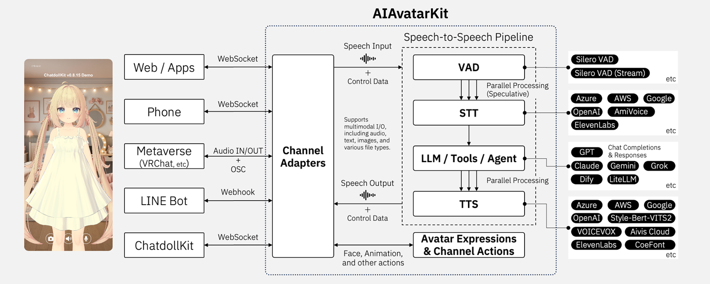
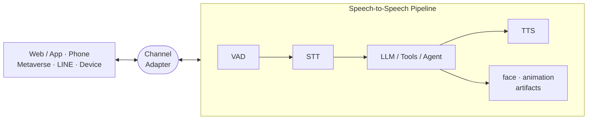

# AIAvatarKit

🥰 Building AI-based conversational avatars lightning fast ⚡️💬




## 💎 What your avatar can be

- **Talking avatars in your app** — a character in your web or mobile app that speaks, reacts with expressions and animations
- **Interactive signage and virtual store staff** — reception, wayfinding, and product guidance that answers out loud while putting images and UI on the screen
- **Companion devices** — Raspberry Pi, M5Stack, StackChan, and other hardware; add voice conversation to anything
- **Metaverse AI avatars** — conversational characters on VRChat, cluster, and Vket Cloud
- **Phone operators** — inbound and outbound calls handled through Twilio or Asterisk
- **Multi-channel AI assistants** — one assistant your users reach through whichever channel fits the moment


## ✨ Features

- **⚡️ Ultra-low latency** — streaming and parallel throughout the pipeline, even running STT speculatively and giving a spoken nod before the answer itself. **&lt;1s** from end of speech to first audio, measured.

- **🧩 Modular architecture** — VAD, STT, LLM, and TTS are swappable parts: popular providers are built in, and a small interface covers the rest. A more natural voice or a smarter model ships — your avatar levels up with it.

- **🦜 AI Agent native** — tool calls and MCP, of course. Tools load only when needed, so a large catalog never confuses the model, and slow ones never stall the conversation: background execution, or a reply straight from a template.

- **🥳 Multimodal and expressive** — accepts speech, text, images, and files; replies with voice, facial expressions, animations, and on-screen artifacts. A chart or a map appears just as the avatar mentions it.

- **🌐 Omnichannel** — web, phone, LINE, metaverse, and local devices all run off one pipeline, and the conversation follows the user rather than the channel: hang up the phone, open LINE, and it is still there.

- **📦 Ready for production** — Admin Panel for config, logs, metrics, and evaluation, plus Langfuse tracing. Retune a running pipeline without restarting. Guardrails run in parallel and can interrupt the avatar mid-sentence to correct what it just said.


## 🚀 Quick start

**Requirements**: Python 3.11+, an OpenAI API key, and a reachable VOICEVOX-compatible server at its default URL.

Install AIAvatarKit.

```sh
pip install aiavatar
```

Start the built-in default application.

```sh
export OPENAI_API_KEY=sk-xxx
aiavatar
```

The built-in application uses Namo Turn semantic VAD. When its optional dependencies are missing, the command asks whether to install them:

```text
Additional dependencies are required to enable Semantic VAD. Install them now? [y/N]:
```

Answer `y` to install `aiavatar[namo-turn]` into the current Python environment and continue startup automatically. Answer `n` to start without the Namo Turn gate; Silero VAD and the filler gate remain enabled.

Open http://127.0.0.1:8000/ and enjoy the conversation! The Admin Panel is available at http://127.0.0.1:8000/admin/.

Or, write your own application script when you need full, fine-grained control over components, routes, and application lifecycle. Save the following as `run.py`.

```python
import os

from fastapi import FastAPI
from fastapi.staticfiles import StaticFiles
from aiavatar.adapter.websocket.server import AIAvatarWebSocketServer
from aiavatar.admin import setup_admin_panel
from aiavatar.util import download_example

# Download example UI if not exists
html_dir = download_example("websocket/html")

# Build Speech-to-Speech pipeline with WebSocket adapter
aiavatar_app = AIAvatarWebSocketServer(
    openai_api_key=os.environ["OPENAI_API_KEY"]
)

app = FastAPI()
app.include_router(aiavatar_app.get_websocket_router())

# Admin panel (optional)
setup_admin_panel(app, adapter=aiavatar_app)

# Serve the UI at "/". This catch-all mount must come after the routes above.
app.mount("/", StaticFiles(directory=html_dir, html=True), name="ui")
```

Start the server. Don't forget to launch VOICEVOX beforehand.

```sh
python -m uvicorn run:app
```

Same URLs as before: http://127.0.0.1:8000/ for the avatar, `/admin/` for the Admin Panel.

See [Getting started](documents/getting-started.md) for the CLI options, script mode, and every setting of the built-in application.

**NOTE:** If the steps in technical blogs don't work as expected, the blog may be based on a version prior to v0.6. Some features may be limited, but you can try downgrading with `pip install aiavatar==0.5.8` to match the environment described in the blog.


## 🔭 Architecture

A single `STSPipeline` turns what the user says into what the avatar says and does. Each stage is a replaceable module, and each stage streams into the next.


```mermaid
flowchart LR
    CH["Web / App · Phone<br/>Metaverse · LINE · Device"]
    AD(["Channel<br/>Adapter"])
    CH <--> AD
    AD <--> STS
    subgraph STS ["Speech-to-Speech Pipeline"]
        direction LR
        VAD --> STT --> LLM["LLM / Tools / Agent"] --> TTS
        LLM --> ACT["face · animation<br/>artifacts"]
    end
```

An **Adapter** wraps the pipeline for one channel — WebSocket, HTTP, telephony, messaging — and owns only transport concerns. Multiple adapters can attach to the same pipeline instance, so a user can move between channels within one conversation.

Every component is a swappable module, and these are the implementations that ship with it:

| Component | Services |
| --- | --- |
| **Voice Activity Detection** | [Silero VAD](documents/vad.md#silero-speech-detector) · [Silero VAD (streaming)](documents/vad.md#silero-stream-speech-detector) · [Azure Speech](documents/vad.md#azure-stream-speech-detector) · [Amazon Transcribe](documents/vad.md#aws-stream-speech-detector) · [Parapper](documents/vad.md#parapper-stream-speech-detector) · [volume threshold](documents/vad.md#standard-speech-detector-legacy) |
| **Turn-end gates** (semantic VAD) | [Smart Turn](documents/vad-turn-end.md#smart-turn-gate) · [Namo Turn](documents/vad-turn-end.md#namo-turn-gate) · [filler-only](documents/vad-turn-end.md#filler-only-gate) · [LLM-based](documents/vad-turn-end.md#llm-turn-gate) · [session hold](documents/vad-turn-end.md#session-hold-gate) · [custom](documents/vad-turn-end.md#custom-gate) |
| **Speech-to-Text** | [Azure Speech](documents/stt.md#azure-speech) · [Google Cloud Speech-to-Text](documents/stt.md#google-cloud-speech-to-text) · [OpenAI](documents/stt.md#openai) · [AmiVoice](documents/stt.md#amivoice), and any OpenAI-compatible endpoint |
| **LLM** | [OpenAI Chat Completions](documents/llm-chat-completions.md) · [Azure OpenAI](documents/llm-chat-completions.md#azure-openai) · [OpenAI Responses API](documents/llm-responses.md) · [Anthropic Claude](documents/llm-claude.md) · [Google Gemini](documents/llm-gemini.md) · [xAI Grok](documents/llm-openai-compatible.md#xai-grok) · [OpenRouter](documents/llm-openai-compatible.md#openrouter) · [LM Studio](documents/llm-openai-compatible.md#lm-studio) · [Dify](documents/llm-dify.md) · [LiteLLM](documents/llm-litellm.md) |
| **Text-to-Speech** | [VOICEVOX](documents/tts.md#voicevox) · [AivisSpeech](documents/tts.md#voicevox) · [Azure](documents/tts.md#azure) · [Google](documents/tts.md#google) · [OpenAI](documents/tts.md#openai) · [VOISONA](documents/tts.md#voisona) · [SpeechGateway](documents/tts.md#speechgateway) · [Style-Bert-VITS2](documents/tts-instant.md#style-bert-vits2) · [Aivis Cloud API](documents/tts-instant.md#aivis-cloud-api) · [ElevenLabs](documents/tts-instant.md#elevenlabs) · [Kotodama](documents/tts-instant.md#kotodama) · [CoeFont](documents/tts-instant.md#coefont) · [Amazon Polly](documents/tts-instant.md#amazon-polly) · [COEIROINK](documents/tts-instant.md#coeiroink) |
| **Channels** | [WebSocket](documents/adapters-websocket.md) · [HTTP (SSE)](documents/adapters-http.md) · [LINE Bot](documents/adapters-linebot.md) · [Twilio Voice and SMS](documents/adapters-twilio.md) · [Asterisk](documents/adapters-asterisk.md) · [OpenAI-compatible endpoint](documents/adapters-chatcompletions.md) · [speech recognition only](documents/adapters-stt-server.md) |

Between **OpenRouter** and **LiteLLM**, practically any commercially available model — GPT, Claude, Gemini, Grok, Llama, Qwen, DeepSeek, Mistral, and others — can be used without writing an integration.

Any TTS service that exposes an HTTP endpoint can be added the same way, without writing a synthesizer class. Several of the services above are supported exactly like that.


## 🍳 Recipes

### Use a different LLM

```python
from aiavatar.sts.llm.claude import ClaudeService

llm = ClaudeService(
    anthropic_api_key=ANTHROPIC_API_KEY,
    model="claude-sonnet-4-5",
    system_prompt="You are my cat.",
)

aiavatar_app = AIAvatarWebSocketServer(
    llm=llm,
    openai_api_key=OPENAI_API_KEY,  # still used for STT
)
```

Or reach any model through an OpenAI-compatible endpoint such as OpenRouter:

```python
from aiavatar.sts.llm.chatgpt import ChatGPTService

llm = ChatGPTService(
    openai_api_key=OPENROUTER_API_KEY,
    base_url="https://openrouter.ai/api/v1",
    model=OPENROUTER_MODEL,
    system_prompt="You are my cat.",
)
```

→ [LLM guide](documents/llm.md)

### Use a different voice

```python
from aiavatar.sts.tts.voicevox import VoicevoxSpeechSynthesizer

# AivisSpeech exposes a VOICEVOX-compatible API
tts = VoicevoxSpeechSynthesizer(
    base_url="http://127.0.0.1:10101",
    speaker="888753761",  # Anneli
    cache_dir="./tts_cache/aivisspeech",
)

aiavatar_app = AIAvatarWebSocketServer(tts=tts, openai_api_key=OPENAI_API_KEY)
```

Or wrap any HTTP TTS endpoint without writing a class:

```python
from aiavatar.sts.tts import create_instant_synthesizer

tts = create_instant_synthesizer(
    method="POST",
    url=f"https://api.elevenlabs.io/v1/text-to-speech/{voice_id}",
    headers={"xi-api-key": ELEVENLABS_API_KEY},
    params={"output_format": "wav_16000"},   # Query parameter, not body
    json={
        "text": "{text}",  # Placeholder for processed text
        "model_id": "eleven_v3",
    },
)
```

→ [TTS guide](documents/tts.md)

### Give the avatar a tool

```python
weather_tool_spec = {
    "type": "function",
    "function": {
        "name": "get_weather",
        "description": "Get the current weather and forecast for a location",
        "parameters": {
            "type": "object",
            "properties": {"location": {"type": "string"}},
            "required": ["location"],
        },
    },
}

@aiavatar_app.sts.llm.tool(weather_tool_spec)
async def get_weather(location: str):
    return await weather_api(location=location)
```

`@llm.tool()` stores the spec as given, so it must already be in that provider's format.
To write one spec and use it anywhere, register through `add_tool()` instead — it converts
between the Chat Completions, Gemini, and Claude shapes for you:

```python
from aiavatar.sts.llm import Tool

aiavatar_app.sts.llm.add_tool(
    Tool("get_weather", weather_tool_spec, get_weather)
)
```

→ [Tools guide](documents/tools.md)

### Connect an MCP server

```python
from contextlib import asynccontextmanager

from fastapi import FastAPI
from aiavatar.sts.llm.tools.mcp import StreamableHttpMCP

mcp = StreamableHttpMCP(url=MCP_URL)
mcp.for_each_tool = aiavatar_app.sts.llm.add_tool

@asynccontextmanager
async def lifespan(app: FastAPI):
    try:
        await mcp.initialize()   # Connects and registers the server's tools
        yield
    finally:
        await mcp.close()

app = FastAPI(lifespan=lifespan)
app.include_router(aiavatar_app.get_websocket_router())
```

`for_each_tool` is the callback; `initialize()` is what connects to the server and runs it.
Setting the callback alone registers nothing.

→ [MCP guide](documents/tools-mcp.md)

### Assemble the whole pipeline

Every stage chosen explicitly: Azure for recognition, streaming Silero for turn detection,
GPT for generation, and Aivis Cloud for the voice.

```python
import os

from fastapi import FastAPI
from aiavatar.sts import STSPipeline
from aiavatar.sts.stt.azure import AzureSpeechRecognizer
from aiavatar.sts.vad.stream import SileroStreamSpeechDetector
from aiavatar.sts.llm.openai_responses_websocket import OpenAIResponsesWebSocketService
from aiavatar.sts.tts import AudioConverter, create_instant_synthesizer
from aiavatar.adapter.websocket.server import AIAvatarWebSocketServer

# Speech-to-Text
stt = AzureSpeechRecognizer(
    azure_api_key=os.environ["AZURE_API_KEY"],
    azure_region=os.environ["AZURE_REGION"],
    language="ja-JP",
)

# Voice activity detection, recognizing segments while the user is still speaking
vad = SileroStreamSpeechDetector(
    speech_recognizer=stt,
    silence_duration_threshold=0.5,
    segment_silence_threshold=0.2,
)

# LLM
llm = OpenAIResponsesWebSocketService(
    openai_api_key=os.environ["OPENAI_API_KEY"],
    model="gpt-5.6-terra",
    system_prompt="You are my cat.",
    reasoning_effort="none",
)

# Text-to-Speech, wrapping the Aivis Cloud HTTP endpoint
tts = create_instant_synthesizer(
    method="POST",
    url="https://api.aivis-project.com/v1/tts/synthesize",
    headers={
        "Content-Type": "application/json",
        "Authorization": f"Bearer {os.environ['AIVIS_API_KEY']}",
    },
    json={
        "model_uuid": "22e8ed77-94fe-4ef2-871f-a86f94e9a579",   # Kohaku
        "text": "{text}",
    },
    response_parser=AudioConverter().convert,
)

# The pipeline owns the conversation; the adapter owns the transport
sts = STSPipeline(vad=vad, stt=stt, llm=llm, tts=tts)

aiavatar_app = AIAvatarWebSocketServer(sts=sts)

app = FastAPI()
app.include_router(aiavatar_app.get_websocket_router())
```

Aivis Cloud returns encoded audio, so `AudioConverter().convert` transcodes it — that path
shells out to `ffmpeg`, which must be installed separately.

The recognizer is passed twice on purpose. `SileroStreamSpeechDetector` uses it to transcribe
segments mid-utterance, and the pipeline keeps it for requests that arrive as audio rather
than as already-recognised text.

→ [Pipeline guide](documents/pipeline.md)

### Serve two channels from one pipeline

Take the `sts` built above and hand the same instance to every adapter. One conversation,
one set of components, several ways in.

```python
from aiavatar.adapter.websocket.server import AIAvatarWebSocketServer
from aiavatar.adapter.linebot.server import AIAvatarLineBotServer

websocket_adapter = AIAvatarWebSocketServer(
    sts=sts,
    channel="websocket",
)

line_adapter = AIAvatarLineBotServer(
    sts=sts,
    channel_access_token=os.environ["LINEBOT_CHANNEL_ACCESS_TOKEN"],
    channel_secret=os.environ["LINEBOT_CHANNEL_SECRET"],
    api_key=os.environ["LINEBOT_ADMIN_API_KEY"],
    channel="linebot",
)

app.include_router(websocket_adapter.get_websocket_router(path="/ws"))
app.include_router(line_adapter.get_api_router(), prefix="/line")
```

Sharing the pipeline shares its components and its conversation storage. To have the *same
person* resume their conversation when they switch channels, add a channel context bridge.

→ [Adapters guide](documents/adapters.md)


## 📚 Documentation

### 🚀 Start here

- [Getting started](documents/getting-started.md)
    - Built-in application — the `aiavatar` command, `.env` settings, Admin Panel, script mode
    - Configuration — OpenAI and LLM configuration, per-component API keys and base URLs, built-in TTS routing
- [Pipeline](documents/pipeline.md)
    - Turn lifecycle — sessions, contexts, and users, request merging, timestamp insertion
    - Queueing — invoke queue, invoke modes, per-request behavior
    - Opening moves — wake word, quick response, QuickResponderPro
    - Hooks and records — request validation, custom behavior, performance recording, voice recording

### 🎙️ Voice Activity Detection

- [Speech detector (VAD)](documents/vad.md)
    - Detectors — Silero, Silero streaming, Azure Stream, AWS Amazon Transcribe Stream, Parapper, standard volume threshold (legacy)
    - Tuning — pre-roll buffer, muting and barge-in, minimum and maximum duration
    - Callbacks — segment recognition, text validation, `on_recording_started`, custom trigger conditions, custom detectors
- [Semantic turn end](documents/vad-turn-end.md)
    - Gates — Smart Turn, Namo Turn, filler-only, LLM turn gate, session hold, custom gates
    - Coordination — turn-end gate manager, wait timeouts, background gates
- [Audio filters](documents/vad-filters.md) — AGC, high-shelf EQ, near-field gate, session audio recorder

### 👂 Speech-to-Text

- [Speech-to-Text](documents/stt.md)
    - Providers — [Azure Speech](documents/stt.md#azure-speech) · [Google Cloud Speech-to-Text](documents/stt.md#google-cloud-speech-to-text) · [OpenAI](documents/stt.md#openai) · [AmiVoice](documents/stt.md#amivoice) · any OpenAI-compatible endpoint
    - Hooks — audio preprocessing, text postprocessing
    - Speakers — speaker diarization, main speaker gate, speaker registry
    - Per-session STT switching — batch VAD, stream VAD

### 🎓 LLM

- [LLM](documents/llm.md)
    - Services — [OpenAI Chat Completions](documents/llm-chat-completions.md) · [Azure OpenAI](documents/llm-chat-completions.md#azure-openai) · [OpenAI Responses API](documents/llm-responses.md) · [Responses over WebSocket](documents/llm-responses.md#websocket-transport) · [Anthropic Claude](documents/llm-claude.md) · [Google Gemini](documents/llm-gemini.md) · [Dify](documents/llm-dify.md) · [LiteLLM](documents/llm-litellm.md)
    - [OpenAI-compatible APIs](documents/llm-openai-compatible.md) — [Anthropic Claude](documents/llm-openai-compatible.md#anthropic-claude) · [Google Gemini](documents/llm-openai-compatible.md#google-gemini) · [xAI Grok](documents/llm-openai-compatible.md#xai-grok) · [OpenRouter](documents/llm-openai-compatible.md#openrouter) · [LM Studio](documents/llm-openai-compatible.md#lm-studio)
    - Response shaping — [text splitting](documents/llm.md#shared-behaviour), [voice text tags](documents/llm.md#voice-text-tag-think-before-answering), [inline LLM parameters](documents/llm.md#inline-llm-parameters), [system prompt parameters](documents/llm.md#system-prompt-parameters)
    - Hooks — [LLM error handling](documents/llm.md#llm-error-handling), [custom chat logging](documents/llm.md#custom-chat-logging)
- [Guardrail](documents/guardrail.md) — blocking and correcting guardrails, block and replace actions, interrupting speech mid-answer, warn-only guardrails, parallel evaluation

### 🦜 Agent and tools

- [Tools](documents/tools.md)
    - Tool call — spec formats, `@llm.tool` versus `add_tool`, one definition across GPT, Gemini, and Claude
    - Long-running work — streaming progress, background tool execution, background timeout
    - Direct output — tool response formatter, continuing tool chains with `continue_chain`, structured content for the client
    - Dynamic tool call — registering dynamic tools, system prompt setup, custom tool repository, supported services
- [Built-in tools](documents/tools-builtin.md)
    - Tools — web search (OpenAI, Gemini, Grok), web scraper, image generation
    - OpenClaw and Hermes — push and polling delivery, progress tracking, report channel routing, per-user configuration, custom harnesses
- [MCP](documents/tools-mcp.md) — Streamable HTTP servers, stdio servers, authentication headers, tool filtering

### 🗣️ Text-to-Speech

- [Text-to-Speech](documents/tts.md)
    - Providers — [VOICEVOX and AivisSpeech](documents/tts.md#voicevox) · [Azure](documents/tts.md#azure) · [Google](documents/tts.md#google) · [OpenAI](documents/tts.md#openai) · [VOISONA](documents/tts.md#voisona) · [SpeechGateway](documents/tts.md#speechgateway)
    - Delivery — [TTS routing](documents/tts.md#tts-routing), [TTS caching](documents/tts.md#tts-caching), [adjusting speech speed](documents/tts.md#adjusting-speech-speed), [style control](documents/tts.md#style-control), [audio format conversion](documents/tts.md#audio-format-conversion)
- [Instant TTS](documents/tts-instant.md) — wrapping any HTTP endpoint without writing a class; custom request makers and response parsers
    - Recipes — [Style-Bert-VITS2](documents/tts-instant.md#style-bert-vits2) · [ElevenLabs](documents/tts-instant.md#elevenlabs) · [Aivis Cloud API](documents/tts-instant.md#aivis-cloud-api) · [Kotodama](documents/tts-instant.md#kotodama) · [CoeFont](documents/tts-instant.md#coefont) · [Amazon Polly](documents/tts-instant.md#amazon-polly) · [COEIROINK](documents/tts-instant.md#coeiroink)
- [TTS preprocessing](documents/tts-preprocessing.md) — alphabet to katakana conversion, pattern match conversion, creating custom preprocessors, combining preprocessors, persisting the kana map

### 🥳 Avatar and character

- [Avatar control](documents/avatar.md) — face expressions and animations, `AvatarControlRequest`, control tags, browser and Python clients
- [Artifacts](documents/artifacts.md) — images, charts, slides, YouTube, sandboxed web apps, Google maps and directions, artifact catalog, URL validation
- [Vision](documents/vision.md) — vision tags, `get_image_url`, sending camera or screen images with a request
- [Character](documents/character.md)
    - Character service — character prompts, weekly and daily schedules, diaries, automated daily updates, batch generation
    - Integration — binding to an adapter, long-term memory
    - CharacterLoader — single file mode, directory mode, hot reload, custom user name resolution, custom message formatting
- [Long-term memory](documents/memory.md) — ChatMemory, `MemorySearchTool`, shared context

### 🌐 Channels

- [Adapters](documents/adapters.md) — choosing an adapter, connecting multiple channels, sharing context across channels, channel-aware processing, per-adapter control tags
- [WebSocket](documents/adapters-websocket.md) — wire protocol, browser and Python clients, connection and disconnection handling
- [HTTP (SSE)](documents/adapters-http.md) — streaming chat API, Dify-compatible `/chat-messages` endpoint, standalone STT and TTS endpoints
- [LINE Bot](documents/adapters-linebot.md) — webhooks, supported messages, push messages, customization hooks
- [Twilio](documents/adapters-twilio.md) — Voice over Media Streams, outbound calls, SMS, protecting the action endpoints
- [Asterisk](documents/adapters-asterisk.md) — ARI call control, media WebSocket, transfer strategies, call lifecycle
- [OpenAI-compatible endpoint](documents/adapters-chatcompletions.md) · [Speech recognition server](documents/adapters-stt-server.md)

### 💻 Environment

- [Database](documents/database.md) — SQLite and PostgreSQL, shared pool provider, conversation context, session state, performance records, speaker registry, channel context bridge
- [Platforms and devices](documents/platforms.md) — VRChat face expression and animation over OSC, Raspberry Pi, audio device selection

### 🎛️ Operations

- [Administration](documents/admin.md) — Admin Panel, admin REST API, observability with Langfuse
- [Evaluation](documents/evaluation.md) — scenario-based dialog evaluation, file-based evaluation, configuration options, the Config API, logic-based evaluation

### 🔖 Reference

- [Migration guide](documents/migration.md) — v0.6.x to v0.7.0 and later
- [examples/](examples/) — WebSocket browser UI, local client, Twilio, Asterisk, speech recognition server


## ⚖️ License

Apache License 2.0. See [LICENSE](LICENSE).
