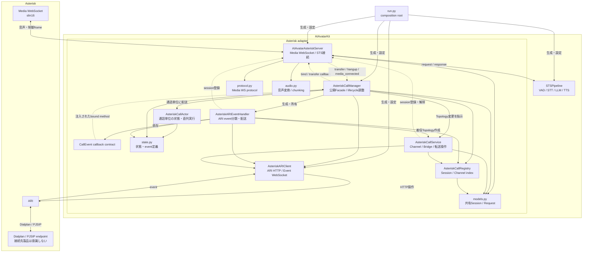
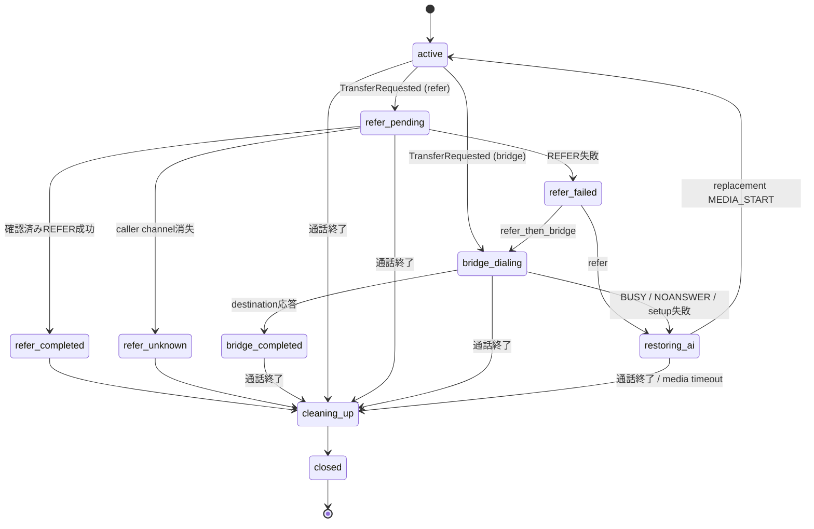

# Asterisk adapter

[English](README.md) | 日本語

AIAvatarKitを、JSON Media WebSocket制御と`transport_data`を備えたAsteriskへ接続する
アダプターです。対応する最小バージョンは20.x系の20.18、22.x系の22.8、23.x系の23.2で、
それ以降のbranchでも同機能を前提とします。21.xと23.0-23.1は対象外です。Asteriskが
SIP/RTPを終端し、AIAvatarKitは次の2経路でAsteriskと通信します。

- ARI REST API / Event WebSocket: 応答、チャネル、Bridge、転送、切断の制御
- Asterisk Media WebSocket: 16 kHz signed linear PCM（`slin16`）とJSON制御イベント

このアダプターはSIPサーバーではありません。SIPトランク、電話番号、NAT、
コーデック、REFER先のURI変換などはAsterisk側で構成してください。

## クイックスタート

### 前提

- Python 3.11以降
- `chan_websocket`、PJSIP、ARI、JSON Media WebSocket制御、`transport_data`、
  HTTP/WebSocketが利用できるAsterisk 20.18+、22.8+、23.2+、またはそれ以降のbranch
- AsteriskからAIAvatarKitのMedia WebSocketへ到達できること
- AIAvatarKitからAsteriskのARIへ到達できること
- 構成したSTT、LLM、TTSを利用するための認証情報とネットワーク接続

開発用のAsterisk設定例は
[`examples/asterisk`](../../../examples/asterisk/)にあります。少なくとも次の設定を
環境に合わせて変更してください。

- `ari.conf.example`: ARIユーザー
- `http.conf.example`: 閉域network用ARI HTTP/HTTPS listener
- `websocket_client.conf.example`: AsteriskからAIAvatarKitへのMedia WebSocket
- `extensions.conf.example`: 着信時の`Stasis()`とREFER用dialplan
- `pjsip.conf.example`: SIPトランクと接続先endpoint

### アプリケーション

以下を`run.py`として保存します。実際のSTT、LLM、TTSの設定は利用する
`STSPipeline`に合わせて追加してください。

```python
import os
from contextlib import asynccontextmanager

from fastapi import FastAPI

from aiavatar.adapter.asterisk import (
    AIAvatarAsteriskServer,
    AsteriskARIClient,
    AsteriskCallManager,
)
from aiavatar.sts.pipeline import STSPipeline
from aiavatar.sts.stt.openai import OpenAISpeechRecognizer


pipeline = STSPipeline(
    stt=OpenAISpeechRecognizer(
        openai_api_key=os.environ["OPENAI_API_KEY"],
    ),
    llm_openai_api_key=os.environ["OPENAI_API_KEY"],
)

asterisk = AIAvatarAsteriskServer(
    sts=pipeline,
    tts_sample_rate=int(os.getenv("AIAVATAR_TTS_SAMPLE_RATE", "24000")),
    api_username=os.environ["AIAVATAR_MEDIA_USERNAME"],
    api_password=os.environ["AIAVATAR_MEDIA_PASSWORD"],
)

ari = AsteriskARIClient(
    base_url=os.environ["ASTERISK_ARI_BASE_URL"],
    username=os.environ["ASTERISK_ARI_USERNAME"],
    password=os.environ["ASTERISK_ARI_PASSWORD"],
)

call_manager = AsteriskCallManager(
    adapter=asterisk,
    ari_client=ari,
    bridge_endpoint=os.getenv("ASTERISK_BRIDGE_ENDPOINT"),
    external_media_host=os.getenv(
        "ASTERISK_MEDIA_CONNECTION",
        "aiavatarkit-media",
    ),
    transfer_destinations={
        "operator": os.getenv("OPERATOR_EXTENSION", "1234"),
    },
    transfer_strategy=os.getenv("ASTERISK_TRANSFER_STRATEGY", "refer"),
    refer_timeout=float(os.getenv("ASTERISK_REFER_TIMEOUT", "30")),
    media_start_timeout=float(
        os.getenv("ASTERISK_MEDIA_START_TIMEOUT", "10")
    ),
)


@asynccontextmanager
async def lifespan(app: FastAPI):
    await call_manager.start()
    try:
        yield
    finally:
        # ARIリソースを解放してからpipelineを停止する。
        await call_manager.close()
        await pipeline.shutdown()


app = FastAPI(lifespan=lifespan)
app.include_router(asterisk.get_router(path="/asterisk/media"))
```

環境変数の例です。実値をソースコードやリポジトリへ保存しないでください。

```sh
export OPENAI_API_KEY=CHANGE_ME
export AIAVATAR_MEDIA_USERNAME=aiavatarkit
export AIAVATAR_MEDIA_PASSWORD=CHANGE_ME
export ASTERISK_ARI_BASE_URL=https://asterisk.internal:8089/ari
export ASTERISK_ARI_USERNAME=aiavatar
export ASTERISK_ARI_PASSWORD=CHANGE_ME
export ASTERISK_MEDIA_CONNECTION=aiavatarkit-media
# bridge / refer_then_bridgeを使う場合のみ設定
export ASTERISK_BRIDGE_ENDPOINT=operator-trunk
export ASTERISK_TRANSFER_STRATEGY=refer
export ASTERISK_REFER_TIMEOUT=30
export ASTERISK_MEDIA_START_TIMEOUT=10
```

起動します。

```sh
python -m uvicorn run:app --host 0.0.0.0 --port 18080
```

AsteriskのWebSocket clientのURIを、上記アプリケーションの
`/asterisk/media`へ向けます。Asteriskから接続するときは`media`サブプロトコルを
指定し、Basic認証のユーザー名とパスワードを`AIAvatarAsteriskServer`の設定に
合わせてください。

### 転送・終話をAI応答から要求する

AI応答に次のcontrol tagを含めると、読み上げ音声の再生完了後に操作されます。

```xml
<operation name="transfer" destination="operator" />
```

```xml
<operation name="hangup" />
```

`structured_content`も利用できます。

```json
{
  "operation": {
    "name": "transfer",
    "destination": "operator"
  }
}
```

`destination`は電話番号やSIP URIではなく、`transfer_destinations`に事前登録した
aliasです。転送先extensionは数字のみ受け付けます。Python側のallowlistと
Asteriskの`aiavatar-transfer` contextのallowlistを一致させてください。

### オペレーターへ会話キーを渡す

`on_transfer_prepare`はARIで転送を始める直前に1回呼ばれます。LLM出力ではなく、
adapterが保持している信頼済みのconversation keyを使ってAsterisk channel変数を追加
できます。

```python
from aiavatar.adapter.asterisk import (
    AsteriskSessionData,
    AsteriskTransferRequest,
)


@asterisk.on_transfer_prepare
async def prepare_operator_handoff(
    request: AsteriskTransferRequest,
    session: AsteriskSessionData,
) -> None:
    # session_idはAIAVATAR_SESSION_IDとして常に渡される。
    request.variables["AIAVATAR_USER_ID"] = request.user_id
    if request.context_id:
        request.variables["AIAVATAR_CONTEXT_ID"] = request.context_id

    # 会話履歴を共有storeへ保存する場合は、ここで生成・保存したopaqueなkeyを渡す。
    # request.variables["AIAVATAR_HANDOFF_ID"] = handoff_id
```

`request`には次が入ります。

- `session_id`: ユーザー実装へ公開される、通話中不変のAsterisk call session ID
- `user_id`: session開始hookで確定したuser ID。未設定時は発信者番号またはsession ID
- `context_id`: STSPipelineのresponseで最後に確認したconversation context ID
- `destination_alias`: `operator`などの許可済みalias
- `destination`: aliasを解決した数字のみのextension
- `transfer_strategy`: `refer`、`bridge`、`refer_then_bridge`
- `variables`: ユーザー実装が追加できるAsterisk channel変数

`request`と`session`はいずれもmutableなdataclassです。このhookは値を返さず、
`request.variables`をin-placeで編集します。同じ変数名を代入すれば、その時点で
`variables`に入っている値を上書きできます。hook完了時にadapterが辞書をcopyするため、
転送開始後に元の辞書を変更しても転送内容には反映されません。

現在、転送処理への出力として採用される`request`のfieldは`variables`だけです。
`destination`や`transfer_strategy`などはhookが判断するためのsnapshotであり、書き換えても
実際の転送先や方式は変わりません。`session`は通話中の`AsteriskSessionData`そのもので、
caller情報、channel ID、転送状態などを参照できます。アプリケーション固有の一時状態を
同じ通話に保持する場合は、manager管理fieldではなく`session.data`を利用してください。

変数はREFERではcaller channelへ、bridgeではARIで作るoutbound channelへ設定されます。
これはSIP headerそのものではありません。Asterisk/Avaya側で、必要に応じて
`PJSIP_HEADER()`のpre-dial handler、User-to-User、Refer-To parameterなどへ変換して
ください。Asterisk公式ドキュメントもoutbound PJSIP channelへheaderを付ける場合は
[pre-dial handlerの利用](https://docs.asterisk.org/Latest_API/API_Documentation/Dialplan_Functions/PJSIP_HEADER/)
を案内しています。

変数名は大文字英数字とunderscoreのみ、最大64文字、最大32件です。値は改行とNULを
含まない最大1024文字の文字列です。managerが使う`AIAVATAR_SESSION_ID`、転送先、
caller identity関連の変数は上書きできません。hookが例外を送出するか検証に失敗すると、
転送は開始されず`on_transfer_failed(..., "transfer_prepare_failed")`が呼ばれます。
予約変数はhook後にmanagerが確定するため、`session`を直接編集して回避することは
callback契約に含まれません。

SIPへ会話全文を入れず、短命で推測困難な`handoff_id`だけを送り、オペレーター側が共有
storeから会話を取得する構成を推奨します。

## 詳細な設定

### `AIAvatarAsteriskServer`

Media WebSocketとSTSPipelineの境界を担当します。

| 引数 | デフォルト | 説明 |
|---|---:|---|
| `sts` | 必須 | 利用する`STSPipeline`。 |
| `tts_sample_rate` | `24000` | TTSがraw PCMを返す場合の入力sample rate。PCM WAVの場合はWAVヘッダーの値が優先されます。出力は16 kHzへ変換されるため、TTSを16 kHzにしても、それ以外の対応sample rateを使っても構いません。 |
| `mute_on_barge_in` | `True` | ユーザー発話検出時に`FLUSH_MEDIA`を送り、再生中のAI音声を停止します。 |
| `channel` | `"phone"` | STSリクエストへ設定するchannel名。 |
| `api_username` | `None` | Media WebSocketのBasic認証ユーザー名。passwordと同時に設定します。 |
| `api_password` | `None` | Media WebSocketのBasic認証パスワード。usernameと同時に設定します。 |
| `media_chunk_duration_ms` | `100` | AI音声を送るBINARY messageの目標時間。Asteriskの`optimal_frame_size`へ整列されます。 |
| `media_flow_timeout` | `10.0` | `MEDIA_XOFF`中に送信再開を待つ最大秒数。超過した音声は送信せず、`MEDIA_XON`後の新しい音声から再開します。 |
| `max_media_message_size` | `65500` | 受信・送信する音声BINARY messageの最大bytes。 |
| `debug` | `False` | 最後の変換済みレスポンスを`last_response`へ保持し、詳細ログを有効にします。 |

汎用`set_config()`から変更できるのは`get_config()`が返す
`tts_sample_rate`、`media_chunk_duration_ms`、`media_flow_timeout`、`debug`です。

主なcallbackは次のとおりです。

```python
from aiavatar.adapter.asterisk import (
    AsteriskSessionData,
    AsteriskTransferRequest,
)


@asterisk.on_connect
async def on_connect(request, session):
    ...

@asterisk.on_disconnect
async def on_disconnect(session):
    ...

@asterisk.on_dtmf
async def on_dtmf(digit, session_id):
    ...

@asterisk.on_transfer_prepare
async def on_transfer_prepare(
    request: AsteriskTransferRequest,
    session: AsteriskSessionData,
) -> None:
    ...

@asterisk.on_transfer_started
async def on_transfer_started(session_id, destination):
    ...

@asterisk.on_transfer_completed
async def on_transfer_completed(session_id, destination, method):
    ...

@asterisk.on_transfer_failed
async def on_transfer_failed(session_id, destination, reason):
    ...

@asterisk.on_transfer_unknown
async def on_transfer_unknown(session_id, destination, reason):
    ...
```

`method`は`refer`または`bridge`です。転送準備・通知callbackは同じ通話のactorからawait
されます。`on_transfer_prepare`の例外は転送を中止します。
`on_transfer_started`、`on_transfer_completed`、`on_transfer_failed`、
`on_transfer_unknown`の例外はログに記録して無視されるため、通知失敗が通話制御を
変更することはありません。`on_transfer_unknown`は、明示的な成功・失敗を観測する前に
caller channelが消えた状態です。`reason`は観測理由であり、転送成功を意味しません。これらのcallbackへ
長時間の同期処理を置かないでください。外部I/Oはasyncにし、重い後続処理は
アプリケーション側で管理するbackground taskやqueueへ渡してください。転送通知callback
から同じsessionの`transfer()`または`hangup()`を呼ばないでください。転送前に同期して
行うアプリケーション処理には`on_transfer_prepare`を使い、通知後の独立処理はcallbackが
戻った後に実行してください。

### `AsteriskARIClient`

ARIのHTTPとEvent WebSocket transportを所有します。通話状態は持ちません。
確定したHTTPエラーは`AsteriskARIError`、HTTP transport障害は
`AsteriskARITransportError`として通知します。これにより転送の再照合では、ARI結果が
未確定な障害とアプリケーションの実装不具合を区別できます。

| 引数 | デフォルト | 説明 |
|---|---:|---|
| `base_url` | 必須 | `/ari`を含むARI base URL。例: `https://asterisk.internal:8089/ari`。 |
| `username` | 必須 | read/write可能なARIユーザー。 |
| `password` | 必須 | ARIパスワード。 |
| `application` | `"aiavatar"` | AsteriskのStasis application名。dialplanの`Stasis()`と一致させます。 |
| `tls_verify` | `True` | ARI HTTPSとARI Event WSSの両方でTLS証明書を検証します。 |
| `reconnect_delay` | `1.0` | ARI Event WebSocket切断後の再接続間隔。完全な状態再同期は行いません。 |
| `startup_timeout` | `10.0` | 起動時にARI Event WebSocket接続を待つ最大秒数。 |
| `http_client` | `None` | テスト・埋め込み用のHTTP client差し替え。通常は指定しません。 |
| `event_connector` | `None` | テスト・埋め込み用のWebSocket connector差し替え。通常は指定しません。 |

### `AsteriskCallManager`

通話ごとのactorと転送ポリシーを所有し、ARI操作を下位コンポーネントへ指示する、
アプリケーション向けのFacadeです。

| 引数 | デフォルト | 説明 |
|---|---:|---|
| `adapter` | 必須 | 対応する`AIAvatarAsteriskServer`。生成時に相互bindされます。 |
| `ari_client` | 必須 | 設定済みの`AsteriskARIClient`。 |
| `bridge_endpoint` | bridgeを使う場合は必須 | bridge転送時に`PJSIP/{extension}@{endpoint}`として使うAsterisk PJSIP endpoint名。`refer`では使用しません。 |
| `transfer_destinations` | 必須 | aliasから数字のみのextensionへのmapping。未登録aliasと任意SIP URIは拒否されます。 |
| `transfer_strategy` | `"refer_then_bridge"` | `refer`、`bridge`、`refer_then_bridge`のいずれか。プロセス単位の固定設定です。 |
| `external_media_host` | `"aiavatarkit-media"` | Asterisk `websocket_client.conf`のsection名。DNS host名ではありません。 |
| `transfer_context` | `"aiavatar-transfer"` | REFERを開始するallowlist済みdialplan context。 |
| `originate_timeout` | `30` | bridge転送先を呼び出す最大秒数としてARI originateへ渡します。 |
| `refer_timeout` | `30.0` | REFERの終端イベントが届かない場合にARIで状態確認を始めるまでの秒数。 |
| `media_start_timeout` | `10.0` | 転送失敗後、再作成したMedia WebSocketの`MEDIA_START`を待つ最大秒数。 |

`call_manager.start()`はARI Event WebSocketの初回接続完了まで待ちます。終了時は
`call_manager.close()`を必ずawaitし、その後でpipelineを停止してください。

通常のアプリケーションが使う操作は`transfer()`と`hangup()`です。
`handle_ari_event(event, wait=True)`は、ARIイベントを外部で取得する埋め込み構成と
決定的なテストのための高度な入口です。通常構成では`AsteriskARIClient`から
`AsteriskARIEventHandler`へ自動的に配送されるため、直接呼び出しません。

Media WebSocketのcodecは`slin16`（16 kHz）固定で、`media` subprotocolは常に必須です。
どちらもAsteriskとのprotocol contractであり、アプリケーション設定では変更できません。

### 転送方式

#### `refer`

1. AI音声の`MEDIA_MARK_PROCESSED`を待つ。
2. AI用Media channelとBridgeを切り離す。
3. caller channelを`transfer_context`の許可済みextensionへ`continue`する。
4. Asteriskのdialplanが`Transfer()`を実行する。
5. `transfer-completed`、`transfer-failed`、またはwatchdogの照合結果で完了を判断する。
   明示的な結果なしのcaller channel消失は`refer_unknown`として分ける。

成功後はAsteriskが通話経路から外れるblind REFERを想定しています。元のcaller
channel消失は通常のcaller切断でも起きるため、成功とはせず`on_transfer_unknown`を
呼びます。そのchannelは制御不能なのでlocal sessionをcleanupします。確認済みの失敗時は
AI mediaを再作成し、`MEDIA_START`確認後に`on_transfer_failed`を呼びます。

watchdog照合では、`SUCCESS`だけを成功、`FAILURE`または`UNSUPPORTED`だけを確認済み失敗
として扱います。空文字列または未知の`TRANSFERSTATUS`はfail-closedとし、bridge fallbackへ
進まず、`unknown_transfer_status`を通知して制御中のcallerを終了します。

`refer_timeout`は`Transfer()`を強制終了するtimeoutではありません。caller channelが
まだStasis外で`Transfer()`を実行中なら、安全でないmedia復旧をせず、Stasisへ戻るか
channelが消えるまで再確認します。Asterisk・接続先PBX側でも呼出時間を有限にして
ください。

HTTP 408以外の確定的なARI 4xx responseはsetup失敗です。一方、transport error、HTTP
408、HTTP 5xxでは、Asteriskがcontinueを受理しresponseだけが失われた可能性があります。
この場合は`refer_pending`を維持し、bridge fallbackより先に同じwatchdogで照合するため、
二重転送を防止できます。プログラムやデータのerrorはtransport failureへ変換せず、通常の
setup失敗経路で処理します。

#### `bridge`

1. AI用Media channelとBridgeを切り離す。
2. callerをholding bridgeへ移動し、Music on Holdを開始する。
3. `PJSIP/{extension}@{bridge_endpoint}`をARIでoriginateする。
4. 応答したdestinationとcallerを新しいmixing bridgeへ接続する。
5. BUSY、NOANSWERなどの場合はdestinationを破棄し、AI mediaを復旧する。

この方式ではAsteriskが通話中継点として残ります。正常な不応答は
`originate_timeout`とARIの`Dial`イベントで検出します。取りこぼしたイベントを
再照合するbridge専用watchdogはありません。

#### `refer_then_bridge`

最初にREFERを試し、`transfer-failed`になった場合だけbridge転送へ移ります。REFERが
未確定のまま時間を超えた場合も、ARI照合で失敗が確認できてからbridgeへ移ります。

転送方式はmanager生成時に固定されます。LLMや転送先aliasごとに動的選択する機構は
ありません。要件ごとにプロセスまたはmanager構成を分けてください。

## 運用上の制約

### ARI Event WebSocket切断時はプロセスを交換する

Event WebSocketは自動再接続しますが、切断中に失ったARIイベントを列挙して通話状態を
完全再同期する機構はありません。再接続後も、切断中にcallerが終了した、bridge転送先が
応答した、channelが破棄された、といった変化を見落とす可能性があります。

本番運用では次を制約としてください。

- ARI Event WebSocketの切断ログを検知したインスタンスは正常復帰扱いせず、
  load balancerから外してプロセスを再起動する。
- そのインスタンスが処理中だった通話の継続は保証せず、切断を許容する。
- graceful shutdownで`call_manager.close()`を実行する。
- ARI RESTへ到達できない障害でも孤立channelが残り続けないよう、Asterisk側に
  `Stasis()`復帰後の`Hangup()`、通話時間上限、障害時のfallbackを設定する。
- 例外を伴う切断では`Asterisk ARI event WebSocket disconnected`ログを監視する。
  正常closeとして見える切断ではこのログが出ない場合があるため、アプリケーションまたは
  外部監視側で`event_connected`を`reconnect_delay`より短い間隔で確認し、一度でも
  `False`になったインスタンスを外部状態として「要交換」にラッチする。

進行中の通話をARI切断後も維持する必要がある場合、この運用制約では不十分です。
ARI再接続後にchannel、bridge、actorを照合する状態同期機構が別途必要です。

監視用endpointはアプリケーション側で公開できます。監視システムはこの値を単なる現在値
として扱わず、1回でも`false`を観測したプロセスを交換対象として記録してください。

```python
@app.get("/health/asterisk")
async def asterisk_health():
    return {"event_connected": call_manager.event_connected}
```

### 1つのStasis applicationを複数managerで同時制御しない

call、channel、actorの状態はプロセスメモリ内にあり、共有ストレージ、分散lock、
leader electionはありません。同じAsteriskの同じ`application`を複数のactive
managerから制御しないでください。水平分割する場合はAsteriskまたはStasis
applicationを分離し、1通話のARIイベントとMedia WebSocketが同じプロセスへ届くように
設計してください。

プロセス再起動後、以前のプロセスが持っていた通話は引き継ぎません。Asterisk側で旧通話を
終了またはfallbackさせ、新しいプロセスは新規`StasisStart`から処理します。

### 同じMedia WebSocket channelを再接続しない

managerが登録したExternal Media channelは、Media WebSocketを1回だけ確立できます。切断後、
同じchannel IDから届く2回目の`MEDIA_START`は拒否します。Asteriskや中継装置で古いmedia
channelを再接続する構成にしないでください。

転送失敗後の復旧は引き続き利用できます。managerが新しいExternal Media channel IDを作成・
事前登録し、その新channelが最初のWebSocketを確立します。予期しないmedia切断は透過的な
継続eventではないため、Asteriskのcall cleanupまたはmanagerによる新channel復旧へ委ねます。

通話中不変の`session_id`を、STS/VAD内部の所有権keyとして再利用しません。managerが作成した
media channelごとに、そのchannel IDをprivateなpipeline session IDとして使います。古い
channelをfinalizeする前にそのprivate routeを外すため、古いchannelの遅延responseやVAD cleanupが
復旧後のchannelを操作・削除することはありません。application callback、transfer、hangupには
引き続き通話中不変の`session_id`を渡します。

### pipeline内の進行中処理は即時キャンセルされない

Media WebSocket切断後、adapterはそのmedia channelのprivateなresponse routeを外し、音声送信を
止め、そのmedia lifecycleのVAD stateをfinalizeします。ただし、すでにpipeline内部で開始された
STT、LLM、TTSのrequestをadapterから強制キャンセルする機構はありません。切断後も外部API
requestが完了し、短時間ログや料金が発生することがありますが、そのresponseが復旧後のmedia
channelへ配送されることはありません。

この制約が許容できない場合は、STSPipeline側にsession単位のキャンセル所有権とAPIを追加
する必要があります。adapterだけでpipeline内部taskを推測してcancelしないでください。

### bridge転送はARIイベントの到達を前提とする

bridge転送の通常のBUSY・NOANSWERはAsteriskの`originate_timeout`と`Dial`イベントで
処理します。ARI Event WebSocket切断中に結果を失った場合のbridge watchdogはありません。
前述の「ARI切断を検知したらプロセス交換」の運用を適用してください。

### REFER先と呼出時間はAsterisk側でも制限する

Python側はaliasと数字のみのextensionをallowlistにしますが、実際のRefer-To URIは
Asteriskのdialplanが生成します。次をAsterisk構築担当者と合意してください。

- `transfer_destinations`と`aiavatar-transfer` contextを同じ宛先一覧にする。
- ユーザー入力、LLM出力、任意SIP URIをdialplanへ直接渡さない。
- Avaya Session Managerなど接続先に合わせてRefer-To domainとURI形式を固定する。
- REFERの呼出・応答待ちが無期限にならないよう、PBX側を含めtimeoutを設定する。
- P-Asserted-Identity、UCID、UUIは信頼済みingressからだけ取得する。

### ネットワークと認証

- ARIはread/write権限を必要とします。管理用の閉域networkへ置き、firewallまたはACLで
  AIAvatarKitプロセスからだけ接続できるようにしてください。
- Media WebSocketはWSSとBasic認証を推奨します。
- 同一の隔離済みLANでBasic認証を省略する場合でも、endpointを外部公開しないでください。
  manager利用時は事前登録済みsession IDとmedia channel IDが照合されますが、これは
  network境界の代替ではありません。
- `tls_verify=False`はローカル検証用途に限定してください。
- proxyを置く場合はWebSocketのBINARY/TEXT frame、`media` subprotocol、Authorization
  header、長時間接続を保持してください。

### 容量とcallback

- 新規着信セットアップはchannelごとのbackground taskで行うため、1件の遅いARI requestが
  Event WebSocket全体を停止させることはありません。一方、着信数のadmission controlは
  adapterにないため、上流で同時通話数を制限してください。
- 通話actorのqueueはライフサイクルイベント専用で、音声frameは通しません。
- transfer callbackは同じ通話のactor上でawaitされます。短時間でreturnさせてください。
- `on_connect`とDTMF callbackはsessionに紐づくtaskとして実行され、切断時にcancel
  されます。cancel可能なasync実装にしてください。

### 監視すべき状態

最低限、次のログと件数を監視してください。

- `Asterisk ARI event WebSocket disconnected`
- `Asterisk AI media restore timed out`
- `Asterisk media remained XOFF beyond ...`
- `Asterisk call cleanup completed with ... failure(s)`
- `Session not found for response (Asterisk)`
- active call数と`transfer_state`別の滞留時間
- REFER、bridgeの成功・失敗・timeout数
- REFERのunknown件数と`on_transfer_unknown`の`reason`別件数
- 外部STT、LLM、TTSのlatency、error、切断後request数

## 詳細なアーキテクチャ

### コンポーネント



実線は生成・所有・コード上の依存、破線は実行時のbindまたはcallbackを表します。
`AsteriskARIEventHandler`は`AsteriskCallManager`そのものではなく、注入された
`CallEvent` callback contractだけに依存します。

| ファイル | 責務 |
|---|---|
| `server.py` | FastAPI Media WebSocket、認証、session照合、音声I/O、callback、操作tag。 |
| `ari_client.py` | ARI HTTP/Event WebSocket接続、認証、再接続、response検証。通話状態は持ちません。 |
| `event_handler.py` | raw ARI event routingと、登録前の着信セットアップtask。 |
| `manager.py` | actor、状態遷移、転送ポリシー、shutdown順序。 |
| `registry.py` | live sessionとcaller/media/destination channelの逆引き索引。同期的に一括更新します。 |
| `service.py` | channel/bridge/media topology、REFER、bridge originate、復旧、best-effort cleanup。 |
| `actor.py` | 1通話のライフサイクルイベントを順序づけるbounded actor queue。 |
| `state.py` | call stateとtyped lifecycle event。 |
| `models.py` | `AIAvatarAsteriskServer`と`AsteriskCallManager`側が共有するsession data。 |
| `protocol.py` | Media WebSocketのJSON event検証とcommand生成。 |
| `audio.py` | PCM WAV/raw PCMの16 kHz mono linear16変換とframe分割。 |

### 着信と双方向音声

図の左から右へ、着信セットアップは次の順に進みます。

1. Asteriskの`Dialplan / PJSIP endpoint`が着信を受け、session ID、着信番号、
   caller identityなどをchannel変数へ保存して`Stasis(aiavatar,inbound)`へ入れます。
2. Asteriskの`ARI`が`StasisStart`を発行し、`AsteriskARIClient`がEvent WebSocketで
   受信します。
3. `AsteriskARIClient`はraw eventを`AsteriskARIEventHandler`へ渡します。
   `AsteriskARIEventHandler`は着信セットアップをchannel単位のtaskとして開始し、
   `AsteriskARIClient`を使ってchannel変数を取得します。
4. `AsteriskARIEventHandler`は`AIAvatarAsteriskServer`へsession登録を依頼します。
   `AIAvatarAsteriskServer`が`models.py`の`AsteriskSessionData`を返すと、
   `AsteriskARIEventHandler`は同じobjectを`AsteriskCallRegistry`にも登録します。以降の
   Media WebSocketとARI call controlは、この共有sessionを通して同じ通話を参照します。
5. `AsteriskARIEventHandler`は`AsteriskCallService`へ通話用Topologyの作成を依頼します。
   `AsteriskCallService`は`AsteriskCallRegistry`へ予想channel IDを先に登録してから、
   `AsteriskARIClient`経由でAsteriskの`ARI`を操作し、callerのanswer、mixing bridge、
   External Media channelを作ります。
6. Asteriskの`Media WebSocket`が`AIAvatarAsteriskServer`へ接続し、最初のTEXT frameで
   `MEDIA_START`を送ります。`AIAvatarAsteriskServer`は事前登録されたsession IDと
   media channel IDを照合して接続を受理します。
7. 発話音声は`Media WebSocket`からBINARY `slin16`として
   `AIAvatarAsteriskServer`へ届き、そのまま16 kHz PCMとして`STSPipeline`へ渡ります。
   音声frameは`AsteriskCallActor`を通りません。
8. `STSPipeline`のSTT、LLM、TTSで生成されたresponse audioは
   `AIAvatarAsteriskServer`へ戻ります。`audio.py`が16 kHz mono linear16へ変換・分割し、
   `protocol.py`が生成する制御frameとともに`Media WebSocket`からAsteriskへ返します。

`AIAvatarAsteriskServer`はAI音声を`START_MEDIA_BUFFERING`と
`STOP_MEDIA_BUFFERING`でまとめ、最後に`MARK_MEDIA`を送ります。Asteriskの
`Media WebSocket`から同じcorrelation IDの`MEDIA_MARK_PROCESSED`が返ると、
その案内音声が再生済みだと判断できます。

`MEDIA_XOFF`中は`AIAvatarAsteriskServer`からの音声送信を停止します。
`media_flow_timeout`を超えるとそのresponseの残りを捨て、`MEDIA_XON`後の新しいresponse
から再開します。古いMedia WebSocketの遅延cleanupが新しい接続を消さないよう、
connectionと`connection_generation`も照合します。音声・MARKのcancelには独立した
`playback_generation`を使うため、barge-inでcallbackの所有世代は変わりません。
adapter自身がTTSを待つ場合は、await前に両方のgenerationを保存し、その間に接続または
再生が失効していれば合成結果を破棄します。STS responseも受信時の接続に属し、
transaction IDがないresponseはactive transactionがない場合だけ受理します。

### AI応答からoperationを開始するまで

終話と転送は共通して、次の入口を通ります。

1. `STSPipeline`のfinal responseが`AIAvatarAsteriskServer`へ返ります。
2. `AIAvatarAsteriskServer`が`operation`を抽出します。案内音声がある場合はoperationを
   sessionへ保留し、`Media WebSocket`から`MEDIA_MARK_PROCESSED`が返るまで待ちます。
   音声がなければ待たずに実行します。
3. `hangup`なら`AIAvatarAsteriskServer`が`AsteriskCallManager.hangup()`を、
   `transfer`なら`AsteriskCallManager.transfer()`を呼びます。アプリケーションがこの2つを
   直接呼び出した場合も、ここから先は同じ経路です。
4. `AsteriskCallManager`はoperationをtyped `CallEvent`へ変換し、通話ごとの
   `AsteriskCallActor`へ配送します。以後のcall controlは音声処理と分離され、同じ通話の
   ARI event、watchdog、operationがactor上で順番に処理されます。

### 終話operation

AIまたはアプリケーションからの終話は、図の
`AIAvatarAsteriskServer → AsteriskCallManager → AsteriskCallActor → AsteriskCallService`
をたどります。

1. `AsteriskCallManager`は`HangupRequested`を`AsteriskCallActor`へ配送します。
2. `AsteriskCallActor`がこの通話の先行eventとの順序を確定し、
   `AsteriskCallManager`がstateを`cleaning_up`へ遷移させます。
3. `AsteriskCallManager`は`AsteriskCallService.cleanup_call()`を呼びます。
4. `AsteriskCallService`は遅延ARI eventの誤配送を防ぐため、最初に
   `AsteriskCallRegistry`からsessionとchannel indexを外します。その後、
   `AsteriskARIClient → ARI`の経路でmedia channel、destination channel、bridge、
   caller channelをbest effortで削除し、`AIAvatarAsteriskServer`のsessionも解除します。
5. cleanup完了後、`AsteriskCallActor`のstateは`closed`になります。

callerまたは転送先が先に切断した場合は逆方向に、
`ARI → AsteriskARIClient → AsteriskARIEventHandler → CallEvent callback contract →
AsteriskCallManager → AsteriskCallActor`と通知されます。その後のcleanup経路は同じですが、
すでに消失したcaller channelを再度hangupしません。

### REFER転送operation

`transfer_strategy="refer"`または`"refer_then_bridge"`の最初の試行では、次の経路を
たどります。

1. `AsteriskCallManager`は転送先aliasをallowlistから解決し、
   `AIAvatarAsteriskServer`のtransfer callbackでhandoff用channel変数を準備します。
2. `AsteriskCallManager`は`AsteriskCallActor`を`refer_pending`へ遷移させ、
   `AsteriskCallService.begin_refer()`を呼びます。
3. `AsteriskCallService`はhandoff変数を`AsteriskARIClient → ARI`でcaller channelへ設定し、
   AI用のMedia channelとBridgeを外して、caller channelを許可済みtransfer contextへ
   `continue`します。
4. Asteriskの`Dialplan / PJSIP endpoint`が`Transfer()`を実行します。転送先PBXや
   SIP carrierの違いはこの境界より先に閉じ、AIAvatarKitは意識しません。
5. 成功・失敗は`ARI → AsteriskARIClient → AsteriskARIEventHandler`へ戻ります。
   `AsteriskARIEventHandler`は`ReferCompleted`または`ReferFailed`を作り、
   `CallEvent callback contract`経由で`AsteriskCallManager`へ返します。
6. `AsteriskCallManager`はeventを同じ`AsteriskCallActor`へ配送します。成功時は
   `refer_completed`として`AsteriskCallRegistry`と`AIAvatarAsteriskServer`のsessionを
   cleanupします。通話自体はSIP REFER先へ移り、AsteriskとAIAvatarKitは通話経路から
   外れます。
7. 成否確定前にcaller channelが消えた場合は`refer_unknown`へ遷移し、
   `on_transfer_unknown`を通知してlocal stateをcleanupします。成功扱いやbridge fallbackは
   行いません。
8. `refer`の失敗時は`AsteriskCallService`がAI用Topologyを再作成します。新しい
   `Media WebSocket`の`MEDIA_START`を`AIAvatarAsteriskServer`が受理して
   `AsteriskCallManager.media_connected()`を呼ぶと、`AsteriskCallActor`は`active`へ戻ります。
   `refer_then_bridge`では、確認済みのREFER失敗後に次のbridge転送へ進みます。

`refer_timeout`では`AsteriskCallActor`のwatchdogが`ReferTimedOut`を同じactor queueへ
投入し、`AsteriskCallManager`が`AsteriskARIClient`でcaller channelを再照合します。
timeoutだけを根拠に成功・失敗を決めたり、進行中の`Transfer()`へAI mediaを重ねたりは
しません。
ARIの`continue`要求でtransport error、HTTP 408、HTTP 5xxを受けた場合も同様です。
照合で失敗が確認できるまでは結果不明として扱い、即座にbridge fallbackへ進みません。

### bridge転送operation

`transfer_strategy="bridge"`、または確認済みREFER失敗後の`"refer_then_bridge"`では、
Asteriskが通話中継点として残ります。

1. `AsteriskCallManager`は`AsteriskCallActor`を`bridge_dialing`へ遷移させ、
   `AsteriskCallService.begin_bridge_transfer()`を呼びます。
2. `AsteriskCallService`はAI用Media channelとBridgeを外し、callerをholding bridgeへ移して
   Music on Holdを開始します。
3. `AsteriskCallService`はdestination channel IDを`AsteriskCallRegistry`へ先に登録し、
   `AsteriskARIClient → ARI → Dialplan / PJSIP endpoint`の経路で
   `PJSIP/{extension}@{bridge_endpoint}`をoriginateします。
4. 応答・BUSY・NOANSWERなどは`ARI → AsteriskARIClient → AsteriskARIEventHandler →
   CallEvent callback contract → AsteriskCallManager → AsteriskCallActor`をたどります。
5. destinationが応答すると、`AsteriskCallManager`は
   `AsteriskCallService.connect_destination()`を呼びます。`AsteriskCallService`はcallerを
   holding bridgeから外し、callerとdestinationを新しいmixing bridgeへ接続します。
   `AsteriskCallActor`は`bridge_completed`になり、AIAvatarKitの音声処理は終了しますが、
   Asteriskは通話中継点として残ります。
6. BUSY、NOANSWER、setup失敗では、`AsteriskCallManager`が`AsteriskCallService`へAI用
   Topologyの復旧を依頼します。新しい`MEDIA_START`を`AIAvatarAsteriskServer`が受理すると
   `AsteriskCallActor`は`active`へ戻り、AIとの会話を再開できます。
7. bridge転送成立後にcallerまたはdestinationが切断すると、そのARI eventが同じ経路で
   `AsteriskCallActor`へ届き、`AsteriskCallService.cleanup_call()`が残存resourceを解放します。

### 通話actorと状態遷移

ライブ通話で最初の`CallEvent`が発生すると、`AsteriskCallManager`がその通話専用の
`AsteriskCallActor`を1つ作ります。以後、transfer、hangup、ARI lifecycle event、watchdogは
同じactorで順番に処理されます。別通話は別actorなので並行して進みます。音声frameを
actorへ入れないことで、音声量がcall controlを圧迫しないようにしています。



`transfer_state`はactor stateの読み取り用mirrorです。状態の書き換えはactorの
transitionだけが行います。`restoring_ai`中はMedia WebSocketを待つ処理でactor自体を
blockせず、`MediaConnected`または`MediaRestoreTimedOut`をqueueへ入れます。そのため、
復旧待ち中でもcallerのhangupを先に処理できます。

### sessionとidentity

`session_id`はライブ通話を識別し、managerによるAI media復旧をまたいでも不変です。通常は
dialplanの`${UNIQUEID}`を`AIAVATAR_SESSION_ID`へ設定します。External Mediaを作る前に、
`AsteriskARIEventHandler`がsessionを登録し、`AsteriskCallService`が予想media channel IDを
`AsteriskCallRegistry`へ登録します。未登録の`MEDIA_START`からsessionを自動生成する旧経路は
ありません。`AIAvatarAsteriskServer`では次を照合します。

内部では、現在のmedia channel IDをSTS/VAD session keyとして使います。復旧後のmedia channelは
新しいVAD stateを持つため、古いchannelの遅延finalizeやresponseの影響を受けません。このprivate
keyはadapterの実装詳細であり、公開hookとcall-control methodでは通話中不変の`session_id`を
使います。

- query parameterとchannel variableのsession IDが両方ある場合は一致すること
- sessionが事前登録されていること
- `MEDIA_START.channel_id`が`AsteriskCallService`の登録した予想media channel IDと一致すること
- 同じsession IDに別のactive WebSocketが接続していないこと
- 通話全体のcleanupが始まっていないこと
- formatが`slin16`であること
- frame sizeとBINARY messageが上限内かつ16-bit sample境界に整列していること

JSON `channel_variables`の値は対応するJSON Media WebSocket形式どおり文字列だけを受け付けます。
session IDとして認識するchannel変数名は`AIAVATAR_SESSION_ID`だけです。URIへ付加する
`session_id` query parameterは`AsteriskCallService`がExternal Media作成時に設定し、
両方が存在するときは一致を必須にします。

user IDと最新context IDに加え、caller number、name、presentation、called number、
trusted PAI、UCID、UUIは
`AsteriskSessionData`へ保持されます。bridge転送では元のidentityをoutbound channel変数へ
引き継ぎます。非通知・利用不能presentationではcaller IDを`Anonymous`として生成します。

### cleanup

`AsteriskCallService`の終了処理は可能な限りbest effortで、media channel、destination
channel、bridge、caller channel、`AIAvatarAsteriskServer`のsessionをそれぞれ解放します。
遅延eventを既存通話へ誤配送しないよう`AsteriskCallRegistry`のindexを先に外し、1つの
`AsteriskARIClient`によるdeleteが失敗しても残りの解放を続けます。
Mediaと通話のcleanupは、それぞれ共有されるshield済みtaskとして実行します。1つの
waiterがcancelされてもcleanupは止まらず、registry削除後でも別のwaiterが同じtaskの
完了を待てます。

Media lifecycleの所有権は次の規則に従います。

- managerが作成したmedia channelごとにprivateなSTS/VAD session keyを分け、cleanup開始時に
  response routeを同期的に外す
- pending MARKとoperationは、`FLUSH_MEDIA`がWebSocket I/Oでyieldする前にlocalで失効させる
- callback taskは生成元の`connection_generation`に属し、音声とMARKの失効には別の
  `playback_generation`を使う
- adapter自身のTTSとresponse callbackは、await後に保存済みの接続・transaction所有権を
  再確認してから次のresponse callbackを呼ぶ
- 初回を含む新しいtransactionは、`accepted`より前の所有者不明な再生、MARK、pending
  operationを失効させる
- session-start hookとmanager通知はawait後に接続所有権を再確認し、full cleanup後に
  VAD stateや接続callbackを復活させない
- 通話全体のcleanupは古いcleanupを待ったあと現在のgenerationを再評価し、managerが
  許可した新channelのWebSocketもなくなるまで完了扱いにしない

同じ通話でtransferとhangupが競合した場合は`AsteriskCallActor`が順序づけます。プロセス
終了時は`AsteriskCallManager`が、まず`AsteriskARIClient`のEvent readerと
`AsteriskARIEventHandler`の着信セットアップtaskを止め、actorをcancelします。その後、
shutdownによって着信セットアップをcancelした場合は、local session登録の前後を問わず
caller channelを明示的に切断します。`AsteriskCallService`が残存ARI resourceを解放し、
最後に`AsteriskARIClient`を閉じます。

## テスト

Asterisk adapterのテストは外部サービスや課金APIを利用しないローカルテストです。
リポジトリrootから実行してください。

```sh
python -m pytest -c /dev/null --rootdir=. -p no:cacheprovider \
  tests/adapter/asterisk -q
```

実機確認では、少なくとも次を試してください。

- 通常着信、双方向音声、barge-in、DTMF、発信者切断
- REFER成功、失敗、結果不明、無応答、caller切断、REFER先のidentity表示
- bridge成功、BUSY、NOANSWER、caller切断、destination切断
- AI media復旧成功と`media_start_timeout`
- 同一channelのMedia WebSocket再接続拒否、managerが許可した新channelでの復旧、
  XOFF/XON、ARI切断時のプロセス交換
- graceful shutdown中の新規着信と既存通話cleanup
