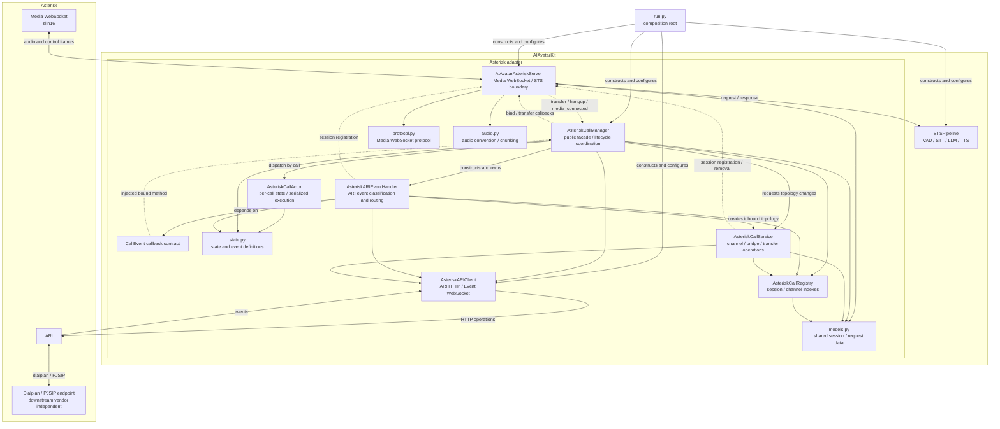
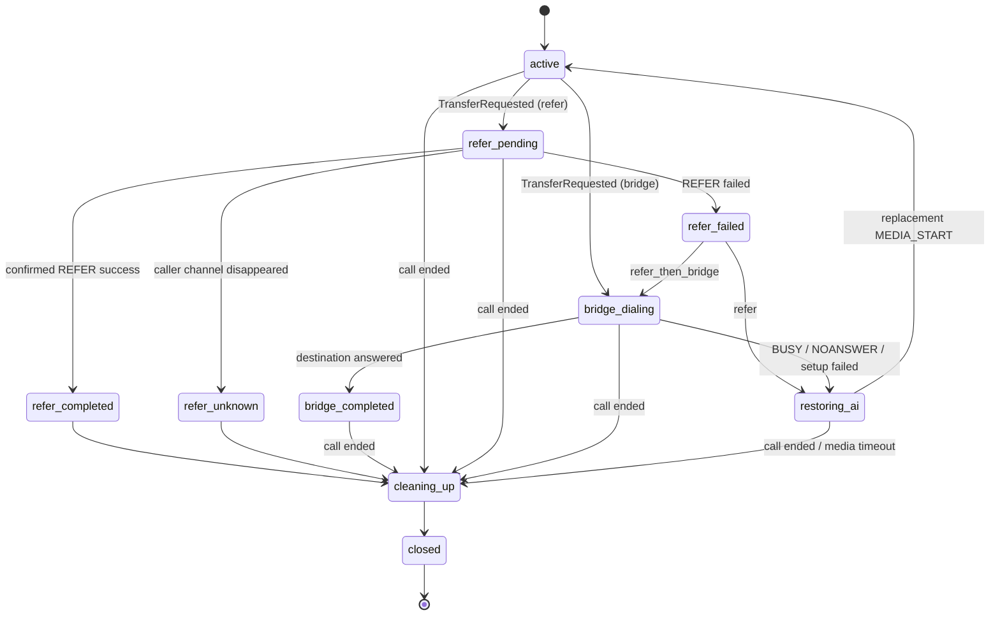

# Asterisk adapter

English | [日本語](README.ja.md)

This adapter connects AIAvatarKit to Asterisk releases that provide the JSON
Media WebSocket control protocol and `transport_data`. The minimum versions are
20.18 on the 20.x branch, 22.8 on 22.x, and 23.2 on 23.x; later branches retain
these capabilities. Asterisk 21.x and 23.0-23.1 are not supported. Asterisk terminates
SIP/RTP, while AIAvatarKit communicates with Asterisk over two paths:

- ARI REST API and Event WebSocket for answering, channels, bridges, transfers,
  and hangup control
- Asterisk Media WebSocket for 16 kHz signed linear PCM (`slin16`) and JSON
  control events

This adapter is not a SIP server. Configure SIP trunks, phone numbers, NAT,
codecs, and REFER URI translation in Asterisk.

## Quick start

### Prerequisites

- Python 3.11 or later
- Asterisk 20.18+, 22.8+, 23.2+, or a later branch with `chan_websocket`,
  PJSIP, ARI, JSON Media WebSocket control, `transport_data`, and
  HTTP/WebSocket support
- Network reachability from Asterisk to the AIAvatarKit Media WebSocket
- Network reachability from AIAvatarKit to Asterisk ARI
- Credentials and network access required by the configured STT, LLM, and TTS

Development-oriented Asterisk configuration examples are available under
[`examples/asterisk`](../../../examples/asterisk/). At minimum, adapt these
files to your environment:

- `ari.conf.example`: ARI user
- `http.conf.example`: private-network ARI HTTP/HTTPS listener
- `websocket_client.conf.example`: Media WebSocket from Asterisk to AIAvatarKit
- `extensions.conf.example`: inbound `Stasis()` entry and REFER dialplan
- `pjsip.conf.example`: SIP trunk and destination endpoint

### Application

Save the following as `run.py`. Add the STT, LLM, and TTS configuration required
by your `STSPipeline`.

```python
import os
from contextlib import asynccontextmanager

from fastapi import FastAPI

from aiavatar.adapter.asterisk import (
    AIAvatarAsteriskServer,
    AsteriskARIClient,
    AsteriskCallManager,
)
from aiavatar.sts.pipeline import STSPipeline
from aiavatar.sts.stt.openai import OpenAISpeechRecognizer


pipeline = STSPipeline(
    stt=OpenAISpeechRecognizer(
        openai_api_key=os.environ["OPENAI_API_KEY"],
    ),
    llm_openai_api_key=os.environ["OPENAI_API_KEY"],
)

asterisk = AIAvatarAsteriskServer(
    sts=pipeline,
    tts_sample_rate=int(os.getenv("AIAVATAR_TTS_SAMPLE_RATE", "24000")),
    api_username=os.environ["AIAVATAR_MEDIA_USERNAME"],
    api_password=os.environ["AIAVATAR_MEDIA_PASSWORD"],
)

ari = AsteriskARIClient(
    base_url=os.environ["ASTERISK_ARI_BASE_URL"],
    username=os.environ["ASTERISK_ARI_USERNAME"],
    password=os.environ["ASTERISK_ARI_PASSWORD"],
)

call_manager = AsteriskCallManager(
    adapter=asterisk,
    ari_client=ari,
    bridge_endpoint=os.getenv("ASTERISK_BRIDGE_ENDPOINT"),
    external_media_host=os.getenv(
        "ASTERISK_MEDIA_CONNECTION",
        "aiavatarkit-media",
    ),
    transfer_destinations={
        "operator": os.getenv("OPERATOR_EXTENSION", "1234"),
    },
    transfer_strategy=os.getenv("ASTERISK_TRANSFER_STRATEGY", "refer"),
    refer_timeout=float(os.getenv("ASTERISK_REFER_TIMEOUT", "30")),
    media_start_timeout=float(
        os.getenv("ASTERISK_MEDIA_START_TIMEOUT", "10")
    ),
)


@asynccontextmanager
async def lifespan(app: FastAPI):
    await call_manager.start()
    try:
        yield
    finally:
        # Release ARI resources before shutting down the pipeline.
        await call_manager.close()
        await pipeline.shutdown()


app = FastAPI(lifespan=lifespan)
app.include_router(asterisk.get_router(path="/asterisk/media"))
```

Example environment variables follow. Never store real values in source code or
commit them to the repository.

```sh
export OPENAI_API_KEY=CHANGE_ME
export AIAVATAR_MEDIA_USERNAME=aiavatarkit
export AIAVATAR_MEDIA_PASSWORD=CHANGE_ME
export ASTERISK_ARI_BASE_URL=https://asterisk.internal:8089/ari
export ASTERISK_ARI_USERNAME=aiavatar
export ASTERISK_ARI_PASSWORD=CHANGE_ME
export ASTERISK_MEDIA_CONNECTION=aiavatarkit-media
# Required only for bridge or refer_then_bridge.
export ASTERISK_BRIDGE_ENDPOINT=operator-trunk
export ASTERISK_TRANSFER_STRATEGY=refer
export ASTERISK_REFER_TIMEOUT=30
export ASTERISK_MEDIA_START_TIMEOUT=10
```

Start the application:

```sh
python -m uvicorn run:app --host 0.0.0.0 --port 18080
```

Point the Asterisk WebSocket client URI at `/asterisk/media` on this
application. Asterisk must request the `media` subprotocol. Its Basic
authentication username and password must match the values configured on
`AIAvatarAsteriskServer`.

### Requesting transfer or hangup from an AI response

Include one of the following control tags in an AI response to run the operation
after the spoken audio has finished playing:

```xml
<operation name="transfer" destination="operator" />
```

```xml
<operation name="hangup" />
```

`structured_content` is also supported:

```json
{
  "operation": {
    "name": "transfer",
    "destination": "operator"
  }
}
```

`destination` is not a phone number or SIP URI. It is an alias registered in
`transfer_destinations`. Destination extensions must contain digits only. Keep
the Python allowlist and the Asterisk `aiavatar-transfer` context allowlist in
sync.

### Passing conversation keys to an operator

`on_transfer_prepare` runs once immediately before the adapter starts an ARI
transfer. It lets application code add Asterisk channel variables using trusted
conversation keys held by the adapter, rather than values produced by the LLM.

```python
from aiavatar.adapter.asterisk import (
    AsteriskSessionData,
    AsteriskTransferRequest,
)


@asterisk.on_transfer_prepare
async def prepare_operator_handoff(
    request: AsteriskTransferRequest,
    session: AsteriskSessionData,
) -> None:
    # session_id is always passed as AIAVATAR_SESSION_ID.
    request.variables["AIAVATAR_USER_ID"] = request.user_id
    if request.context_id:
        request.variables["AIAVATAR_CONTEXT_ID"] = request.context_id

    # When storing the conversation in a shared store, pass an opaque key
    # generated and persisted here.
    # request.variables["AIAVATAR_HANDOFF_ID"] = handoff_id
```

`request` contains:

- `session_id`: stable Asterisk call session ID exposed to application code
- `user_id`: user ID finalized by the session-start hook; falls back to the
  caller number or session ID
- `context_id`: most recent conversation context ID observed in an
  `STSPipeline` response
- `destination_alias`: an allowed alias such as `operator`
- `destination`: the digits-only extension resolved from the alias
- `transfer_strategy`: `refer`, `bridge`, or `refer_then_bridge`
- `variables`: Asterisk channel variables that application code may add

Both `request` and `session` are mutable dataclasses. The hook returns nothing
and edits `request.variables` in place. Assigning an existing name overwrites
the value currently in `variables`. The adapter copies the dictionary when the
hook completes, so later changes to the original dictionary do not affect an
in-progress transfer.

Only `request.variables` is used as output from the hook. Fields such as
`destination` and `transfer_strategy` are snapshots provided for decision
making; modifying them does not change the actual destination or strategy.
`session` is the live `AsteriskSessionData` for the call and exposes caller
information, channel IDs, and transfer state. Store application-specific
temporary call state in `session.data`, not in manager-owned fields.

For REFER, variables are set on the caller channel. For bridge transfers, they
are set on the ARI-originated outbound channel. These values are not themselves
SIP headers. Convert them in the Asterisk or downstream PBX configuration as
needed, for example with a `PJSIP_HEADER()` pre-dial handler, User-to-User, or a
Refer-To parameter. The Asterisk documentation likewise recommends a
[pre-dial handler](https://docs.asterisk.org/Latest_API/API_Documentation/Dialplan_Functions/PJSIP_HEADER/)
when adding headers to an outbound PJSIP channel.

Variable names may contain only uppercase ASCII letters, digits, and
underscores. Names are limited to 64 characters, at most 32 variables are
accepted, and values must be strings of at most 1,024 characters without
newlines or NUL. Reserved manager variables such as `AIAVATAR_SESSION_ID`, the
transfer destination, and caller identity cannot be overwritten. If the hook
raises or validation fails, the transfer does not start and
`on_transfer_failed(..., "transfer_prepare_failed")` is called. Reserved values
are finalized by the manager after the hook; mutating `session` to bypass them
is outside the callback contract.

Do not put a full conversation into SIP. Prefer a short-lived, unguessable
`handoff_id` that the operator-side application can use to retrieve the
conversation from a shared store.

## Detailed configuration

### `AIAvatarAsteriskServer`

Owns the boundary between the Media WebSocket and `STSPipeline`.

| Argument | Default | Description |
|---|---:|---|
| `sts` | required | `STSPipeline` to use. |
| `tts_sample_rate` | `24000` | Input sample rate when the TTS returns raw PCM. A PCM WAV header takes precedence. Output is converted to 16 kHz, so either 16 kHz or another supported TTS sample rate is valid. |
| `mute_on_barge_in` | `True` | Sends `FLUSH_MEDIA` when user speech is detected, stopping currently playing AI audio. |
| `channel` | `"phone"` | Channel name attached to STS requests. |
| `api_username` | `None` | Basic authentication username for the Media WebSocket. Configure together with the password. |
| `api_password` | `None` | Basic authentication password for the Media WebSocket. Configure together with the username. |
| `media_chunk_duration_ms` | `100` | Target duration of each outbound AI-audio BINARY message. Chunks are aligned to Asterisk's `optimal_frame_size`. |
| `media_flow_timeout` | `10.0` | Maximum time to wait for sending to resume during `MEDIA_XOFF`. Timed-out audio is discarded; sending resumes with new audio after `MEDIA_XON`. |
| `max_media_message_size` | `65500` | Maximum size in bytes of inbound and outbound audio BINARY messages. |
| `debug` | `False` | Retains the latest converted response in `last_response` and enables detailed logging. |

Generic `set_config()` may update only the keys returned by `get_config()`:
`tts_sample_rate`, `media_chunk_duration_ms`, `media_flow_timeout`, and `debug`.

The primary callbacks are:

```python
from aiavatar.adapter.asterisk import (
    AsteriskSessionData,
    AsteriskTransferRequest,
)


@asterisk.on_connect
async def on_connect(request, session):
    ...

@asterisk.on_disconnect
async def on_disconnect(session):
    ...

@asterisk.on_dtmf
async def on_dtmf(digit, session_id):
    ...

@asterisk.on_transfer_prepare
async def on_transfer_prepare(
    request: AsteriskTransferRequest,
    session: AsteriskSessionData,
) -> None:
    ...

@asterisk.on_transfer_started
async def on_transfer_started(session_id, destination):
    ...

@asterisk.on_transfer_completed
async def on_transfer_completed(session_id, destination, method):
    ...

@asterisk.on_transfer_failed
async def on_transfer_failed(session_id, destination, reason):
    ...

@asterisk.on_transfer_unknown
async def on_transfer_unknown(session_id, destination, reason):
    ...
```

`method` is either `refer` or `bridge`. Transfer preparation and notification
callbacks are awaited by the actor for that call. An exception from
`on_transfer_prepare` aborts the transfer. Exceptions from
`on_transfer_started`, `on_transfer_completed`, `on_transfer_failed`, and
`on_transfer_unknown` are logged and ignored so notification failures cannot
alter call control. `on_transfer_unknown` means that the caller channel
disappeared before an explicit REFER success or failure could be observed. This
may be an ordinary caller hangup or a downstream effect of the transfer;
`reason` describes the observation, not a confirmed transfer result. Do not
put long-running synchronous work in these callbacks. Use asynchronous external
I/O, and hand expensive follow-up work to an application-managed background task
or queue. Transfer notification callbacks must not call `transfer()` or
`hangup()` for the same session. Use `on_transfer_prepare` for synchronous
pre-transfer application work, or schedule independent follow-up work after a
notification callback returns.

### `AsteriskARIClient`

Owns the ARI HTTP and Event WebSocket transports. It does not own call state.
Definitive non-success HTTP responses raise `AsteriskARIError`. HTTP transport
failures raise `AsteriskARITransportError`, allowing transfer reconciliation to
distinguish an unknown ARI outcome from an application programming error.

| Argument | Default | Description |
|---|---:|---|
| `base_url` | required | ARI base URL including `/ari`, for example `https://asterisk.internal:8089/ari`. |
| `username` | required | ARI user with read/write access. |
| `password` | required | ARI password. |
| `application` | `"aiavatar"` | Asterisk Stasis application name. Must match `Stasis()` in the dialplan. |
| `tls_verify` | `True` | Verifies TLS certificates for both ARI HTTPS and the ARI Event WSS connection. |
| `reconnect_delay` | `1.0` | Delay before reconnecting a disconnected ARI Event WebSocket. No complete state resynchronization is performed. |
| `startup_timeout` | `10.0` | Maximum time to wait for the initial ARI Event WebSocket connection. |
| `http_client` | `None` | Replacement HTTP client for tests or embedding. Normally omitted. |
| `event_connector` | `None` | Replacement WebSocket connector for tests or embedding. Normally omitted. |

### `AsteriskCallManager`

The application-facing facade that owns per-call actors and transfer policy and
instructs lower-level components to perform ARI operations.

| Argument | Default | Description |
|---|---:|---|
| `adapter` | required | Matching `AIAvatarAsteriskServer`. The two are bound during construction. |
| `ari_client` | required | Configured `AsteriskARIClient`. |
| `bridge_endpoint` | required when bridge is used | Asterisk PJSIP endpoint used as `PJSIP/{extension}@{endpoint}` for bridge transfers. Not used by `refer`. |
| `transfer_destinations` | required | Mapping from aliases to digits-only extensions. Unregistered aliases and arbitrary SIP URIs are rejected. |
| `transfer_strategy` | `"refer_then_bridge"` | One of `refer`, `bridge`, or `refer_then_bridge`. Fixed per manager process. |
| `external_media_host` | `"aiavatarkit-media"` | Section name from Asterisk `websocket_client.conf`; not a DNS hostname. |
| `transfer_context` | `"aiavatar-transfer"` | Allowlisted dialplan context used to start REFER. |
| `originate_timeout` | `30` | Maximum ring time passed to ARI originate for bridge destinations. |
| `refer_timeout` | `30.0` | Time before ARI state checks begin when a terminal REFER event has not arrived. |
| `media_start_timeout` | `10.0` | Maximum time to wait for `MEDIA_START` from recreated Media WebSocket after a failed transfer. |

`call_manager.start()` waits for the initial ARI Event WebSocket connection.
Always await `call_manager.close()` before shutting down the pipeline.

The normal application operations are `transfer()` and `hangup()`.
`handle_ari_event(event, wait=True)` is an advanced entry point for embedded
configurations that obtain ARI events externally and for deterministic tests.
In the normal configuration, `AsteriskARIClient` delivers events to
`AsteriskARIEventHandler` automatically, so applications do not call it.

The Media WebSocket codec is fixed to `slin16` at 16 kHz, and the `media`
subprotocol is always required. Both are protocol contracts with Asterisk and
are not application settings.

### Transfer strategies

#### `refer`

1. Wait for `MEDIA_MARK_PROCESSED` for the final AI audio.
2. Detach the AI Media channel and bridge.
3. Continue the caller channel to the allowlisted extension in
   `transfer_context`.
4. Let the Asterisk dialplan run `Transfer()`.
5. Determine completion from `transfer-completed`, `transfer-failed`, or the
   watchdog's state check. A caller-channel disappearance without an explicit
   result is recorded separately as `refer_unknown`.

This mode assumes a blind REFER where Asterisk leaves the media path after
success. Because disappearance of the original caller channel can also be an
ordinary caller hangup, it triggers `on_transfer_unknown`, not
`on_transfer_completed`. The local session is then cleaned up because the
caller channel can no longer be controlled. On confirmed failure, AI media is
recreated and `on_transfer_failed` runs after the new `MEDIA_START` is confirmed.

During watchdog reconciliation, only `SUCCESS` is accepted as success and only
`FAILURE` or `UNSUPPORTED` is accepted as a confirmed failure. An empty or
unknown `TRANSFERSTATUS` is fail-closed: no bridge fallback is attempted, the
outcome is reported as `unknown_transfer_status`, and the controlled caller is
ended.

`refer_timeout` does not forcibly stop `Transfer()`. If the caller channel is
still outside Stasis while `Transfer()` is running, the manager does not perform
an unsafe media restore. It rechecks until the channel returns to Stasis or
disappears. Configure a finite ringing timeout in Asterisk and the downstream
PBX as well.

A definitive ARI 4xx response other than HTTP 408 is a setup failure. A
transport failure, HTTP 408, or HTTP 5xx may instead mean that Asterisk accepted
the continuation but its response was lost. The actor remains `refer_pending`
in that case and uses the same watchdog reconciliation before any bridge
fallback, preventing two simultaneous transfer attempts. Programming and data
errors are not converted into transport failures; they follow the normal setup
failure path.

#### `bridge`

1. Detach the AI Media channel and bridge.
2. Move the caller to a holding bridge and start Music on Hold.
3. Originate `PJSIP/{extension}@{bridge_endpoint}` through ARI.
4. Connect the answered destination and caller in a new mixing bridge.
5. On BUSY, NOANSWER, or similar failure, discard the destination and restore AI
   media.

Asterisk remains in the media path in this mode. Normal unanswered calls are
detected using `originate_timeout` and ARI `Dial` events. There is no dedicated
bridge watchdog that reconciles missed events.

#### `refer_then_bridge`

REFER is attempted first. The manager proceeds to bridge transfer only after a
confirmed `transfer-failed`. If REFER remains indeterminate past its timeout, it
also waits for an ARI check to confirm failure before falling back to bridge.

The transfer strategy is fixed when the manager is constructed. It is not
selected dynamically by the LLM or per destination alias. Use separate process
or manager configurations for different requirements.

## Operational constraints

### Replace a process after an ARI Event WebSocket disconnect

The Event WebSocket reconnects automatically, but there is no mechanism that
enumerates events lost during the disconnect and fully resynchronizes call
state. After reconnection, the process may have missed a caller hangup, a bridge
destination answer, a destroyed channel, or another state change.

Apply these constraints in production:

- Do not treat an instance that observed an ARI Event WebSocket disconnect as
  recovered. Remove it from the load balancer and restart the process.
- Do not guarantee continuation of calls owned by that instance; allow those
  calls to be disconnected.
- Run `call_manager.close()` during graceful shutdown.
- Configure Asterisk-side `Hangup()` after returning from `Stasis()`, maximum
  call durations, and failure fallbacks so orphaned channels do not remain
  indefinitely when ARI REST is unavailable.
- Monitor the `Asterisk ARI event WebSocket disconnected` log for disconnects
  involving exceptions. A clean-looking close may not emit this log, so an
  application or external monitor should sample `event_connected` more
  frequently than `reconnect_delay` and latch the instance as requiring
  replacement if it is ever `False`.

If active calls must survive an ARI disconnect, this operational constraint is
not sufficient. A separate state-synchronization mechanism must reconcile
channels, bridges, and actors after ARI reconnects.

The application may expose a monitoring endpoint. A monitor must not interpret
this as only a current value; it should record an instance for replacement after
observing `false` even once.

```python
@app.get("/health/asterisk")
async def asterisk_health():
    return {"event_connected": call_manager.event_connected}
```

### Do not control one Stasis application from multiple managers

Call, channel, and actor state is stored in process memory. There is no shared
storage, distributed lock, or leader election. Do not control the same
`application` on the same Asterisk server from multiple active managers.

For horizontal partitioning, separate either Asterisk instances or Stasis
applications, and ensure that each call's ARI events and Media WebSocket reach
the same process.

After a process restart, the new process does not adopt calls owned by the old
process. End or route those old calls through an Asterisk-side fallback, and let
the new process begin with new `StasisStart` events.

### Do not reconnect the same Media WebSocket channel

Each manager-registered External Media channel may establish its Media
WebSocket exactly once. If that socket disconnects, another `MEDIA_START` for
the same channel ID is rejected. Do not configure Asterisk or an intermediary
to reconnect the old media channel.

Transfer recovery remains supported: the manager creates and pre-registers a
new External Media channel ID, and that new channel may establish its first
WebSocket. An unexpected media disconnect is not a transparent continuity
event; allow Asterisk call cleanup or the manager's new-channel recovery path
to run.

The stable call `session_id` is not reused as the internal STS/VAD ownership
key. Each manager-created media channel uses its own channel ID as a private
pipeline session ID. Before an old channel is finalized, its private route is
removed; therefore delayed responses and VAD cleanup from that channel cannot
control or delete the replacement channel. Application callbacks, transfer,
and hangup operations continue to receive the stable call `session_id`.

### In-flight pipeline work is not canceled immediately

After a Media WebSocket disconnect, the adapter removes that media channel's
private response route, stops sending audio, and finalizes that media
lifecycle's VAD state. It does not forcibly cancel STT, LLM, or TTS requests
that have already started inside the pipeline. External API requests may
therefore complete after disconnect and briefly continue to produce logs or
charges, but their responses are not routed to a replacement media channel.

If this is unacceptable, session-level cancellation ownership and an API must
be added to `STSPipeline`. The adapter must not guess which internal pipeline
tasks to cancel.

### Bridge transfer depends on ARI event delivery

Normal BUSY and NOANSWER results are handled through Asterisk's
`originate_timeout` and `Dial` events. There is no bridge watchdog for a result
lost while the ARI Event WebSocket is disconnected. Apply the process
replacement policy described above.

### Constrain REFER destinations and ringing time in Asterisk

Python allowlists destination aliases and digits-only extensions, but the
Asterisk dialplan constructs the actual Refer-To URI. Agree on the following
with the team operating Asterisk:

- Keep `transfer_destinations` and the `aiavatar-transfer` context synchronized
  to the same destination list.
- Never pass user input, LLM output, or arbitrary SIP URIs directly to the
  dialplan.
- Fix the Refer-To domain and URI form for the downstream system, such as an
  Avaya Session Manager.
- Configure finite REFER ringing and answer timeouts across the PBX path.
- Accept P-Asserted-Identity, UCID, and UUI only from trusted ingress.

### Network and authentication

- ARI requires read/write access. Place it on a private management network and
  restrict it with a firewall or ACL so only the AIAvatarKit process can connect.
- WSS and Basic authentication are recommended for the Media WebSocket.
- If Basic authentication is omitted on the same isolated LAN, never expose the
  endpoint externally. With a manager, the adapter checks pre-registered session
  and media channel IDs, but these checks do not replace a network boundary.
- Use `tls_verify=False` only for local testing.
- A proxy must preserve WebSocket BINARY and TEXT frames, the `media`
  subprotocol, the Authorization header, and long-lived connections.

### Capacity and callbacks

- Inbound setup runs as one background task per channel, so a single slow ARI
  request does not stop the entire Event WebSocket. The adapter has no admission
  control, so enforce a concurrent-call limit upstream.
- The call actor queue carries lifecycle events only, not audio frames.
- Transfer callbacks are awaited on the actor for the same call. Return quickly.
- `on_connect` and DTMF callbacks run as session-owned tasks and are canceled on
  disconnect. Implement them as cancellation-safe async functions.

### What to monitor

At minimum, monitor these logs and metrics:

- `Asterisk ARI event WebSocket disconnected`
- `Asterisk AI media restore timed out`
- `Asterisk media remained XOFF beyond ...`
- `Asterisk call cleanup completed with ... failure(s)`
- `Session not found for response (Asterisk)`
- active-call count and dwell time by `transfer_state`
- REFER and bridge success, failure, and timeout counts
- REFER unknown counts grouped by the `on_transfer_unknown` reason
- external STT, LLM, and TTS latency, errors, and requests after disconnect

## Detailed architecture

### Components



Solid arrows represent construction, ownership, or code dependencies. Dashed
arrows represent runtime binding or callbacks. `AsteriskARIEventHandler` depends
on the injected `CallEvent` callback contract, not on `AsteriskCallManager`
itself.

| File | Responsibility |
|---|---|
| `server.py` | FastAPI Media WebSocket, authentication, session matching, audio I/O, callbacks, and operation tags. |
| `ari_client.py` | ARI HTTP/Event WebSocket connection, authentication, reconnect, and response validation. Holds no call state. |
| `event_handler.py` | Raw ARI event routing and pre-registration inbound setup tasks. |
| `manager.py` | Actors, state transitions, transfer policy, and shutdown ordering. |
| `registry.py` | Live sessions and reverse indexes for caller, media, and destination channels. Updates them synchronously. |
| `service.py` | Channel/bridge/media topology, REFER, bridge originate, restoration, and best-effort cleanup. |
| `actor.py` | Bounded actor queue that serializes lifecycle events for one call. |
| `state.py` | Call states and typed lifecycle events. |
| `models.py` | Session data shared by `AIAvatarAsteriskServer` and the `AsteriskCallManager` side. |
| `protocol.py` | Media WebSocket JSON event validation and command generation. |
| `audio.py` | Conversion from PCM WAV or raw PCM to 16 kHz mono linear16 and frame chunking. |

### Inbound calls and bidirectional audio

Reading the diagram from left to right, inbound setup proceeds as follows:

1. The Asterisk `Dialplan / PJSIP endpoint` accepts a call, saves the session ID,
   called number, caller identity, and related values as channel variables, and
   enters `Stasis(aiavatar,inbound)`.
2. Asterisk `ARI` emits `StasisStart`, which `AsteriskARIClient` receives on the
   Event WebSocket.
3. `AsteriskARIClient` passes the raw event to `AsteriskARIEventHandler`.
   `AsteriskARIEventHandler` starts a per-channel inbound setup task and uses
   `AsteriskARIClient` to read channel variables.
4. `AsteriskARIEventHandler` asks `AIAvatarAsteriskServer` to register a session.
   After `AIAvatarAsteriskServer` returns the `AsteriskSessionData` from
   `models.py`, the handler registers the same object with
   `AsteriskCallRegistry`. Media WebSocket and ARI call control therefore refer
   to the same call through one shared session object.
5. `AsteriskARIEventHandler` asks `AsteriskCallService` to create the call
   topology. `AsteriskCallService` first reserves the expected channel ID in
   `AsteriskCallRegistry`, then operates Asterisk `ARI` through
   `AsteriskARIClient` to answer the caller and create a mixing bridge and an
   External Media channel.
6. The Asterisk `Media WebSocket` connects to `AIAvatarAsteriskServer` and sends
   `MEDIA_START` as its first TEXT frame. `AIAvatarAsteriskServer` accepts the
   connection only after matching its session ID and media channel ID against
   the pre-registered values.
7. Caller speech arrives from the `Media WebSocket` as BINARY `slin16` and is
   passed by `AIAvatarAsteriskServer` to `STSPipeline` as 16 kHz PCM. Audio frames
   never pass through `AsteriskCallActor`.
8. Response audio produced by STT, LLM, and TTS in `STSPipeline` returns to
   `AIAvatarAsteriskServer`. `audio.py` converts and chunks it as 16 kHz mono
   linear16, and the server returns it to Asterisk over the `Media WebSocket`
   together with control frames generated by `protocol.py`.

`AIAvatarAsteriskServer` groups AI audio with `START_MEDIA_BUFFERING` and
`STOP_MEDIA_BUFFERING`, then sends `MARK_MEDIA`. When the Asterisk
`Media WebSocket` returns `MEDIA_MARK_PROCESSED` with the same correlation ID,
the adapter knows that the announcement has finished playing.

`AIAvatarAsteriskServer` pauses outbound audio during `MEDIA_XOFF`. If
`media_flow_timeout` expires, it discards the rest of that response and resumes
with new audio after `MEDIA_XON`. It also checks both the connection and
`connection_generation` so delayed cleanup from an old Media WebSocket cannot
remove a newer connection. Outbound audio and MARK cancellation use a separate
`playback_generation`, so barge-in never changes callback ownership.
The adapter captures both generations before awaiting adapter-owned TTS
synthesis and discards the result if the connection or playback has since been
replaced. STS responses are scoped to the connection that received them;
responses without a transaction ID are accepted only while no transaction is
active.

### From an AI response to an operation

Hangup and transfer share this entry path:

1. A final response from `STSPipeline` reaches `AIAvatarAsteriskServer`.
2. `AIAvatarAsteriskServer` extracts the `operation`. If the response has spoken
   audio, it holds the operation in the session until the `Media WebSocket`
   returns `MEDIA_MARK_PROCESSED`. Without audio, it executes immediately.
3. For `hangup`, `AIAvatarAsteriskServer` calls
   `AsteriskCallManager.hangup()`. For `transfer`, it calls
   `AsteriskCallManager.transfer()`. An application may call the same methods
   directly; the remaining path is identical.
4. `AsteriskCallManager` converts the operation into a typed `CallEvent` and
   dispatches it to the call's `AsteriskCallActor`. Call control is now separate
   from audio processing, and ARI events, watchdogs, and operations for the same
   call are processed in order on that actor.

### Hangup operation

An AI- or application-initiated hangup follows
`AIAvatarAsteriskServer → AsteriskCallManager → AsteriskCallActor → AsteriskCallService`
in the diagram.

1. `AsteriskCallManager` dispatches `HangupRequested` to
   `AsteriskCallActor`.
2. `AsteriskCallActor` orders it relative to earlier events for the call, and
   `AsteriskCallManager` transitions the state to `cleaning_up`.
3. `AsteriskCallManager` calls `AsteriskCallService.cleanup_call()`.
4. To prevent delayed ARI events from being routed to the call,
   `AsteriskCallService` first removes the session and channel indexes from
   `AsteriskCallRegistry`. It then follows `AsteriskARIClient → ARI` to delete
   media channels, destination channels, bridges, and the caller channel on a
   best-effort basis, and removes the session from `AIAvatarAsteriskServer`.
5. After cleanup, the `AsteriskCallActor` state becomes `closed`.

When the caller or transfer destination disconnects first, notification flows
in the other direction:
`ARI → AsteriskARIClient → AsteriskARIEventHandler → CallEvent callback contract → AsteriskCallManager → AsteriskCallActor`.
Cleanup then follows the same path, except it does not attempt to hang up a
caller channel that has already disappeared.

### REFER transfer operation

The initial attempt for `transfer_strategy="refer"` or
`"refer_then_bridge"` follows this path:

1. `AsteriskCallManager` resolves the destination alias through its allowlist
   and prepares handoff channel variables through the transfer callback on
   `AIAvatarAsteriskServer`.
2. `AsteriskCallManager` transitions `AsteriskCallActor` to `refer_pending` and
   calls `AsteriskCallService.begin_refer()`.
3. `AsteriskCallService` sets the handoff variables on the caller channel over
   `AsteriskARIClient → ARI`, detaches the AI Media channel and bridge, and
   continues the caller channel into the allowlisted transfer context.
4. The Asterisk `Dialplan / PJSIP endpoint` executes `Transfer()`. Differences
   between downstream PBXs and SIP carriers remain beyond this boundary and are
   not modeled by AIAvatarKit.
5. Success or failure returns through
   `ARI → AsteriskARIClient → AsteriskARIEventHandler`.
   `AsteriskARIEventHandler` creates `ReferCompleted` or `ReferFailed` and sends
   it to `AsteriskCallManager` through the `CallEvent` callback contract.
6. `AsteriskCallManager` dispatches the event to the same
   `AsteriskCallActor`. On success, it marks the transfer `refer_completed` and
   cleans up the sessions in `AsteriskCallRegistry` and
   `AIAvatarAsteriskServer`. The call itself moves to the SIP REFER destination;
   Asterisk and AIAvatarKit leave the call path.
7. If the caller channel disappears without a confirmed result, the actor
   enters `refer_unknown`, emits `on_transfer_unknown`, and cleans up local
   state without claiming success or attempting bridge fallback.
8. On failure in `refer` mode, `AsteriskCallService` recreates the AI topology.
   Once `AIAvatarAsteriskServer` accepts `MEDIA_START` on the new
   `Media WebSocket` and calls `AsteriskCallManager.media_connected()`, the
   `AsteriskCallActor` returns to `active`. In `refer_then_bridge`, a confirmed
   REFER failure proceeds to bridge transfer instead.

At `refer_timeout`, the `AsteriskCallActor` watchdog places `ReferTimedOut` on
the same actor queue. `AsteriskCallManager` then checks the caller channel
through `AsteriskARIClient`. A timeout alone never determines success or failure
and never overlays AI media on a `Transfer()` that is still in progress.
Transport failures, HTTP 408, and HTTP 5xx from the ARI `continue` request are
handled the same way: their result is unknown until this reconciliation proves a
failure, so they do not immediately trigger bridge fallback.

### Bridge transfer operation

With `transfer_strategy="bridge"`, or after a confirmed REFER failure under
`"refer_then_bridge"`, Asterisk remains in the call path.

1. `AsteriskCallManager` transitions `AsteriskCallActor` to `bridge_dialing` and
   calls `AsteriskCallService.begin_bridge_transfer()`.
2. `AsteriskCallService` detaches the AI Media channel and bridge, moves the
   caller to a holding bridge, and starts Music on Hold.
3. `AsteriskCallService` first reserves the destination channel ID in
   `AsteriskCallRegistry`, then originates
   `PJSIP/{extension}@{bridge_endpoint}` through
   `AsteriskARIClient → ARI → Dialplan / PJSIP endpoint`.
4. Answer, BUSY, NOANSWER, and related events follow
   `ARI → AsteriskARIClient → AsteriskARIEventHandler → CallEvent callback contract → AsteriskCallManager → AsteriskCallActor`.
5. When the destination answers, `AsteriskCallManager` calls
   `AsteriskCallService.connect_destination()`. The service removes the caller
   from the holding bridge and joins the caller and destination in a new mixing
   bridge. `AsteriskCallActor` becomes `bridge_completed`. AIAvatarKit audio
   processing has ended, but Asterisk remains the media relay.
6. On BUSY, NOANSWER, or setup failure, `AsteriskCallManager` asks
   `AsteriskCallService` to restore the AI topology. When
   `AIAvatarAsteriskServer` accepts a new `MEDIA_START`, the actor returns to
   `active` and the AI conversation can resume.
7. After a successful bridge transfer, a caller or destination disconnect
   travels through the same event path to `AsteriskCallActor`, and
   `AsteriskCallService.cleanup_call()` releases the remaining resources.

### Call actor and state transitions

When the first `CallEvent` occurs for a live call, `AsteriskCallManager` creates
one dedicated `AsteriskCallActor`. Transfer, hangup, ARI lifecycle events, and
watchdogs for that call are then processed sequentially by the same actor.
Different calls use different actors and can proceed concurrently. Audio frames
are excluded from actor queues so media volume cannot starve call control.



`transfer_state` is a read-only mirror of actor state. Only actor transitions
change it. While `restoring_ai`, the actor does not block waiting for a Media
WebSocket. Instead, `MediaConnected` or `MediaRestoreTimedOut` is placed on the
queue, allowing a caller hangup to be processed first while restoration is
pending.

### Session and identity

`session_id` identifies the live call and remains stable across a manager-owned
AI-media restoration. A dialplan normally sets `${UNIQUEID}` as
`AIAVATAR_SESSION_ID`. Before External Media is created,
`AsteriskARIEventHandler` registers the session and `AsteriskCallService`
registers the expected media channel ID in `AsteriskCallRegistry`. There is no
legacy path that creates a session from an unregistered `MEDIA_START`.

Internally, the current media channel ID is the STS/VAD session key. A restored
media channel therefore gets fresh VAD state and cannot be affected by delayed
finalization or responses from the previous channel. This private key is an
adapter implementation detail; public hooks and call-control methods use the
stable call `session_id`.

`AIAvatarAsteriskServer` validates all of the following:

- query-parameter and channel-variable session IDs match when both are present
- the session was registered in advance
- `MEDIA_START.channel_id` matches the expected media channel ID registered by
  `AsteriskCallService`
- no different active WebSocket is already using the same session ID
- full call cleanup has not started
- the format is `slin16`
- frame sizes and BINARY messages stay within limits and align to 16-bit sample
  boundaries

JSON `channel_variables` values must be strings, matching the supported JSON
Media WebSocket format. The only recognized session-ID channel variable is
`AIAVATAR_SESSION_ID`. `AsteriskCallService` also adds a `session_id` query
parameter when it creates External Media; when both forms are present, they must
match.

In addition to user ID and the latest context ID, `AsteriskSessionData` stores
caller number, name, presentation, called number, trusted PAI, UCID, and UUI. A
bridge transfer carries original identity into outbound channel variables. When
presentation is prohibited or unavailable, the outbound caller ID is generated
as `Anonymous`.

### Cleanup

`AsteriskCallService` performs best-effort cleanup of media channels,
destination channels, bridges, caller channels, and the session in
`AIAvatarAsteriskServer`. It removes indexes from `AsteriskCallRegistry` first
so delayed events cannot be routed to the old call, and continues releasing
resources even if one delete through `AsteriskARIClient` fails.
Media and call cleanup each run as a shared shielded task. Canceling one waiter
does not cancel cleanup, and another waiter can join the same task even after
the call has been removed from the registry.

Media lifecycle ownership follows these rules:

- each manager-created media channel has a distinct private STS/VAD session
  key; its response route is removed synchronously when cleanup starts
- pending MARK and operation state is revoked locally before `FLUSH_MEDIA`
  yields to the WebSocket
- callback tasks belong to the `connection_generation` that created them, while
  audio and MARK invalidation uses a separate `playback_generation`
- adapter-owned TTS and response callbacks re-check their captured connection
  and transaction ownership after every await and before invoking the next
  response callback
- every new transaction, including the first one, invalidates any unowned
  playback, MARK, and pending operation from before its `accepted` response
- session-start hooks and manager notifications re-check connection ownership
  after every await, so full cleanup cannot be followed by revived VAD state or
  readiness callbacks
- full session cleanup joins any older cleanup and then re-evaluates the current
  generation until no manager-authorized new-channel WebSocket remains

When transfer and hangup race on the same call, `AsteriskCallActor` orders them.
During process shutdown, `AsteriskCallManager` first stops the Event reader in
`AsteriskARIClient` and inbound setup tasks in `AsteriskARIEventHandler`, then
cancels actors. A caller whose inbound setup is canceled by shutdown is
explicitly hung up whether or not local session registration has completed.
`AsteriskCallService` releases remaining ARI resources, and finally
`AsteriskARIClient` is closed.

## Tests

The Asterisk adapter tests are local and do not use external services or paid
APIs. Run them from the repository root:

```sh
python -m pytest -c /dev/null --rootdir=. -p no:cacheprovider \
  tests/adapter/asterisk -q
```

At minimum, validate these scenarios against a real Asterisk installation:

- normal inbound call, bidirectional audio, barge-in, DTMF, and caller hangup
- REFER success, failure, unknown outcome, no answer, caller hangup, and
  destination identity
  display
- bridge success, BUSY, NOANSWER, caller hangup, and destination hangup
- successful AI media restoration and `media_start_timeout`
- same-channel Media WebSocket reconnection rejection, manager-authorized
  new-channel recovery, XOFF/XON, and process replacement after ARI disconnect
- new calls and active-call cleanup during graceful shutdown
