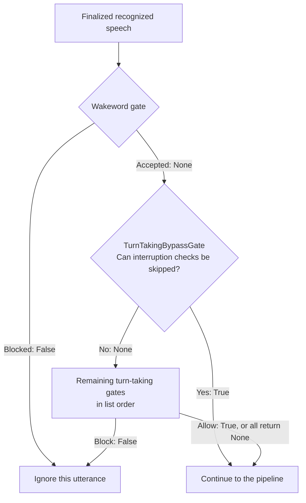

# Wakeword activation

A wakeword is a name or phrase used to call the assistant, such as
"Hey assistant". Waiting for a wakeword helps prevent nearby conversations
from triggering a response. Once a conversation starts, you can allow follow-up
speech for a configured time without requiring the wakeword again.

AIAvatarKit provides this feature as a [turn-taking gate](vad-turn-taking.md).
Use it on its own to control when the assistant responds, or combine it with
other gates that decide whether the user should interrupt ongoing speech.

- [Keyword matching and ongoing conversations](#keyword-matching-and-ongoing-conversations)
- [Jev](#semantic-activation-with-jev)
- [OpenAI Decisions API](#semantic-activation-with-openai-decisions)
- [Conversation callbacks](#conversation-callbacks)
- [Processing flow](#processing-flow)
- [Wakeword gates vs. pipeline wakewords](#wakeword-gates-vs-pipeline-wakewords)

## Keyword matching and ongoing conversations

`WakewordGate` accepts speech containing one of the registered phrases. Pass it
directly to `SileroStreamSpeechDetector`, using your existing streaming speech
recognizer:

```python
from aiavatar.sts.vad.stream import SileroStreamSpeechDetector
from aiavatar.sts.vad.turn_taking_gates.wakeword import WakewordGate

wakeword_gate = WakewordGate(
    wakewords=["Hello", "Hey assistant"],
)
vad = SileroStreamSpeechDetector(
    speech_recognizer=speech_recognizer,
    turn_taking_gate=wakeword_gate,
)
```

### Combining with other gates

Use `TurnTakingGateManager` to add other turn-taking gates. Always put the
wakeword gate first, followed by `TurnTakingBypassGate`, then the other gates:

```python
from aiavatar.sts.vad.turn_taking_gates import TurnTakingGateManager
from aiavatar.sts.vad.turn_taking_gates.bypass import TurnTakingBypassGate

manager = TurnTakingGateManager(gates=[
    wakeword_gate,
    TurnTakingBypassGate(),
    turn_taking_gate,  # Your configured turn-taking classifier.
])
# Pass turn_taking_gate=manager when creating the detector.
```

This order checks the wakeword before allowing any bypass. Once that check
passes, the bypass can skip interruption classification when appropriate, such
as when the assistant is idle. See the
[processing flow](#processing-flow)
below.

### Options and conversation continuation

| Option | Default | Meaning |
| --- | --- | --- |
| `wakewords` | `None` | Literal substrings. `None` or an empty list disables the keyword restriction. |
| `wakeword_timeout` | `60.0` | Seconds since the callback's timestamp during which another wakeword is unnecessary. Zero disables this continuation window. |
| `get_last_conversation_at` | `None` | Async callback taking `session_id` and returning a timezone-aware `datetime` or `None`. Without it, each utterance needs a wakeword. |
| `debug` | `False` | Enable gate decision diagnostics. |

Matching is case-sensitive substring matching, as in the existing pipeline
wakeword feature. The gate receives the complete finalized text. For example,
`Hello, what's the weather today?` matches `Hello` and passes the complete original
utterance to subsequent gates and the pipeline. It does not strip the wakeword,
split the utterance, or discard the request following the greeting.

To allow follow-up speech without repeating a wakeword, define
[`get_last_conversation_at`](#conversation-callbacks) to return the time of the
last stored conversation message. Then configure the gate to keep the
conversation open for 60 seconds after that time:

```python
wakeword_gate = WakewordGate(
    wakewords=["Hello", "Hey assistant"],
    wakeword_timeout=60.0,
    get_last_conversation_at=get_last_conversation_at,
)
```

The callback defines what counts as an ongoing conversation. The implementation
below uses the session's context ID to read its latest stored message timestamp.
Without a context ID, it returns `None` and the gate requires a wakeword.
Timestamps must be timezone-aware; the continuation window uses elapsed
wall-clock time, with the timeout boundary requiring a new wakeword.

The gate does not write timestamps when it accepts an utterance and does not
maintain a second conversation-state store. Update the underlying record only
at the event your application considers a successful conversation. For example,
passing the wakeword check but then being blocked by turn-taking should not
extend the conversation window. Callback failures produce `False` rather than
opening the gate; cancellation propagates.

A matched wakeword or a recent conversation returns a decision with
`should_take_turn=None`: alone, the gate allows the input; in a Manager, later
gates still decide whether to respond. A missing wakeword while waiting returns
terminal `False`.

## Semantic activation with Jev

Replace the keyword gate with `JevWakewordGate` when activation should depend on
whether the speaker is addressing the assistant, rather than only on a literal
substring.

Define the [conversation callbacks](#conversation-callbacks) below using your
application's `vad` and `llm`, then pass them to the gate:

```python
import os
import httpx
from aiavatar.sts.vad.turn_taking_gates.jev_wakeword import JevWakewordGate


jev_http_client = httpx.AsyncClient()
wakeword_gate = JevWakewordGate(
    http_client=jev_http_client,
    api_key=os.environ["TYPESAFE_API_KEY"],
    wakewords=["Hey Ava"],  # Optional: accept these phrases without an API call.
    get_last_conversation_at=get_last_conversation_at,
    get_conversation_history=get_conversation_history,
    wakeword_timeout=60.0,
    wake_threshold=0.8,
)
```

Use this object first in the same Manager configuration shown above. The optional
`wakewords` list and semantic check are alternatives: a case-sensitive substring
match returns `None` without calling Jev; unmatched text goes to the semantic
check. Literal matches take priority over semantic instructions. Omitting
`wakewords` or using an empty list keeps semantic detection enabled.

The gate asks Jev for a Noul activation probability. A probability **at or above**
`wake_threshold` returns `None`; a lower probability returns `False`. An
ongoing conversation is checked before keyword matching and also returns `None`
without an API request. Semantic activation receives the whole unmatched
utterance, including any request following a greeting. Evaluate the instructions
and threshold on representative utterances in your target language; the gate
does not guarantee a particular
classification accuracy.

`get_conversation_history(session_id)` optionally supplies text messages such as
`{"role": "assistant", "content": "Where would you like to go?"}`, ordered oldest to newest.
The application chooses how many messages to include. Jev can use this context
to recognize answers, alternative proposals, corrections, or elaborations after
the timeout, even without a name or an answer among the offered options.
Merely mentioning the same topic or an unaddressed attention-getter alone is not
enough. The gate does not import a context manager or cache the history.

History is fetched only when a semantic API request is needed and `session_id`
is available. Recent conversation activity, a keyword match, or empty input
skips the history callback. A nonempty result becomes `state.conversation_history`;
`None`, an empty list, or no callback leaves that field absent. Callback failures
block the input with `wakeword_error`; cancellation propagates.

| Option | Default | Meaning |
| --- | --- | --- |
| `http_client`, `api_key` | Required | Application-owned HTTPX async client and Typesafe API key. |
| `wakewords` | `None` | Optional literal substrings accepted before semantic classification. `None` or an empty list uses semantic detection only. |
| `model` | `"jev-latest"` | Jev model name. |
| `request_timeout` | `1.0` | Total API deadline in seconds, also used for HTTPX I/O timeouts. |
| `wake_threshold` | `0.8` | Minimum activation probability, inclusive. |
| `instructions` | Built-in instructions | Optional replacement semantic activation instructions. Omit to use the preset. |
| `wakeword_timeout` | `60.0` | Same continuation window as the keyword gate. |
| `get_last_conversation_at` | `None` | Same application-supplied async timestamp callback. |
| `get_conversation_history` | `None` | Async callback receiving `session_id` and returning chronological `role`/`content` text-message dictionaries, or `None`. Used only for semantic classification. |
| `debug` | `False` | Enable gate decision diagnostics. |

While waiting for activation, empty text, API timeouts, invalid responses, and
other API failures block the input. This differs from `JevTurnTakingGate`, whose
failure fallback allows the user to interrupt. Cancellation remains
cancellation. The HTTP client is
caller-owned: close it with `await jev_http_client.aclose()` during application
shutdown after pending sessions finish. It may be shared with other Jev gates.

## Semantic activation with OpenAI Decisions

`DecisionsWakewordGate` uses the [OpenAI Decisions API](https://developers.openai.com/api/docs/guides/decisions)
to check whether speech is addressed to the assistant, including answers or
resumptions supported by conversation history. It implements the same activation
contract as Jev and inherits literal matching and conversation activity checks
from `WakewordGate`.

Use the same [conversation callbacks](#conversation-callbacks) with the
Decisions gate:

```python
import os
import httpx
from aiavatar.sts.vad.turn_taking_gates.decisions_wakeword import DecisionsWakewordGate

decisions_http_client = httpx.AsyncClient()
wakeword_gate = DecisionsWakewordGate(
    http_client=decisions_http_client,
    api_key=os.environ["OPENAI_API_KEY"],
    wakewords=["Hey Ava"],
    get_last_conversation_at=get_last_conversation_at,
    get_conversation_history=get_conversation_history,
    wakeword_timeout=60.0,
    wake_threshold=0.93,
)
```

The caller supplies the key and owns the reusable asynchronous HTTP client;
the gate does not read environment variables or stored conversations itself.
Close the client with `await decisions_http_client.aclose()` after pending
sessions finish. No additional SDK or provider extra is required.

Evaluation follows this order:

1. Recent activity from `get_last_conversation_at` returns `None` without an API
   or history lookup. The continuation window works as for the keyword gate;
   accepting an utterance never updates the timestamp.
2. While waiting for activation, missing or blank text returns `False`.
3. A case-sensitive substring match against `wakewords` returns `None` without
   an API or history lookup. The complete original utterance is preserved.
4. Otherwise, the gate optionally fetches history and calls the `wake` predicate.
   `P(wake) >= wake_threshold` returns `None`; a lower probability returns `False`.

`None` lets later gates evaluate; it does not force a response. `wakewords=None`
or `[]` keeps semantic detection enabled. Literal matches take precedence over
semantic instructions, so even a quoted wakeword can match; omit the literal
list when every utterance awaiting activation must be classified semantically.

| Option | Default | Meaning |
| --- | --- | --- |
| `http_client`, `api_key` | Required | Reusable HTTPX async client and OpenAI API key. |
| `wakewords` | `None` | Optional literal substrings accepted without an API call. |
| `model` | `"gpt-6-luna"` | Decisions model name. |
| `request_timeout` | `1.0` | Total HTTP request deadline in seconds, also applied to HTTPX I/O phases. |
| `wake_threshold` | `0.93` | Minimum activation probability, inclusive. |
| `instructions` | Built-in instructions | Optional replacement for the complete semantic activation prompt. Omit to use the preset. |
| `wakeword_timeout` | `60.0` | Same continuation window as the keyword gate; zero disables it. |
| `get_last_conversation_at` | `None` | Same application-supplied async timestamp callback. |
| `get_conversation_history` | `None` | Async callback returning chronological `role`/`content` text messages for `session_id`, or `None`. |
| `debug` | `False` | Enable gate decision diagnostics. |

The history callback runs only for semantic classification when a session ID is
available. The caller controls its length; the gate does not cache it. Empty
history is omitted from the JSON text `input`. History and activity callbacks
must be nonblocking and cancellable and impose their own storage deadlines;
`request_timeout` bounds only the HTTP request.

API timeouts, HTTP failures, malformed responses, and history/activity callback
errors block input. Cancellation propagates. The gate selects the answer named
`wake` and rejects missing or duplicate answers, wrong types, invalid JSON, and
probabilities outside finite `[0, 1]`; booleans are not probabilities. Requests
are neither automatically retried nor redirected.

Semantic results use `decisions_wakeword_match`, `decisions_wakeword_missing`,
`decisions_wakeword_timeout`, and `decisions_wakeword_error`. Activity, literal,
empty-input, and callback paths retain the shared `wakeword_*` reasons.
Debug logging reports gate decision metadata; the gate does not log response
bodies, credentials, or exception messages.

## Conversation callbacks

The gates use callbacks to read the last conversation time and recent messages.
With your application's `vad` and `llm`, resolve the conversation's context ID
from the VAD session and read it through `llm.context_manager`:

```python
from datetime import datetime


async def get_last_conversation_at(session_id: str) -> datetime | None:
    context_id = vad.get_session_data(session_id, "context_id")
    if not context_id:
        return None
    return await llm.context_manager.get_last_created_at(context_id)


async def get_conversation_history(session_id: str) -> list[dict[str, str]]:
    context_id = vad.get_session_data(session_id, "context_id")
    if not context_id:
        return []
    # Fetch 10 individual messages, roughly five user/assistant exchanges.
    messages = await llm.context_manager.get_histories(context_id, limit=10)
    history = []
    for message in messages:
        role = message.get("role")
        if role not in ("user", "assistant"):
            continue
        content = message.get("content")
        if isinstance(content, list):
            content = "\n".join(
                part["text"] for part in content
                if isinstance(part, dict)
                and part.get("type") in ("input_text", "output_text", "text")
                and isinstance(part.get("text"), str)
            )
        if isinstance(content, str) and content.strip():
            history.append({"role": role, "content": content})
    return history
```

`get_histories()` returns the latest stored messages in chronological order.
The callback keeps user and assistant text, flattening text content blocks and
omitting tool messages, images, and empty content. The limit applies before this
filtering, so the resulting history may contain fewer than ten messages.

The standard pipeline and WebSocket adapter store `context_id` in the VAD
session as the conversation is established. If your application manages that
association itself, store the context ID for each session before these callbacks
run. A new session without a context ID returns no timestamp or history.

These direct calls assume nonblocking context storage, such as
`PostgreSQLContextManager`. The current `SQLiteContextManager` performs
synchronous database work inside its async methods; use a worker-backed adapter
for those lookups to keep database work off the audio event loop.

Pass `get_last_conversation_at` to any wakeword gate. Both `JevWakewordGate` and
`DecisionsWakewordGate` also accept `get_conversation_history`, as shown above.

## Processing flow

In the [combined setup](#combining-with-other-gates), the wakeword gate first
checks whether the utterance can enter the conversation. Only accepted speech
reaches the bypass and the remaining turn-taking gates. This order is the same
for keyword, Jev, and Decisions wakeword detection.

The bypass lets an accepted utterance skip interruption classification when it
is unnecessary. For example, when the assistant is idle, there is no speech to
interrupt. Putting the bypass after the wakeword gate lets the user start a
conversation while still requiring activation first.



`None` means continue to the next gate. `True` allows the input immediately,
and `False` blocks it; either ends the chain. Used alone, a wakeword gate's
`None` result allows the input directly, with no further gate checks.

The bypass also handles a configured duration policy, replies near the confirmed
end of a response, and missing recognized text or an empty estimated spoken
prefix. For example, a long utterance can count as an intentional interruption,
while a brief acknowledgment during playback can still go to the classifier. See
[bypass options](vad-turn-taking.md#turntakingbypassgate) for these policies.

### Automatic settings and explicit overrides

For both the standalone example and the combined example above, bypass settings
are selected automatically. You do not need to set `bypass_enabled` yourself.
The Manager's default is `None`, which chooses its behavior from the direct
child gates supplied at construction:

| Configuration | Automatic behavior |
| --- | --- |
| Wakeword gate used alone | The gate disables automatic bypass, so each utterance reaches the activation check. |
| Manager with a `TurnTakingBypassGate` | The Manager disables bypass before the chain. The explicit bypass gate runs where you place it. |
| Manager without a `TurnTakingBypassGate` | The Manager checks bypass conditions **before any child gate**. A matching condition skips the entire chain, including a wakeword gate. |

If you deliberately omit the bypass gate so every accepted utterance goes to the
remaining classifiers, explicitly disable the Manager's automatic bypass:

```python
manager = TurnTakingGateManager(
    gates=[wakeword_gate, turn_taking_gate],
    bypass_enabled=False,
)
```

Setting `bypass_enabled=True` explicitly forces the Manager to check bypass
conditions before the chain, even when it contains an explicit bypass gate.
Use this only when skipping every child gate is acceptable; it would allow
the wakeword check to be skipped when the assistant is idle.

These overrides affect the Manager's check before the chain.
`bypass_enabled=False` does not disable an explicit `TurnTakingBypassGate`.
Inside a Manager, child gates' standalone bypass settings are unused. With the
recommended order, configure `skip_condition` and `response_end_grace_seconds`
on `TurnTakingBypassGate`; the Manager's versions of those options are unused
because its automatic bypass is off.

### Playback and cancellation

Forward playback events as described in the
[turn-taking quick start](vad-turn-taking.md#quick-start-with-jev) when using
playback-aware turn-taking gates after the wakeword gate. Wakeword filtering
alone does not require playback events.

Recording-start callbacks occur before these checks. In particular,
`mute_on_barge_in=True` can stop playback before a wakeword decision. Use
`mute_on_barge_in=False` when playback must continue until the finalized input
passes the chain.

The Manager shares one playback snapshot across the chain. New finalized speech
or session closure cancels pending decisions, including wakeword API requests.

## Wakeword gates vs. pipeline wakewords

Wakeword gates cover the pipeline's keyword matching and conversation
continuation features, and add semantic activation. For
`SileroStreamSpeechDetector`, gates are the more capable option. Pipeline
wakewords have broader input support: they also work with other VADs and direct
text requests.

| Feature | Wakeword gates | [Pipeline wakewords](pipeline.md#wakeword) |
| --- | --- | --- |
| Activation methods | Keyword matching, semantic detection, or both | Keyword matching only |
| Current built-in VAD support | `SileroStreamSpeechDetector` only | Any VAD connected to `STSPipeline` |
| Direct text requests to `pipeline.invoke()` | Do not pass through the gates | Checked by the pipeline |
| Conversation continuation without repeating a wakeword | Uses the `get_last_conversation_at` callback | Uses the pipeline's stored conversation timestamp |
| When activation is checked | Before the pipeline and subsequent turn-taking gates | Inside the pipeline, after speech recognition and request merging |

Wakeword gates need recognized text at the gate stage. Plain
`SileroSpeechDetector` accepts turn-taking gates but supplies no recognized text
there, so it cannot perform wakeword detection with them.

When using wakeword gates, leave the pipeline's `wakewords=None` to avoid
checking activation twice.

---

[← Turn taking](vad-turn-taking.md) · [Speech detector (VAD)](vad.md)
