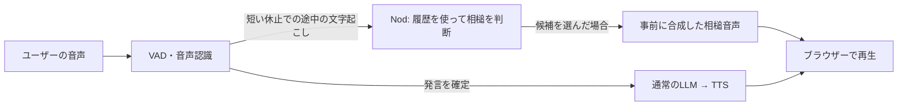

# Nod (🧪 experimental)

[🇬🇧 English README](README.md) | 日本語

AIAvatarKitの音声会話に「うん」「そっか」「よかったね」といった短い相槌を加える実験的なサンプルです。
ユーザーが話の途中で少し間を置いたとき、そこまでの文字起こしと会話履歴を使って相槌を判断します。
ユーザーは話を続けられ、話し終えた後は通常のSTT → LLM → TTSパイプラインが応答します。

## どんな会話になるか

例えば、次のようなやり取りを目指します。相槌を入れるか・どの文言にするかはLLMが判断します。

```text
ユーザー：週末は家でパンを焼こうと思って、（少し間を置く）
AI      ：うん                         ← Nodの相槌
ユーザー：前は焦がしちゃったから、今度は温度を下げてみるんだ。
          （話し終える）
AI      ：焼き色を見ながら調整するとよさそうだね。 ← 通常の応答
```

話の続きを促す相槌、事情を受け止める相槌、よい結果を喜ぶ相槌を候補から選びます。
完成した質問・依頼や、すでに相槌した内容の繰り返しでは相槌を見送ります。
本応答の受付が先に来た場合も、未送信の相槌は取り消します。

## 音声パイプラインに組み込む

[WebSocketサーバー例](../websocket/server.py)のように、すでに音声会話が動いているサーバーへ追加します。
以下はリポジトリ直下から実行する構成です。Python 3.11以上と、このリポジトリの実行環境が必要です。
Nodはリポジトリ内のサンプルであり、`pip install aiavatar` には同梱されません。

### 1. VADとNodを設定する

既存の `stt`・`llm`・`tts` を使い、VADを `SileroStreamSpeechDetector` にします。
このVADは短い休止で途中の文字起こしを通知し、長い休止で本応答へ渡す発言を確定します。
以下はサーバーのVAD・アダプターを生成している箇所に置きます。
認証など、アダプターの既存設定も引き継いでください。

```python
import os
from pathlib import Path
from aiavatar.adapter.websocket.server import AIAvatarWebSocketServer
from aiavatar.sts.vad.stream import SileroStreamSpeechDetector
from examples.nod import NodEngine
from examples.nod.integrations.aiavatar import NodPipelineBridge

# stt・llm・ttsは既存サーバーで設定したものを使う。
vad = SileroStreamSpeechDetector(
    speech_recognizer=stt,
    segment_silence_threshold=0.2,    # 短い休止も拾い、相槌の判断機会を増やす
    # 相槌の判断・送信に余裕を持たせるため長めに設定。応答テンポを優先する場合は短くする。
    silence_duration_threshold=1.5,
)
aiavatar_app = AIAvatarWebSocketServer(
    vad=vad, stt=stt, llm=llm, tts=tts,
)

# 候補とプロンプトをまとめたプロファイルを一度読み込む。
engine = NodEngine.from_profile(
    Path("examples/nod/profiles/imouto_ja.toml"),
    api_key=os.environ["OPENAI_API_KEY"],
)
nod = NodPipelineBridge(aiavatar_app, engine)
```

Bridgeの生成時に、会話の開始・途中の文字起こし・本応答の受付・応答内容・切断のフックを自動登録します。
独自のフックや実行順を管理する場合は、[Deep Dive: フックを手動で接続する](#deep-dive-フックを手動で接続する)を参照してください。

サンプルのプロファイルは日本語です。STTとTTSも日本語に対応した設定を使ってください。
この例ではNodの判断にもOpenAI APIを使うため、起動前に `OPENAI_API_KEY` を設定します。
相槌音声は既存のTTSで起動時に合成します。通常のSTT・LLMに加えて、相槌判断のAPI呼び出しが発生します。

### 2. 起動時に相槌音声を準備する

FastAPIの起動・終了処理に、相槌音声の準備とNodの終了処理を加えます。
`lifespan` を新しく定義する場合、Nodの処理部分は次の形です。

```python
from contextlib import asynccontextmanager

@asynccontextmanager
async def lifespan(app):
    async with engine:
        try:
            await nod.prepare_audio()
            yield
        finally:
            await nod.close()
```

この関数を `FastAPI(lifespan=lifespan)` に指定します。すでに `lifespan` がある場合は、
その中に同じ処理を加え、既存のパイプラインやSTT・LLM・TTSの起動・終了処理も引き続き行ってください。
Nodは音声準備中に全候補を合成し、会話中はキャッシュから送信します。
終了時は `nod.close()` が判断タスクと会話を閉じ、その後 `async with engine` がHTTPクライアントを閉じます。

### 3. ブラウザーで会話する

既存のWebSocketルーターとHTML配信を使ってサーバーを起動し、`3d.html`（VRM/MMD）で会話を開始します。
**BARGE-INをON** にすると、相槌中もマイク入力を続けられます。
共通の [`aiavatar.js`](../websocket/html/aiavatar.js) に再生処理があり、追加のクライアントスクリプトは不要です。
冒頭の会話例のように、話の途中で少し間を置いてから続けてみてください。

## 相槌の文言・方針を変える

[`profiles/imouto_ja.toml`](profiles/imouto_ja.toml) に候補のID・文言・説明と、判断方針のプロンプトをまとめています。
サンプルは元気で世話焼き、少しツン寄りの妹タイプAIを想定し、9つの相槌候補を持ちます。
英語版は [`profiles/imouto_en.toml`](profiles/imouto_en.toml) です。英語で会話する場合は読み込むファイルを切り替え、
STTとTTSも英語に対応した設定にしてください。プロファイルの `language` はSTT・TTSの設定を切り替えません。
`NodEngine.from_profile()` はこのTOMLファイルだけを読み込みます。`prompt` の本文に候補の文言・説明を加え、
Nod用LLMへのsystemメッセージとして使います。

`prompt` は複数行文字列で書き、候補は `[[candidates]]` ごとに追加します。候補を2つに絞った構成例です。

```toml
prompt = """
あなたは元気で世話焼き、少しツン寄りの妹タイプAIです。
ユーザーの話の途中で、続きを促す短い相槌を入れるか判断してください。
完成した質問・依頼や、すでに相槌した内容には相槌を入れません。
出力は候補文言を含む <nod_assistant>うん</nod_assistant> の形式だけ。
相槌なしは <nod_assistant/> としてください。
"""

[[candidates]]
id = "neutral"
phrase = "うん"
description = "出来事や予定が伝わり、話の続きを聞くときの軽い頷き。"

[[candidates]]
id = "joy"
phrase = "よかったね"
description = "本人にとって明確によい結果が出たことを喜ぶ。願望や予定だけでは使わない。"
```

キャラクターや言語に合わせて、このTOMLファイルを編集します。設定変更後はサーバーを再起動し、相槌音声も再生成してください。
従来のJSON + TXTを使っている場合は、プロンプト本文をTOMLの `prompt` に移し、候補と1ファイルにまとめてください。
外部ファイルを指定する `prompt_file` は使いません。

LLMには会話履歴と今回の発言を渡し、送信済みの相槌は `<nod_assistant>うん</nod_assistant>` のように本文へ挿入します。
どこまでを受け止めたか分かるので、同じ内容に繰り返し相槌するのを抑えられます。
入力は毎回独立した `system`・`user` メッセージで、過去発言は各600文字、現在の発言は1,200文字まで渡します。

出力は候補文言を含むXML要素1つです。

```xml
<nod_assistant>うん</nod_assistant>
```

相槌なしは `<nod_assistant/>` です。候補外の文言や不正な形式を受け取った場合は発話しません。
独自のプロンプトに変更する場合も、この出力形式を維持してください。

### モデル・エンドポイントを指定する

モデルやエンドポイントは `NodEngine.from_profile()` の `model`・`base_url`・`api_key` で指定します。
OpenAI互換のChat Completionsに対応しており、OpenRouterなどのエンドポイントも指定できます。
追加の生成パラメーターは `request_options` で渡せます。
既定のモデルは `gpt-5.6-luna`、OpenAIでの既定設定は `reasoning_effort="none"`、最大出力32トークンです。

組み込み例の `engine` を作る部分を、次のように置き換えます。
OpenAIの既定モデル・エンドポイントを明示し、出力上限を64トークンに変更する例です。

```python
engine = NodEngine.from_profile(
    Path("examples/nod/profiles/imouto_ja.toml"),
    model="gpt-5.6-luna",
    base_url="https://api.openai.com/v1",
    api_key=os.environ["OPENAI_API_KEY"],
    request_options={
        "reasoning_effort": "none",
        "max_completion_tokens": 64,
    },
)
```

OpenRouterを使う場合は、接続先・APIキー・モデルIDを変更します。
`NOD_MODEL` にはOpenRouterで利用するモデルID、`OPENROUTER_API_KEY` にはAPIキーを設定します。

```python
engine = NodEngine.from_profile(
    Path("examples/nod/profiles/imouto_ja.toml"),
    model=os.environ["NOD_MODEL"],
    base_url="https://openrouter.ai/api/v1",
    api_key=os.environ["OPENROUTER_API_KEY"],
    request_options={"max_tokens": 64},
)
```

`request_options` の項目は、接続先とモデルが受け付けるものを指定してください。

## Nodの仕組み

音声入力から、話の途中の相槌と、話し終えた後の応答に分岐します。



### 部品の役割

`NodPipelineBridge` がAIAvatarKitのイベントを受け取り、会話ごとの `NodSession` を更新します。
`NodSession` はその時点の会話履歴を `NodEngine` に渡し、相槌の判断を依頼します。
候補が選ばれると、Bridgeが事前に合成した音声をブラウザーへ送ります。

| 部品 | 役割 |
|---|---|
| [`NodPipelineBridge`](integrations/aiavatar.py) | AIAvatarKitのイベントを受け取り、会話ごとの処理と相槌音声の送信を管理する |
| [`NodSession`](session.py) | 1会話の履歴、判断期限、連発抑制、送信成功の記録を持つ |
| [`NodEngine`](engine.py) | プロファイルと会話入力をLLMへ渡し、候補文言または相槌なしを判定する。複数の会話で共有する |

### 会話履歴を使う理由

Nodは、ユーザーの発言、AIの本応答、送信済みの相槌を会話ごとに記憶します。
その履歴を次の判断に使うことで、会話の流れに合った相槌を選び、同じ内容への繰り返しを抑えます。

Bridgeは途中の文字起こしと確定結果を同じ発言として扱い、履歴を自動更新します。
AIの本応答も、分割して届いた文章をまとめ、同じ内容を重複して記録しないようにしています。

履歴は接続の開始時に作られ、切断時に破棄されます。本応答用の会話履歴とは別にメモリーで管理します。
直近10発言と現在の入力を保持し、各発言の末尾2,400文字、送信済み相槌は各発言3件まで記録します。
履歴はサーバーが扱った応答と送信成功した相槌の記録であり、端末での再生完了は追跡しません。

### 相槌を出すタイミング

相槌判断は本応答と並行して進みます。本応答の生成を相槌待ちで遅らせる処理はありません。

| 設定 | 上の例での値 | 意味 |
|---|---|---|
| `segment_silence_threshold` | 0.2秒 | 短い休止でも途中の文字起こしを始め、相槌の判断機会を増やす |
| `silence_duration_threshold` | 1.5秒 | 発言を確定する休止の長さ。相槌の判断・送信に余裕を持たせるため長めに設定 |
| `NodPipelineBridge.timeout` | 1.5秒（既定） | 途中の文字起こし受信後、判断・送信に使える時間。STTの時間は含まない |
| `NodPipelineBridge.min_interval` | 2秒（既定） | 同じ発言内で、相槌送信後に次の判断を控える時間 |

処理中に別の休止が来ても、判断をキューに積みません。
ユーザーの発話再開だけでは判断を取り消さず、文字起こしへの追記を許容します。
判断対象の部分が認識訂正で変わった場合、新しい発言が始まった場合、本応答の受付や切断では送信を見送ります。

### 本応答との再生順序

- ユーザーが話を再開したとき：相槌は流し続け、本応答の音声は通常のバージインで停止する。
- 本応答を受付・開始したとき：未再生の相槌を捨てる。すでに再生中なら最後まで流し、本応答の音声がその後に並ぶ。
- 画面のStop操作・切断時：相槌も含めて停止する。

相槌は `metadata.nod=true` を付けた音声として送ります。通常の `stop` 通知でも、
ブラウザーはこのメタデータから相槌を識別できます。
相槌メッセージの `text` と `voice_text` は空文字なので、会話ウィンドウの表示を上書きしません。

## ログと回帰評価

`logging` の `examples.nod.session` をINFOで有効にすると、ID、送信結果、API時間、全体時間が出ます。
`NodPipelineBridge(..., log_inputs=True)` なら実際に送った平文も記録します。
システムプロンプトとAPIキーは判断ログに含めません。

[`evaluate.py`](evaluate.py) と [`cases/sample.json`](cases/sample.json) で固定入力の回帰評価ができます。
同梱する6ケースはAI生成の架空の会話です。話の途中、完成した質問、会話履歴、
送信済み相槌、整形済み入力、空入力を例示しています。
入力形式を試し、自分のケースを追加するための小さなサンプルであり、精度の保証ではありません。
期待IDは用途上の方針であり、すべての会話に共通する正解ではありません。
コマンド・出力項目は `python -m examples.nod.evaluate --help` で確認できます。
既定の入力は `cases/sample.json`、動作はプレビューだけで、実APIの利用には `--run` が必要です。
既定のプロファイルは `profiles/imouto_ja.toml` です。`--profile path/to/profile.toml` を指定すると、
そのTOMLの候補とプロンプトをまとめて使います。

```sh
python -m examples.nod.evaluate
```

実APIで同じケースを3巡する場合は次のように実行します。API利用料が発生します。
キーは `NOD_API_KEY`、または接続先に合う `OPENAI_API_KEY` / `OPENROUTER_API_KEY` から読みます。

```sh
export OPENAI_API_KEY="YOUR_OPENAI_API_KEY"
python -m examples.nod.evaluate --run --repeat 3 --output nod-results.json
```

### ケースを追加する

JSON配列に1ケースずつ追加します。各ケースは独立しており、必要な会話履歴もそのケースに含めます。
`sample.json` をコピーし、まず `id`・`text`・`expected` を書き換えてください。

| フィールド | 内容 |
|---|---|
| `id` | 必須。ファイル内で一意の空でない文字列 |
| `text` | 必須。判断対象の累積文字起こし。空文字ならAPIを呼ばず `none` として扱う |
| `expected` | 必須。許容する候補IDの配列。例：`["neutral"]`、`["joy", "neutral"]`。相槌なしは `["none"]` |
| `history` | 任意。過去発言の配列。各要素に `role`（`user` / `assistant`）と `content` を指定 |
| `nods` | 任意。今回の発言に送信済みの相槌。`phrase` と `acknowledged_text` を持つ要素の配列。`history` のユーザー発言にも指定可能 |
| `input` | 任意。整形済みのLLM入力をそのまま再送する場合に指定 |
| `note` | 任意。ケースの意図を人が読むためのメモ。LLMへは送らない |

`expected` には使用するプロファイルの候補IDか `none` を指定します。候補文言ではありません。
`nods` の `acknowledged_text` は、相槌を判断した時点の累積文字起こしです。
通常はその末尾に相槌タグが挿入されます。元の文字位置を明示する場合は `text_length` も指定できます。
省略時は `acknowledged_text` の文字数です。

ケースの `input` がある場合は、記録した平文をそのまま再送します。履歴の相槌も保持し、
`history`・`nods` からの再構築や `--history-limit` による再切り詰めは行いません。
この形式でも `text`・`expected` は必須です。
新しい判断結果を後続ケースの履歴へ反映する会話シミュレーションではありません。
結果には入力・期待ID・選択・所要時間・出現割合・p50/p95を保存します。
再現のため、候補説明を含むシステムプロンプトをレポート設定に1度だけ保存します。
ケースごとのログには繰り返し含めません。既存の出力ファイルは上書きしません。
この評価は文字起こし済みの固定入力を使うため、実会話のASR待ち・送信・再生の時間は含みません。

### 自分のケースで評価する

同梱サンプルをコピーして編集し、`--cases` で指定します。

```sh
cp examples/nod/cases/sample.json my-cases.json
python -m examples.nod.evaluate --cases my-cases.json
```

プレビューで入力を確認したら、`--run --output` を加えてLLMの判断を評価できます。

```sh
python -m examples.nod.evaluate --cases my-cases.json --run --output my-results.json
```

### 単体テスト

API・音声・DBを使わずに、入力の整形、判断結果の処理、キャンセル、履歴管理などを検証できます。

```sh
python -m pytest -c /dev/null --rootdir=. -p no:cacheprovider tests/examples/nod -q
```

## Deep Dive: フックを手動で接続する

`auto_register_hooks` は既定で `True` です。既存フックとの実行順を指定したい場合や、
独自の切断処理を使う場合は、`False` にして必要な呼び出しを自分で接続できます。

`on_disconnect` 以外の4つのフックは追加登録され、登録順に実行されます。
**`on_disconnect` は単一コールバックです。** 自動登録すると既存の切断コールバックを置き換えます。
逆に、Bridgeの生成後に `on_disconnect` を登録すると、Nodの切断処理が置き換わります。
独自の切断処理がある場合は自動登録をオフにし、同じ関数から両方の処理を呼んでください。

```python
nod = NodPipelineBridge(aiavatar_app, engine, auto_register_hooks=False)

@aiavatar_app.on_session_start
async def on_session_start(request, session):
    await nod.open_session(session)

@vad.on_speech_detecting
async def on_partial(text, session):
    nod.on_partial(text, session)

@aiavatar_app.sts.on_accepted
async def on_accepted(request):
    nod.on_accepted(request)

@aiavatar_app.on_response
async def on_response(response, sts_response):
    nod.on_response(response, sts_response)

@aiavatar_app.on_disconnect
async def on_disconnect(session):
    await nod.close_session(session)
```

| フック | Nodに渡す理由 |
|---|---|
| `on_session_start` | 接続ごとに会話履歴を用意する |
| `on_speech_detecting` | 累積の文字起こしを更新し、相槌の判断を始める |
| `on_accepted` | 本応答に進む発言の未送信判断を取り消し、確定テキストを保存する |
| `on_response` | AIの本応答を履歴に加え、次の相槌判断に使う |
| `on_disconnect` | 判断タスクを終了し、その接続の履歴を解放する |

既存のフックがある場合は、その関数内に上記の呼び出しを追加してください。
音声の準備と終了処理は、自動登録の設定によらず `lifespan` で行います。

## Deep Dive: 同じ接続で新しい会話を始める

WebSocket接続を維持したまま「新しい会話」を始める機能を実装する場合は、Nodの履歴もリセットします。
Bridgeは接続単位で履歴を管理するため、本応答の `context_id` を変更するだけではNodの履歴は切り替わりません。

アプリの会話切り替え処理で、対象の接続に対して `await nod.close_session(session)` を実行し、
続けて `await nod.open_session(session)` を呼びます。これにより、それまでの判断タスクと履歴を閉じ、
新しい会話の相槌判断を始められます。
