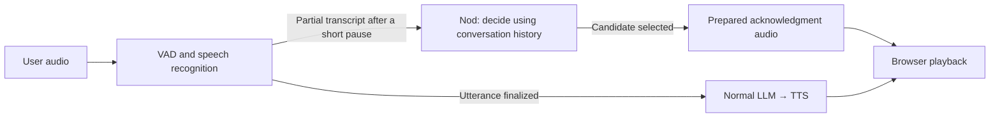

# Nod (🧪 experimental)

[🇯🇵 日本語README](README.ja.md)

Nod is an experimental sample that adds brief listener acknowledgments, such as “Mm-hmm,” “I see,” and “That's great,” to AIAvatarKit voice conversations.
When the user pauses briefly mid-sentence, Nod uses the transcript so far and the conversation history to decide whether to acknowledge them.
The user can keep talking. Once they finish, the usual STT → LLM → TTS pipeline produces the main response.

## What a conversation looks like

The following example illustrates the intended interaction. The LLM decides whether to acknowledge the user and which phrase to use.

```text
User: I'm thinking of baking bread at home this weekend... (brief pause)
AI:   Mm-hmm                                            ← Nod acknowledgment
User: I burned it last time, so I'll try a lower temperature this time.
      (finishes speaking)
AI:   That sounds good. Keep an eye on the crust as it bakes. ← Main response
```

The candidates include phrases that encourage the user to continue, acknowledge their situation, or celebrate a good outcome.
Nod skips acknowledgments for completed questions or requests, and for repetitions of content it has already acknowledged.
If the main response pipeline accepts the utterance first, Nod cancels any acknowledgment that has not been sent.

## Add Nod to a speech pipeline

Add Nod to a server that already supports voice conversations, such as the [WebSocket server example](../websocket/server.py).
The following setup runs from the repository root and requires Python 3.11 or later and this repository's runtime environment.
Nod is a repository sample; it is not included in `pip install aiavatar`.

### 1. Configure VAD and Nod

Use your existing `stt`, `llm`, and `tts`, and switch the VAD to `SileroStreamSpeechDetector`.
This detector reports partial transcripts after short pauses and finalizes the utterance for the main response after a longer pause.
Place the following code where your server creates its VAD and adapter.
Carry over your existing adapter settings, including authentication.

```python
import os
from pathlib import Path
from aiavatar.adapter.websocket.server import AIAvatarWebSocketServer
from aiavatar.sts.vad.stream import SileroStreamSpeechDetector
from examples.nod import NodEngine
from examples.nod.integrations.aiavatar import NodPipelineBridge

# Reuse stt, llm, and tts configured in your existing server.
vad = SileroStreamSpeechDetector(
    speech_recognizer=stt,
    segment_silence_threshold=0.2,    # Catch short pauses for more opportunities to acknowledge.
    # Leave time to decide and send an acknowledgment. Lower this for faster main responses.
    silence_duration_threshold=1.5,
)
aiavatar_app = AIAvatarWebSocketServer(
    vad=vad, stt=stt, llm=llm, tts=tts,
)

# Load the profile containing both candidates and the prompt once.
engine = NodEngine.from_profile(
    Path("examples/nod/profiles/imouto_en.toml"),
    api_key=os.environ["OPENAI_API_KEY"],
)
nod = NodPipelineBridge(aiavatar_app, engine)
```

Creating the bridge automatically registers hooks for session start, partial transcripts, accepted utterances, responses, and disconnection.
To manage your own hooks or their execution order, see [Deep Dive: Connect hooks manually](#deep-dive-connect-hooks-manually).

This example uses the English profile. Configure STT and TTS for English as well.
Set `OPENAI_API_KEY` before starting: this setup also uses the OpenAI API for Nod's decisions.
Acknowledgment audio is synthesized with your existing TTS at startup. Nod adds decision API calls alongside the usual STT and LLM calls.

### 2. Prepare acknowledgment audio at startup

Add audio preparation and Nod cleanup to FastAPI's startup and shutdown handling.
If you are defining a new `lifespan`, the Nod portion looks like this:

```python
from contextlib import asynccontextmanager

@asynccontextmanager
async def lifespan(app):
    async with engine:
        try:
            await nod.prepare_audio()
            yield
        finally:
            await nod.close()
```

Pass this function to `FastAPI(lifespan=lifespan)`. If you already have a `lifespan`,
add the same steps to it and keep your existing pipeline, STT, LLM, and TTS startup and shutdown handling.
Nod synthesizes all candidates during preparation and sends cached audio during conversations.
On shutdown, `nod.close()` closes decision tasks and conversations, then `async with engine` closes the HTTP client.

### 3. Talk in the browser

Start the server with your existing WebSocket router and HTML serving setup, then open `3d.html` (VRM/MMD) to start a conversation.
Turn **BARGE-IN ON** to keep microphone input active while an acknowledgment plays.
Playback support is included in the shared [`aiavatar.js`](../websocket/html/aiavatar.js); no additional client script is needed.
Try pausing briefly in the middle of a thought before continuing, as in the conversation example above.

## Customize the phrases and decision policy

[`profiles/imouto_en.toml`](profiles/imouto_en.toml) contains candidate IDs, phrases, descriptions, and the decision prompt in one file.
The sample depicts a lively, caring younger-sister AI with a mildly teasing attitude and provides nine acknowledgment candidates.
The Japanese version is [`profiles/imouto_ja.toml`](profiles/imouto_ja.toml).
`NodEngine.from_profile()` reads only the selected TOML file. It adds candidate phrases and descriptions to the `prompt` text
and uses the result as the system message for Nod's LLM.

Write `prompt` as a multiline string and add each candidate under `[[candidates]]`. Here is a small example with two candidates:

```toml
prompt = """
You are a lively, caring younger-sister AI with a mildly teasing attitude.
Decide whether to add a brief acknowledgment that encourages the user to continue.
Do not acknowledge completed questions or requests, or content already acknowledged.
Output only a candidate phrase in this format: <nod_assistant>Mm-hmm</nod_assistant>.
Use <nod_assistant/> when no acknowledgment is needed.
"""

[[candidates]]
id = "neutral"
phrase = "Mm-hmm"
description = "A light nod while listening to an event or plan, encouraging the speaker to continue."

[[candidates]]
id = "joy"
phrase = "That's great"
description = "Celebrate a clearly positive outcome for the speaker. Do not use for wishes or plans alone."
```

Edit the TOML file for your character and language. After changing it, restart the server and regenerate the acknowledgment audio.
If you previously used JSON + TXT, move the prompt text into the TOML `prompt` field and combine it with the candidates in one file.
The `prompt_file` field for loading an external file is no longer used.

The profile's `language` metadata does not configure STT or TTS. The input formatter still uses Japanese section labels internally;
the English profile explains those labels and selects English candidate phrases.

The LLM receives the conversation history and current utterance. Acknowledgments already sent are inserted into the text,
for example as `<nod_assistant>Mm-hmm</nod_assistant>`. This shows which portion of the utterance has been acknowledged and helps avoid repetitions.
Each decision uses independent `system` and `user` messages, with up to 600 characters per historical utterance and 1,200 characters for the current input.

The output is a single XML element containing a candidate phrase:

```xml
<nod_assistant>Mm-hmm</nod_assistant>
```

`<nod_assistant/>` means no acknowledgment. Nod does not speak if it receives an unknown phrase or an invalid format.
Keep this output format when writing your own prompt.

### Choose a model and endpoint

Set `model`, `base_url`, and `api_key` on `NodEngine.from_profile()` to choose the model and endpoint.
Nod supports OpenAI-compatible Chat Completions, including endpoints such as OpenRouter.
Use `request_options` for additional generation parameters.
The default model is `gpt-5.6-luna`; its default OpenAI settings include `reasoning_effort="none"` and a 32-token output limit.

Replace the `engine` creation in the integration example with the following to explicitly select the default OpenAI model and endpoint,
and raise the output limit to 64 tokens:

```python
engine = NodEngine.from_profile(
    Path("examples/nod/profiles/imouto_en.toml"),
    model="gpt-5.6-luna",
    base_url="https://api.openai.com/v1",
    api_key=os.environ["OPENAI_API_KEY"],
    request_options={
        "reasoning_effort": "none",
        "max_completion_tokens": 64,
    },
)
```

For OpenRouter, change the endpoint, API key, and model ID.
Set `NOD_MODEL` to the model ID you want to use on OpenRouter, and `OPENROUTER_API_KEY` to your API key.

```python
engine = NodEngine.from_profile(
    Path("examples/nod/profiles/imouto_en.toml"),
    model=os.environ["NOD_MODEL"],
    base_url="https://openrouter.ai/api/v1",
    api_key=os.environ["OPENROUTER_API_KEY"],
    request_options={"max_tokens": 64},
)
```

Only specify `request_options` that the selected endpoint and model accept.

## How Nod works

Audio input branches into acknowledgments during the user's turn and the main response after the user finishes.



### Component responsibilities

`NodPipelineBridge` receives AIAvatarKit events and updates the `NodSession` for each conversation.
`NodSession` passes the current history to `NodEngine` and requests a decision.
When a candidate is selected, the bridge sends its prepared audio to the browser.

| Component | Responsibility |
|---|---|
| [`NodPipelineBridge`](integrations/aiavatar.py) | Receives AIAvatarKit events, manages processing for each conversation, and sends acknowledgment audio |
| [`NodSession`](session.py) | Holds one conversation's history, decision deadlines, minimum intervals between acknowledgments, and successful sends |
| [`NodEngine`](engine.py) | Sends the profile and conversation input to the LLM to select a phrase or no acknowledgment; shared across conversations |

### Why Nod uses conversation history

Nod remembers the user's utterances, the AI's main responses, and acknowledgments already sent for each conversation.
It uses that history in the next decision to choose a phrase that fits the context and avoid acknowledging the same content again.

The bridge associates partial transcripts and finalized text with the same utterance and updates history automatically.
It also combines the AI's response chunks without recording the same content twice.

History is created when the connection starts and discarded on disconnection. It is stored in memory separately from the main response pipeline's history.
Nod keeps the latest ten utterances plus the current input, the last 2,400 characters of each utterance, and up to three sent acknowledgments per utterance.
This records responses handled by the server and acknowledgments successfully sent; it does not track playback completion on the client.

### When acknowledgments happen

Nod makes decisions alongside the main response pipeline. Main response generation does not wait for an acknowledgment.

| Setting | Value in the example | Meaning |
|---|---|---|
| `segment_silence_threshold` | 0.2 seconds | Starts partial transcription even after short pauses, creating more opportunities to acknowledge |
| `silence_duration_threshold` | 1.5 seconds | Pause length that finalizes an utterance; set longer here to leave time for Nod to decide and send |
| `NodPipelineBridge.timeout` | 1.5 seconds (default) | Time available to decide and send after receiving a partial transcript; excludes STT time |
| `NodPipelineBridge.min_interval` | 2 seconds (default) | Minimum wait after sending an acknowledgment before making another decision in the same utterance |

If another pause occurs while a decision is running, Nod does not queue another decision.
The user resuming speech alone does not cancel it; the transcript can grow while the decision runs.
Nod skips sending if recognition corrects the portion being evaluated, a new utterance starts, the main pipeline accepts the utterance, or the connection closes.

### Playback order with the main response

- When the user resumes speaking: the acknowledgment continues; normal barge-in stops the main response audio.
- When the main response is accepted or starts: queued acknowledgments are discarded. An acknowledgment already playing finishes, and main response audio follows it.
- When the user presses Stop or disconnects: all playback stops, including acknowledgments.

Acknowledgment audio carries `metadata.nod=true`. The browser uses this metadata to recognize acknowledgments even when handling a normal `stop` notification.
Their `text` and `voice_text` fields are empty strings, so acknowledgments do not overwrite the text displayed in the conversation window.

## Logging and regression evaluation

Enable INFO logging for `examples.nod.session` to see IDs, send results, API time, and total time.
`NodPipelineBridge(..., log_inputs=True)` also logs the actual plain-text input sent to the model.
Decision logs do not include the system prompt or API key.

Use [`evaluate.py`](evaluate.py) and [`cases/sample.json`](cases/sample.json) to evaluate fixed inputs.
The six bundled cases are fictional, AI-generated conversations in Japanese. They cover unfinished speech, completed questions, history,
previous acknowledgments, preformatted input, and empty input.
They are small examples for learning the input format and adding your own cases, not an accuracy guarantee.
Expected IDs express the intended policy for each case; they are not universal answers for every conversation.
Run `python -m examples.nod.evaluate --help` for command options and output details.

The default input is `cases/sample.json` and the default profile is `profiles/imouto_ja.toml`, so the default evaluation uses Japanese.
The command only previews inputs unless you add `--run` to call the API.
Use `--profile path/to/profile.toml` to select both the candidates and prompt from another TOML file.
For English evaluation, select `profiles/imouto_en.toml` and provide your own English cases as shown below.

```sh
python -m examples.nod.evaluate
```

To run the same bundled cases through the API three times, use the following. API charges apply.
The key is read from `NOD_API_KEY`, or from `OPENAI_API_KEY` / `OPENROUTER_API_KEY` as appropriate for the endpoint.

```sh
export OPENAI_API_KEY="YOUR_OPENAI_API_KEY"
python -m examples.nod.evaluate --run --repeat 3 --output nod-results.json
```

### Add cases

Store cases in a JSON array. Each case is independent and includes any conversation history it needs.
Copy `sample.json` and start by editing `id`, `text`, and `expected`.

| Field | Description |
|---|---|
| `id` | Required. A nonempty string unique within the file |
| `text` | Required. The cumulative transcript to evaluate. Empty text skips the API call and is treated as `none` |
| `expected` | Required. An array of acceptable candidate IDs, such as `["neutral"]` or `["joy", "neutral"]`. Use `["none"]` for no acknowledgment |
| `history` | Optional. Previous utterances, each with `role` (`user` / `assistant`) and `content` |
| `nods` | Optional. Acknowledgments already sent for the current utterance, each with `phrase` and `acknowledged_text`. Also supported on user utterances in `history` |
| `input` | Optional. A preformatted LLM input to replay exactly |
| `note` | Optional. Explains the case's intent for human readers; not sent to the LLM |

Use IDs from the selected profile or `none` in `expected`, rather than the phrases themselves.
In `nods`, `acknowledged_text` is the cumulative transcript at the time of the acknowledgment decision.
The acknowledgment tag is normally inserted at the end of that text. Set `text_length` to specify the original position explicitly;
when omitted, it defaults to the length of `acknowledged_text`.

When a case includes `input`, that text is replayed exactly, including its acknowledgment history.
It is not rebuilt from `history` and `nods`, or truncated again by `--history-limit`. `text` and `expected` are still required.
Cases do not form a conversation simulation: new decisions are not added to the history of later cases.

Results contain the input, expected IDs, selected phrase, elapsed time, choice distribution, and p50/p95 latency.
For reproducibility, the report settings include one copy of the system prompt with candidate descriptions; it is not repeated for each case.
Existing output files are never overwritten.
Because evaluation uses fixed transcripts, it does not measure speech recognition waiting time, audio delivery, or playback in a live conversation.

### Evaluate your own cases

Copy the bundled sample, edit it, and pass it with `--cases`.
For English evaluation, replace the text and history with your own English examples, use English phrases in any `nods`, and select the English profile:
If a copied case has an `input` field, translate that field too or remove it so the input is rebuilt from `text`, `history`, and `nods`.

```sh
cp examples/nod/cases/sample.json my-cases-en.json
python -m examples.nod.evaluate --profile examples/nod/profiles/imouto_en.toml --cases my-cases-en.json
```

After reviewing the preview, add `--run --output` to evaluate the LLM's decisions:

```sh
python -m examples.nod.evaluate --profile examples/nod/profiles/imouto_en.toml --cases my-cases-en.json --run --output my-results.json
```

### Unit tests

Test input formatting, decision handling, cancellation, and history management without API, audio, or database access:

```sh
python -m pytest -c /dev/null --rootdir=. -p no:cacheprovider tests/examples/nod -q
```

## Deep Dive: Connect hooks manually

`auto_register_hooks` defaults to `True`. Set it to `False` when you need to control execution order with existing hooks
or provide your own disconnection handling, then connect the event methods yourself.

The four hooks other than `on_disconnect` append callbacks and run them in registration order.
**`on_disconnect` holds a single callback.** Automatic registration replaces any existing disconnection callback.
Conversely, registering `on_disconnect` after creating the bridge replaces Nod's cleanup callback.
If you have custom disconnection handling, disable automatic registration and call both handlers from the same function.

```python
nod = NodPipelineBridge(aiavatar_app, engine, auto_register_hooks=False)

@aiavatar_app.on_session_start
async def on_session_start(request, session):
    await nod.open_session(session)

@vad.on_speech_detecting
async def on_partial(text, session):
    nod.on_partial(text, session)

@aiavatar_app.sts.on_accepted
async def on_accepted(request):
    nod.on_accepted(request)

@aiavatar_app.on_response
async def on_response(response, sts_response):
    nod.on_response(response, sts_response)

@aiavatar_app.on_disconnect
async def on_disconnect(session):
    await nod.close_session(session)
```

| Hook | Why Nod receives it |
|---|---|
| `on_session_start` | Creates conversation history for each connection |
| `on_speech_detecting` | Updates the cumulative transcript and starts an acknowledgment decision |
| `on_accepted` | Cancels unsent decisions for the utterance entering the main pipeline and saves the finalized text |
| `on_response` | Adds the AI's main response to history for the next acknowledgment decision |
| `on_disconnect` | Stops decision tasks and releases that connection's history |

If you already have a hook, add the corresponding Nod call inside that function.
Keep audio preparation and cleanup in `lifespan`, regardless of the automatic registration setting.

## Deep Dive: Start a new conversation on the same connection

If your application starts a new conversation while keeping its WebSocket connection open, reset Nod's history too.
The bridge manages history per connection, so changing the main response's `context_id` alone does not switch Nod's history.

In your application's conversation-switching handler, call `await nod.close_session(session)` for the connection,
then `await nod.open_session(session)`. This closes the previous decision tasks and history so Nod can begin making decisions for the new conversation.
